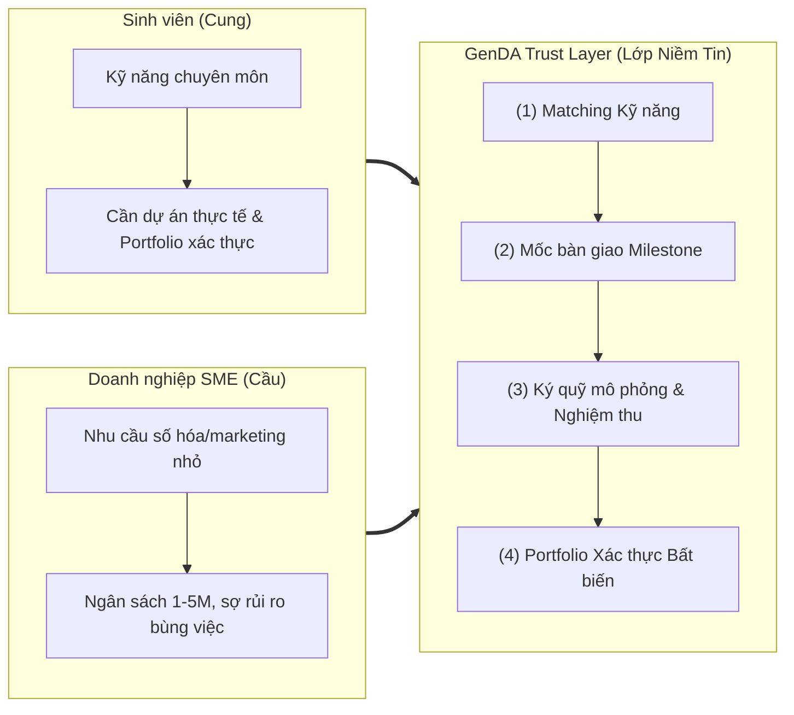
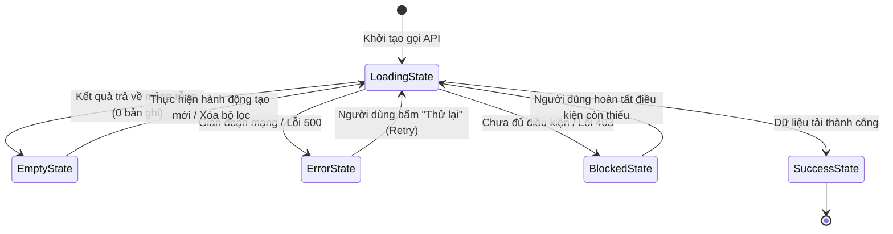
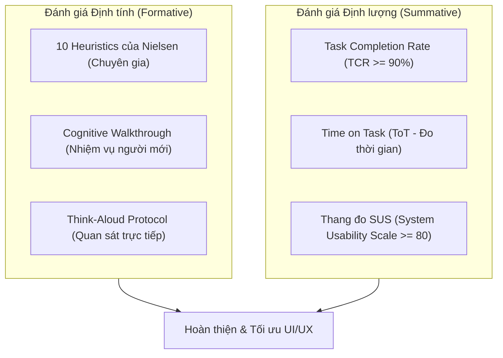

# Đặc tả Thiết kế Giao diện & Trải nghiệm Người dùng (UI/UX Design Specification) — GenDA

Tài liệu này đặc tả toàn diện kiến trúc giao diện, trải nghiệm người dùng (UI/UX), cơ sở lý luận khả dụng (HCI Foundations), hệ thống thiết kế (Design System), phân tích nhiệm vụ phân cấp (HTA) và phương pháp đánh giá khả dụng cho nền tảng **GenDA** (SkillBridge) trong phiên bản **MVP**.

> **Tài liệu đi kèm**: [`design-tokens.md`](./design-tokens.md) chứa kiến trúc token ba lớp và đặc tả chi tiết từng component (hợp đồng bàn giao thiết kế → mã nguồn). Tài liệu bạn đang đọc trả lời **"tại sao"**; `design-tokens.md` trả lời **"bằng giá trị gì"**; [Mục 12](#12-bản-đồ-bàn-giao-thiết-kế--mã-nguồn) của tài liệu này trả lời **"ở tệp nào"**. Khi hai tài liệu lệch nhau về giá trị màu, tài liệu này thắng.
>
> **Ba mục dùng hằng ngày** khi đã quen tài liệu: [Mục 4.9.2](#492-luật-kiểm-đếm-được-countable-rules) (luật kiểm đếm được), [Mục 8](#8-chuẩn-mực-xử-lý-5-trạng-thái-giao-diện-the-5-ui-states---nfr-ux-02) (năm trạng thái giao diện), và [Mục 13](#13-danh-sách-kiểm-tra-trước-khi-bàn-giao-một-màn-hình) (danh sách kiểm tra trước khi bàn giao).

Nguồn tham chiếu nền tảng:
- Nghiệp vụ & Kỹ thuật hệ thống: [`requirement.md`](./requirement.md), [`architecture.md`](./architecture.md), [`domain-model.md`](./domain-model.md), [`authorization-matrix.md`](./authorization-matrix.md), [`frontend-conventions.md`](./frontend-conventions.md).
- Tài liệu đề tài & bản sắc thương hiệu: `docs/general/[SSExFIC] Mô tả dự án vòng sơ loại GenD Arena .md`, `docs/general/SkillBridge_Slides.pdf`.
- Giáo trình & Tiêu chuẩn Khoa học Thiết kế Giao diện: Bộ bài giảng Thiết Kế Giao Diện (CSC13112 - ĐH Khoa học Tự nhiên ĐHQG-HCM, PGS.TS. Nguyễn Văn Vũ & TS. Lê Khánh Duy) và CS3240 (Interaction Design - NUS) trong `docs/general/design/`.

---

## 1. Tổng quan Sản phẩm & Triết lý Thiết kế

### 1.1. Sứ mệnh & Đề xuất Giá trị (UVP)
GenDA mang khẩu hiệu **"From Learn to Earn"** — là nền tảng số chuyên biệt đóng vai trò **Lớp Niềm Tin (Trust Layer)**, giải quyết triệt để sự đứt gãy giữa đào tạo lý thuyết và thực tiễn tuyển dụng tại TP.HCM.

Nền tảng chuẩn hóa các mini-project chuyên môn ngắn hạn (ngân sách 1.000.000 – 5.000.000 VNĐ) giữa sinh viên đại học (nguồn cung) và doanh nghiệp nhỏ & vừa (SME - nguồn cầu) thông qua quy trình 4 trụ cột khép kín:



### 1.2. Bốn Nguyên tắc Thiết kế Cốt lõi (Core Design Principles)

1. **Trust-First (Minh bạch tối đa để kiến tạo niềm tin)**: Mọi cam kết, trạng thái mốc, số tiền phân bổ và giới hạn pháp lý đều hiển thị rõ ràng. Đặc biệt, giao diện thể hiện minh bạch rằng cơ chế ký quỹ (escrow) ở bản MVP là **mô phỏng trạng thái** và thanh toán thực tế diễn ra ngoài nền tảng (FR-MIL-07) để bảo vệ tính trung thực.
2. **Duality & Empathy (Thấu cảm hai đối tượng người dùng)**:
   - *Sinh viên*: Trải nghiệm **Mobile-First**, giao diện trực quan, ngôn ngữ khích lệ học hỏi, thao tác tìm kiếm & nộp bài nhanh gọn.
   - *SME*: Tinh giản, **Frictionless**, tối ưu hiển thị trên Desktop/Tablet, tập trung kiểm soát kết quả đầu ra và tiến độ công việc.
3. **Progressive Disclosure (Tiết lộ tuần tự, giảm tải nhận thức)**: Chia nhỏ các tác vụ phức tạp (như đăng dự án hay nộp mốc bàn giao) thành các bước tuần tự (Wizard/Stepper), tránh gây ngợp nhận thức (Cognitive Overload).
4. **Radical Feedback (Phản hồi tức thì & rõ ràng)**: Bắt buộc hiện thực hóa 4 trạng thái giao diện chuẩn mực (*Loading, Empty, Error, Success*) trên 100% các màn hình tương tác với API (NFR-UX-02).

---

## 2. Cơ sở Lý luận Khả dụng & Quy tắc Vàng (HCI Foundations)

### 2.1. Năm Chiều Khả dụng của Jakob Nielsen (Usability Dimensions - LN02)

| Chiều khả dụng | Định nghĩa khoa học | Mục tiêu thiết kế đo lường trên GenDA |
| :--- | :--- | :--- |
| **1. Learnability (Khả năng học hỏi)** | Tốc độ người dùng mới thực hiện thành công tác vụ cơ bản trong lần đầu tiên tiếp xúc. | Sinh viên hoàn thành nộp đơn ứng tuyển đầu tiên trong **$\le 3$ phút**; SME đăng thành công dự án đầu tiên trong **$\le 5$ phút** mà không cần xem tài liệu hướng dẫn. |
| **2. Efficiency (Hiệu suất thao tác)** | Tốc độ hoàn thành tác vụ khi người dùng đã có kinh nghiệm sử dụng lặp lại. | SME kiểm tra và nghiệm thu một mốc bàn giao chỉ qua **$\le 3$ thao tác nhấp chuột**; sinh viên nộp lại bản sửa đổi trong **$\le 1$ phút**. |
| **3. Memorability (Khả năng ghi nhớ)** | Mức độ dễ dàng tái lập thành thạo sau một khoảng thời gian người dùng không sử dụng. | SME sau 2-3 tháng quay lại đăng dự án mới vẫn thao tác trơn tru nhờ bố cục quen thuộc và các mẫu gợi ý có sẵn. |
| **4. Low Errors & Recovery (Kiểm soát & phục hồi lỗi)** | Số lượng lỗi người dùng mắc phải, mức độ nghiêm trọng và khả năng tự phục hồi. | Tỷ lệ lỗi nộp form **$< 5\%$** nhờ kiểm tra hợp lệ tức thời (Inline Validation); có hộp thoại cảnh báo xác nhận rõ ràng trước các hành động không thể đảo ngược (chấp nhận ứng viên, xóa dự án). |
| **5. Subjective Satisfaction (Mức độ hài lòng)** | Cảm giác thoải mái, tin cậy và thẩm mỹ khi người dùng trải nghiệm hệ thống. | Điểm khảo sát độ hài lòng qua thang đo chuẩn **System Usability Scale (SUS) đạt $\ge 80$ điểm** (Xếp loại A - Excellent). |

### 2.2. Ứng dụng 8 Quy tắc Vàng của Ben Shneiderman (Shneiderman’s Eight Golden Rules - LN02)

1. **Nhất quán (Strive for consistency)**: Áp dụng đồng bộ một bảng màu, kiểu chữ, cấu trúc thẻ và vị trí nút điều hướng xuyên suốt cả 4 phân hệ (Public, Student, SME, Admin).
2. **Khả năng sử dụng phổ quát (Cater to universal usability)**: Hỗ trợ người dùng đa thiết bị (Mobile, Tablet, Desktop) và người khuyết tật thông qua chuẩn tiếp cận **WCAG 2.2 AA**. Bao gồm cả người dùng chỉ thao tác bằng bàn phím và người dùng trình đọc màn hình — đặc tả chi tiết tại [Mục 4.6](#46-đặc-tả-tiếp-cận-bàn-phím--trình-đọc-màn-hình-nfr-ux-01).
3. **Phản hồi mang tính thông tin (Offer informative feedback)**: Mọi thao tác đều có phản hồi tương xứng: đổi màu khi rê chuột, spinner khi chờ đợi, toast thông báo khi hoàn tất, và banner giải thích khi có lỗi.
4. **Thiết kế hội thoại tạo cảm giác đóng gói (Design dialogs to yield closure)**: Các chuỗi tác vụ như đăng ký, đăng dự án 3 bước, nghiệm thu đều có màn hình chúc mừng/hoàn thành rõ ràng để người dùng biết tác vụ đã kết thúc.
5. **Ngăn chặn lỗi (Prevent errors & simple error handling)**: Ràng buộc nhập liệu chặt chẽ (ô ngân sách chỉ cho nhập số 1–5 triệu VNĐ, lịch chỉ cho chọn ngày tương lai); thông báo lỗi chỉ rõ nguyên nhân và cách khắc phục.
6. **Cho phép hoàn tác dễ dàng (Permit easy reversal of actions)**: Sinh viên được quyền rút đơn ứng tuyển (`WITHDRAWN`) khi chưa được duyệt (FR-APP-06); SME được sửa/xóa dự án ở trạng thái `DRAFT` (FR-PRJ-02).
7. **Trao quyền kiểm soát cho người dùng (Support internal locus of control)**: Người dùng chủ động quản lý dữ liệu cá nhân, sinh viên chủ động chọn ẩn hoặc hiện từng mục trên trang portfolio công khai (FR-CERT-04).
8. **Giảm tải trí nhớ ngắn hạn (Reduce short-term memory load)**: Tuân thủ quy tắc tâm lý học $7 \pm 2$ (Miller's Law). Không bắt người dùng nhớ thông tin từ trang trước; hiển thị tóm tắt thông tin dự án ngay tại màn hình nộp bàn giao.

### 2.3. Mô hình Tinh thần vs. Mô hình Hệ thống (Mental Model vs. System Image)
- **Mô hình Tinh thần của Sinh viên**: Kỳ vọng nhận được công việc rõ ràng, được bảo vệ tiền thù lao, không bị bùng việc và có thành quả chứng minh năng lực.
- **Mô hình Tinh thần của SME**: Kỳ vọng giao việc đúng người, nắm bắt tiến độ từng ngày, nghiệm thu hài lòng mới xác nhận giải ngân.
- **Hình ảnh Hệ thống (System Image của GenDA)**: Biến các quy tắc phức tạp thành giao diện trực quan gồm **Thanh Stepper tiến độ 7 bước**, **Thẻ Ký quỹ mô phỏng**, và **Thẻ Portfolio xác thực**.

---

## 3. Nghiên cứu Người dùng & Phân tích Nhiệm vụ Phân cấp (HTA - LN04)

### 3.1. Chân dung Người dùng Mục tiêu (User Personas)

#### Persona 1: Sinh viên — Nguyễn Hải Nam (21 tuổi)
- **Hồ sơ**: Sinh viên năm 3 CNTT, ĐH Khoa học Tự nhiên TP.HCM. Sống tại Ký túc xá ĐHQG.
- **Kỹ năng**: Lập trình Web (React, Next.js, HTML/CSS cơ bản), có khả năng tự học tốt.
- **Mục tiêu**: Có 1–2 dự án thực tế với doanh nghiệp để đưa vào CV; kiếm 2–4 triệu VNĐ/tháng trang trải sinh hoạt; được bảo đảm không bị bùng tiền.
- **Rào cản**: Thiếu kinh nghiệm phỏng vấn; sợ bị lừa đảo trên Facebook/Zalo; không cạnh tranh được trên các sàn freelance quốc tế.
- **Thiết bị**: 85% sử dụng Smartphone (Android/iOS), 15% sử dụng Laptop tại thư viện.

#### Persona 2: Doanh nghiệp SME — Chị Trần Mai Anh (34 tuổi)
- **Hồ sơ**: Chủ chuỗi 2 cửa hàng đồ uống tại Quận 1, TP.HCM. Quy mô 8 nhân sự.
- **Nhu cầu**: Cần xây dựng landing page giới thiệu thực đơn mới và lập fanpage trong 2 tuần; ngân sách dự kiến 3.000.000 VNĐ.
- **Mục tiêu**: Tìm người làm việc có trách nhiệm; kiểm soát công việc theo đầu việc rõ ràng; không muốn ký hợp đồng lao động dài hạn.
- **Rào cản**: Bận rộn quản lý kinh doanh; không hiểu sâu kỹ thuật lập trình; từng bị freelancer tự do nhận cọc rồi biến mất.
- **Thiết bị**: 60% Laptop tại cửa hàng, 40% Smartphone khi di chuyển.

#### Persona 3: Quản trị viên — Đỗ Minh Triết (24 tuổi)
- **Hồ sơ**: Thành viên đội ngũ vận hành GenDA.
- **Mục tiêu**: Duyệt dự án trong vòng 4 giờ; xác minh thẻ sinh viên chính xác; hỗ trợ xử lý khiếu nại bằng nhật ký kiểm toán.
- **Kỳ vọng**: Giao diện hàng đợi (Queue) tinh giản, hỗ trợ duyệt hàng loạt hoặc phím tắt.

---

### 3.2. Phân tích Nhiệm vụ Phân cấp (Hierarchical Task Analysis - HTA)

Theo phương pháp chuẩn hóa trong `LN04 - Task Analysis`, các tác vụ cốt lõi của GenDA được phân rã phân cấp như sau:

#### HTA 1: Doanh nghiệp Đăng Dự án Mới (Post Project)
- **Mục tiêu tổng quát (0)**: Tạo và xuất bản dự án tuyển sinh viên thực hiện.
- **Điều kiện tiên quyết (Preconditions)**: SME đã đăng nhập tài khoản có trạng thái hoạt động.
- **Cây phân rã nhiệm vụ**:
  ```text
  0. Đăng dự án mới
     1. Khởi tạo & Khai báo thông tin cơ bản
        1.1. Nhập tiêu đề dự án
        1.2. Nhập mô tả bài toán & yêu cầu công việc
        1.3. Chọn lĩnh vực hoạt động (F&B, Bán lẻ, TMĐT, Công nghệ, Khác)
     2. Thiết lập Kỹ năng & Ngân sách
        2.1. Chọn các kỹ năng yêu cầu từ danh mục chuẩn (FR-USR-05)
        2.2. Nhập ngân sách dự án (Ràng buộc: 1.000.000 - 5.000.000 VNĐ - BR-10)
        2.3. Chọn hạn chót hoàn thành (Ràng buộc: Ngày tương lai - BR-11)
     3. Thiết lập Tiêu chí Nghiệm thu & Phân bổ Mốc
        3.1. Nhập tiêu chí nghiệm thu chi tiết
        3.2. Định nghĩa các mốc bàn giao (Milestones)
        3.3. Kiểm tra tổng ngân sách các mốc bằng đúng ngân sách dự án (FR-MIL-02)
     4. Xem trước & Gửi duyệt
        4.1. Xem lại bản tóm tắt dự án
        4.2. Lưu bản nháp (DRAFT) HOẶC Bấm Gửi duyệt (DRAFT -> PENDING_REVIEW)
  ```
- **Kế hoạch thực hiện (Plan 0)**: Thực hiện tuần tự $1 \rightarrow 2 \rightarrow 3 \rightarrow 4$. Nếu có lỗi xác thực tại bước bất kỳ, dừng lại và thông báo lỗi tại trường đó.

> #### Quyết định thiết kế DD-01: Milestone được khai báo **trước** khi xuất bản dự án
>
> **Mâu thuẫn cần giải quyết.** `docs/domain-model.md` mô tả vai trò SME theo thứ tự *"creates projects, selects applicants, defines milestones"*, và `FR-MIL-01` ghi *"SME định nghĩa các milestone cho dự án **đã giao**"*. Cả hai đều hàm ý milestone được tạo **sau** khi chọn được sinh viên (dự án đã ở `IN_PROGRESS`). Tuy nhiên bước 3 của HTA này lại đặt việc khai báo milestone **ngay trong Wizard đăng dự án**, tức trước cả khi admin duyệt.
>
> **Quyết định: giữ milestone trong Wizard (trước khi xuất bản).** Ba lý do:
> 1. **Ràng buộc nghiệp vụ đòi hỏi vậy.** `FR-MIL-02` yêu cầu tổng ngân sách các mốc bằng đúng ngân sách dự án. Nếu milestone chỉ được tạo sau khi chọn ứng viên, hệ thống sẽ xuất bản ra công khai những dự án chưa hề được kiểm tra bất biến này, và admin ở bước duyệt cũng không có gì để thẩm định về cấu trúc phân bổ ngân sách.
> 2. **Luồng ứng tuyển của sinh viên phụ thuộc vào nó.** HTA 2 bước 2.3 quy định sinh viên đọc *"yêu cầu, tiêu chí nghiệm thu và các mốc bàn giao"* trước khi quyết định ứng tuyển. Milestone vì thế **bắt buộc** phải tồn tại ở trạng thái `PUBLISHED`.
> 3. **Đúng với nguyên tắc Trust-First.** Sinh viên cần biết trước tiền được chia thành mấy đợt và mỗi đợt bao nhiêu thì mới đánh giá được rủi ro trước khi nhận việc.
>
> **Hệ quả cần đồng bộ ngược (action item).** `FR-MIL-01` và dòng mô tả vai trò SME trong `docs/domain-model.md` cần được sửa lại cho khớp: milestone thuộc giai đoạn **soạn thảo dự án**, không phải giai đoạn **thực thi dự án**. Trước khi module `milestones` được implement, cần chốt điểm này như một mục trong danh sách Câu hỏi mở của `requirement.md`. Tài liệu thiết kế ghi nhận đây là **mâu thuẫn đã biết và đã có phương án**, không phải chỗ bị bỏ sót.

---

#### HTA 2: Sinh viên Khám phá & Ứng tuyển Dự án (Apply for Project)
- **Mục tiêu tổng quát (0)**: Tìm dự án phù hợp với năng lực và nộp hồ sơ ứng tuyển.
- **Điều kiện tiên quyết (Preconditions)**: Sinh viên đã đăng nhập và đã được xác thực danh tính sinh viên (`VERIFIED` - BR-03).
- **Cây phân rã nhiệm vụ**:
  ```text
  0. Khám phá & Ứng tuyển dự án
     1. Tìm kiếm & Lọc dự án
        1.1. Nhập từ khóa tìm kiếm (tiêu đề, kỹ năng)
        1.2. Áp dụng bộ lọc kỹ năng (Figma, React, Content,...)
        1.3. Áp dụng bộ lọc khoảng ngân sách (1-2tr, 2-3tr, 3-5tr)
     2. Đánh giá mức độ phù hợp
        2.1. Xem thẻ dự án trong danh sách (sắp xếp theo Match Score - FR-MAT-02)
        2.2. Mở trang chi tiết dự án
        2.3. Đọc yêu cầu, tiêu chí nghiệm thu và các mốc bàn giao
     3. Nộp đơn ứng tuyển (Apply)
        3.1. Bấm nút "Ứng tuyển ngay" để mở modal nộp đơn
        3.2. Soạn thư ngỏ giới thiệu bản thân & cam kết
        3.3. Đính kèm liên kết sản phẩm minh chứng (GitHub, Behance, Drive)
        3.4. Gửi đơn ứng tuyển (Tạo bản ghi Application trạng thái SUBMITTED)
  ```
- **Kế hoạch thực hiện (Plan 0)**: Thực hiện $1 \rightarrow 2$. Nếu phù hợp thực hiện $3$. Ngoại lệ: Nếu sinh viên chưa `VERIFIED`, hệ thống chặn bước 3.1 và chuyển hướng sang trang xác thực hồ sơ (BR-03). Nếu đã nộp trước đó, chặn nộp lần 2 (FR-APP-02).

---

#### HTA 3: SME Đánh giá & Lựa chọn Ứng viên (Select Applicant)
- **Mục tiêu tổng quát (0)**: Lựa chọn 1 sinh viên duy nhất để giao thực hiện dự án.
- **Điều kiện tiên quyết (Preconditions)**: Dự án của SME đang ở trạng thái `PUBLISHED` và có ít nhất 1 ứng viên nộp đơn.
- **Cây phân rã nhiệm vụ**:
  ```text
  0. Lựa chọn ứng viên
     1. Xem danh sách ứng viên
        1.1. Mở trang quản lý ứng viên của dự án
        1.2. Xem danh sách sắp xếp ưu tiên theo điểm phù hợp (FR-MAT-03)
     2. Thẩm định năng lực từng ứng viên
        2.1. Xem hồ sơ kỹ năng, trường lớp và huy hiệu xác thực
        2.2. Đọc thư ngỏ và xem các sản phẩm minh chứng đính kèm
        2.3. Đánh dấu danh sách rút gọn (SHORTLISTED - tùy chọn)
     3. Chấp nhận ứng viên duy nhất
        3.1. Bấm nút "Chấp nhận ứng viên này"
        3.2. Đọc hộp thoại xác nhận cảnh báo (Dự án chuyển IN_PROGRESS, các ứng viên khác bị REJECTED)
        3.3. Xác nhận chọn (Thực thi transaction: Accept 1, Reject còn lại - FR-APP-05, BR-13)
        3.4. Hệ thống chuyển hướng cả 2 bên vào Workspace làm việc
  ```
- **Kế hoạch thực hiện (Plan 0)**: Thực hiện $1 \rightarrow 2 \rightarrow 3$.

---

#### HTA 4: Hợp tác Bàn giao & Nghiệm thu theo Milestone (Deliver & Accept)
- **Mục tiêu tổng quát (0)**: Sinh viên nộp sản phẩm từng mốc; SME kiểm tra, nghiệm thu và xác nhận thanh toán mô phỏng.
- **Điều kiện tiên quyết (Preconditions)**: Dự án đang ở trạng thái `IN_PROGRESS`, cả hai bên truy cập Workspace dự án.
- **Cây phân rã nhiệm vụ**:
  ```text
  0. Bàn giao & Nghiệm thu mốc
     1. Sinh viên nộp kết quả bàn giao mốc (Milestone Deliverable)
        1.1. Xem yêu cầu và hạn chót của mốc hiện tại
        1.2. Tải tệp đính kèm lên hệ thống lưu trữ (FR-MIL-09)
        1.3. Nhập liên kết demo/sản phẩm trực tuyến và ghi chú bàn giao
        1.4. Bấm nộp kết quả (Milestone chuyển sang SUBMITTED)
     2. SME thẩm định kết quả
        2.1. Nhận thông báo và mở xem tệp/liên kết bàn giao
        2.2. So sánh kết quả với Tiêu chí nghiệm thu đã thống nhất
     3. Xử lý kết quả nghiệm thu (Nhánh rẽ)
        3.1. Nếu chưa đạt: SME chọn "Yêu cầu chỉnh sửa"
             3.1.1. Nhập lý do bắt buộc cần sửa đổi (FR-MIL-04)
             3.1.2. Mốc chuyển sang CHANGES_REQUESTED
             3.1.3. Sinh viên xem góp ý, sửa đổi và nộp lại (Lưu toàn bộ lịch sử - FR-MIL-05)
        3.2. Nếu đạt: SME chọn "Nghiệm thu mốc này"
             3.2.1. Mốc chuyển sang ACCEPTED
             3.2.2. Cập nhật trạng thái thanh toán mô phỏng (FUNDED -> RELEASED)
     4. Hoàn tất dự án & Cấp Portfolio
        4.1. Khi mốc cuối cùng được ACCEPTED: Dự án chuyển sang COMPLETED (FR-PRJ-08)
        4.2. SME viết đánh giá sao và nhận xét cho sinh viên (FR-REV-01)
        4.3. Hệ thống tự động sinh mục Portfolio xác thực vào hồ sơ sinh viên (FR-CERT-01)
  ```
- **Kế hoạch thực hiện (Plan 0)**: Thực hiện $1 \rightarrow 2 \rightarrow 3$. Lặp lại $3.1 \rightarrow 1 \rightarrow 2$ nếu có yêu cầu chỉnh sửa cho đến khi $3.2$ thành công. Kết thúc bằng $4$.

---

## 4. Hệ thống Thiết kế & Nguyên lý Đồ họa Thị giác (LN08, LN09)

### 4.1. Ứng dụng Bộ Quy tắc Đồ họa CRAP (LN08, LN09)
Bốn nguyên lý cơ bản của thiết kế đồ họa được áp dụng triệt để:

```text
[ Contrast (Tương phản) ]   --> Tách bạch rõ rệt giữa nút CTA chính, thẻ nội dung và nền.
[ Repetition (Lặp lại) ]    --> Thống nhất hình dáng nút bấm, thẻ dự án và icon trên mọi trang.
[ Alignment (Căn gióng) ]  --> Căn lề trái nghiêm ngặt cho văn bản, căn phải cho số tiền/ngày tháng.
[ Proximity (Khoảng cách) ] --> Các phần tử có liên quan được nhóm gần nhau (Gestalt Law of Proximity).
```

- **Contrast (Tương phản)**:
  - Sử dụng màu thương hiệu **Deep Teal** (`#1F6F8E` — `color-primary-600`, lấy từ khối gradient của logo GenDA) làm nền nút hành động chính (Primary CTA) với chữ trắng, đạt tỷ lệ tương phản đo được **5.64:1** (vượt ngưỡng WCAG AA 4.5:1).
  - Tỷ lệ tương phản chữ nội dung chính (`#16222B` trên nền `#F6F9FB`) đo được **15.31:1**, vượt xa chuẩn WCAG AAA ($\ge 7:1$).
  - Toàn bộ số đo tương phản của từng cặp màu được kiểm định và ghi nhận tại [Mục 4.4.5](#445-bảng-token-ngữ-nghĩa--số-đo-tương-phản-đã-kiểm-định).
- **Repetition (Lặp lại)**:
  - Cấu trúc thẻ dự án (Project Card), thẻ mốc (Milestone Card) và thẻ ứng viên (Applicant Card) dùng chung một bán kính bo góc (`radius-xl` = 16px, xem [Mục 4.8.2](#482-bo-góc-border-radius--đính-chính-ký-hiệu)) và màu viền (`#D8E1E8` — `color-border-subtle`). Bề mặt để **phẳng, không đổ bóng** — lý do tại [Mục 4.9](#49-kỷ-luật-chống-giao-diện-khuôn-mẫu).
- **Alignment (Căn gióng)**:
  - Lưới 12 cột trên Desktop và lưới 1 cột trên Mobile.
  - Toàn bộ nhãn form, văn bản mô tả căn lề trái (Left-aligned) giúp mắt quét nhanh theo mô hình F-pattern; các con số ngân sách VNĐ căn lề phải (Right-aligned) trong bảng dữ liệu để dễ so sánh độ lớn.
- **Proximity (Khoảng cách nhóm)**:
  - Áp dụng nguyên lý Gestalt: Nhãn trường nhập liệu đặt sát ngay trên ô nhập liệu (khoảng cách 6px), trong khi khoảng cách giữa hai nhóm trường khác nhau là 20px. Thông báo lỗi đặt ngay sát dưới ô nhập liệu tương ứng.

### 4.2. Nguyên lý Tâm lý học Thị giác Gestalt (LN09)
1. **Định luật Gần gũi (Law of Proximity)**: Nhóm các mốc bàn giao và kết quả nộp bài của mốc đó vào chung một khối viền thẻ để người dùng nhận biết ngay chúng thuộc về nhau.
2. **Định luật Tương đồng (Law of Similarity)**: Mọi kỹ năng của sinh viên đều hiển thị dưới dạng viên thuốc (Tag Pills) bo tròn nền `color-neutral-100`; mọi kỹ năng đã trùng khớp với dự án đổi sang nền xanh lá nhạt `color-accent-50` (`#F2FAE9`) + chữ `color-accent-700` + **icon dấu tích**, để độ tương đồng không chỉ được mã hóa bằng màu sắc (xem quy tắc Redundant Coding tại [Mục 4.4.1](#441-quy-trình-chọn-màu-sáu-bước-color-selection-protocol)).
3. **Định luật Đóng kín & Hình/Nền (Closure & Figure/Ground)**: Sử dụng các hộp thẻ màu trắng (`#FFFFFF`) nổi bật rõ trên nền xám lam nhạt (`#F6F9FB`) giúp mắt người dùng phân định tức thì vùng làm việc và khoảng đệm.

### 4.3. Nhận thức Hành vi: Affordance, Signifiers & Visible Constraints (LN08)
- **Perceived Affordance & Signifiers**:
  - Các nút bấm (Buttons) có hiệu ứng nổi nhẹ, bo góc, đổi màu và đổi con trỏ chuột sang dạng bàn tay (`pointer`) khi rê chuột, phát tín hiệu rõ ràng rằng "vật thể này bấm được".
  - **Tín hiệu tương đương cho người dùng bàn phím**: mọi signifier dựa trên `:hover` đều bắt buộc có cặp song sinh dựa trên `:focus-visible` (vòng focus dày 2px, màu `color-primary-600`, cách viền 2px). Không có signifier nào chỉ tồn tại khi rê chuột — nếu không, người dùng bàn phím mất hoàn toàn khả năng nhận biết phần tử đang được chọn (đặc tả đầy đủ tại [Mục 4.6](#46-đặc-tả-tiếp-cận-bàn-phím--trình-đọc-màn-hình-nfr-ux-01)).
  - Khu vực nộp bài (Deliverable Dropzone) có viền nét đứt (Dashed border), biểu tượng đám mây tải lên và dòng chữ "Kéo thả tệp vào đây hoặc Bấm để duyệt tệp", tạo tín hiệu nhận thức tức thì về hành vi kéo thả.
- **Visible Constraints (Ràng buộc trực quan chống lỗi)**:
  - Ô nhập ngân sách bị giới hạn cứng từ 1.000.000 đến 5.000.000 VNĐ; nếu nhập ngoài khoảng, nút gửi duyệt bị vô hiệu hóa (Disabled state) và hiện thông báo giải thích.
  - Bộ chọn ngày (Date Picker) làm mờ và khóa toàn bộ các ngày trong quá khứ và ngày hiện tại (bắt buộc chọn hạn chót trong tương lai - BR-11).

---

### 4.4. Hệ thống Màu sắc: Nguyên tắc Chọn màu & Semantic Tokens

#### 4.4.1. Quy trình chọn màu sáu bước (Color Selection Protocol)

Bảng màu GenDA **không được chọn theo cảm tính hay thị hiếu cá nhân**. Mọi giá trị hex xuất hiện trong tài liệu này đều là đầu ra của quy trình bắt buộc sáu bước dưới đây; bất kỳ màu mới nào muốn đưa vào hệ thống đều phải đi qua đủ sáu bước này trước khi được chấp nhận.

| Bước | Nguyên tắc | Cách thực thi trên GenDA |
| :--- | :--- | :--- |
| **1** | **Trích xuất từ nhận diện (Brand Extraction)** | Màu neo (anchor) được lấy trực tiếp bằng công cụ hút màu từ logo GenDA, không tự sáng tác. Điều này bảo đảm giao diện và nhận diện thương hiệu là một khối thống nhất. |
| **2** | **Sinh thang màu giữ nguyên tông (Tonal Ramp)** | Từ mỗi màu neo, giữ nguyên **Hue**, chỉ biến thiên **Lightness/Saturation** theo bước đều để sinh thang 10 bậc `50 → 900`. Không trộn hue lạ vào giữa thang, tránh bảng màu bị "bẩn". |
| **3** | **Ngữ nghĩa trước, hex sau (Semantic-First)** | Component **không bao giờ** gọi trực tiếp mã hex hay tên bậc màu (`#1F6F8E`, `teal-600`). Component chỉ gọi token ngữ nghĩa (`color-action-primary`, `color-status-verified`). Nhờ đó đổi thương hiệu về sau chỉ cần sửa một lớp ánh xạ. |
| **4** | **Cổng kiểm định tương phản (Contrast Gate)** | Mọi cặp *chữ / nền* phải được đo bằng công thức tỷ lệ tương phản WCAG 2.1 **trước khi** được đưa vào hệ thống, và số đo phải được ghi vào bảng tại Mục 4.4.5. Ngưỡng bắt buộc: **4.5:1** cho chữ thường, **3:1** cho chữ lớn ($\ge$ 24px thường hoặc $\ge$ 18.66px in đậm) và cho đường viền của phần tử giao diện. Cặp màu không đạt ngưỡng bị loại, không có ngoại lệ vì lý do thẩm mỹ. |
| **5** | **Không dùng màu làm kênh thông tin duy nhất (Redundant Coding)** | Khoảng 8% nam giới bị rối loạn phân biệt màu (chủ yếu đỏ–lục). Vì vậy mọi trạng thái trên GenDA đều được mã hóa **ba lớp**: màu sắc + biểu tượng (icon) + nhãn chữ. Người dùng không phân biệt được đỏ/lục vẫn đọc được trạng thái mốc bàn giao. |
| **6** | **Phân bổ theo tỷ lệ 60-30-10** | Giữ cân bằng thị giác: 60% nền trung tính, 30% cấu trúc/chữ, 10% màu nhấn. Màu nhấn khan hiếm thì mới thực sự "nhấn" được. |

#### 4.4.2. Ba màu neo trích xuất từ logo GenDA

```text
             LOGO GenDA
 ┌──────────────────────────────────────────────────────────────┐
 │ Khối gradient xanh mòng két   ──> PRIMARY (Teal)             │
 │   #7FC3D9 (sáng) → #2C89AB (đậm)   Hạ tầng, quy trình,       │
 │                                     Trust Layer đang vận hành │
 │                                                              │
 │ Chữ "DA" xanh lá              ──> ACCENT (Green)             │
 │   #7DC242                           Thành quả ĐÃ xác thực     │
 │                                                              │
 │ Chữ "Gen" xám lam             ──> NEUTRAL (Slate)            │
 │   #6B7F8C                           Nền, chữ, cấu trúc        │
 └──────────────────────────────────────────────────────────────┘
```

**Ánh xạ ngữ nghĩa (vì sao là hai màu này, không phải màu khác)**: logo GenDA đã tự mang sẵn cấu trúc kể chuyện của sản phẩm — khối teal là *quá trình*, chữ xanh lá là *kết quả*. Hệ thiết kế chỉ việc tôn trọng đúng cấu trúc đó:

- **Teal = "Learn" / quá trình**: dùng cho mọi thứ đang vận hành — nút hành động, thanh tiến độ milestone, điều hướng, Match Score. Xanh mòng két là màu lạnh, mang liên tưởng tới sự điềm tĩnh, hạ tầng kỹ thuật và độ tin cậy thể chế — đúng vai trò **Lớp Niềm Tin**.
- **Xanh lá = "Earn" / thành quả**: chỉ dùng cho những gì đã hoàn tất và được xác thực — huy hiệu `VERIFIED`, mốc `ACCEPTED`, thẻ Portfolio xác thực, quỹ `RELEASED`. Vì được dùng tiết chế, màu xanh lá trở thành **phần thưởng thị giác** trên hành trình của sinh viên.
- **Slate = khung đỡ**: không mang ngữ nghĩa trạng thái, chỉ làm nền và chữ để hai màu trên nổi bật.

> **Quy tắc khan hiếm**: xanh lá **không** được dùng cho nút "Gửi", "Lưu" hay bất kỳ hành động thông thường nào. Nếu xanh lá xuất hiện ở khắp nơi, huy hiệu xác thực — tài sản cốt lõi của GenDA — sẽ mất hoàn toàn sức nặng.

#### 4.4.3. Quy tắc Bậc màu (Tier Rule) — chống lỗi tương phản ngay từ gốc

Đây là quy tắc quan trọng nhất của hệ màu, sinh ra để ngăn lỗi phổ biến nhất khi triển khai: lấy màu thương hiệu ở bậc sáng (thường là bậc 400–500 vì "nhìn đẹp nhất") đặt làm nền nút rồi viết chữ trắng lên — tạo ra nút chỉ đạt khoảng 3:1 và **trượt chuẩn WCAG AA**.

| Bậc màu | ĐƯỢC PHÉP dùng cho | TUYỆT ĐỐI KHÔNG dùng cho |
| :--- | :--- | :--- |
| **50 – 200** | Nền tint của banner/badge/hàng bảng được chọn; nền vùng kéo thả. | Chữ, icon nhỏ, đường viền mang thông tin. |
| **300 – 500** | Đường viền trang trí, icon cỡ lớn ($\ge$ 24px), fill biểu đồ, thanh tiến độ, hình minh họa, trạng thái `disabled`. | **Chữ trên nền sáng** và **nền nút có chữ trắng** — các bậc này chỉ đạt khoảng 2:1–4:1. |
| **600 – 900** | Chữ trên nền sáng; nền nút/badge có chữ trắng; tiêu đề; đường viền ô nhập liệu. | (Không hạn chế.) |

> **Câu ghi nhớ một dòng cho toàn đội**: ***"Chữ chỉ sống ở bậc $\ge$ 600."***

#### 4.4.4. Thang màu đầy đủ (Tonal Ramps)

```text
PRIMARY — Teal (Hue ≈ 196°, neo từ khối logo)
50 #EFF7FA │ 100 #D7ECF3 │ 200 #AEDAE7 │ 300 #7FC3D9* │ 400 #4FA6C4
500 #2C89AB* │ 600 #1F6F8E │ 700 #1A5A73 │ 800 #154A5F │ 900 #103A4B

ACCENT — Green (Hue ≈ 92°, neo từ chữ "DA")
50 #F2FAE9 │ 100 #E2F5CC │ 200 #C8EBA0 │ 300 #A8DC6E │ 400 #7DC242*
500 #63A22E │ 600 #4A7F1F │ 700 #396317 │ 800 #2C4D12 │ 900 #21390E

NEUTRAL — Slate (Hue ≈ 205°, neo từ chữ "Gen")
0 #FFFFFF │ 50 #F6F9FB │ 100 #ECF1F5 │ 200 #D8E1E8 │ 300 #B9C7D1
400 #8CA0AD │ 500 #6B7F8C* │ 600 #52646F │ 700 #3C4A54 │ 900 #16222B

(*) = màu neo lấy trực tiếp từ logo.
```

Hai màu trạng thái còn lại (`warning`, `danger`) **không** nằm trong nhận diện thương hiệu. Chúng được chọn theo quy ước văn hóa phổ quát (hổ phách = lưu ý, đỏ = cảnh báo) vì đây là ngữ nghĩa người dùng đã biết sẵn, và được kéo về cùng độ bão hòa với hệ màu chính để không phá vỡ tổng thể.

#### 4.4.5. Bảng Token Ngữ nghĩa & Số đo Tương phản đã Kiểm định

Cột cuối là **số đo thực tế** theo công thức WCAG 2.1 (không phải ước lượng). Đây chính là kết quả của Bước 4 — Contrast Gate.

| Token ngữ nghĩa | Bậc màu | Hex | Ứng dụng & Ý nghĩa tâm lý | Cặp tương phản đã đo |
| :--- | :--- | :--- | :--- | :--- |
| `color-action-primary` | primary-600 | `#1F6F8E` | **Deep Teal** — nền nút hành động chính, tab đang chọn, vòng focus. Xanh lạnh tạo cảm giác điềm tĩnh, đáng tin. | Chữ trắng trên nền này: **5.64:1** ✅ AA |
| `color-action-primary-hover` | primary-700 | `#1A5A73` | Trạng thái hover/active của nút chính. | Chữ trắng: **7.63:1** ✅ AAA |
| `color-action-link` | primary-600 | `#1F6F8E` | Liên kết văn bản trên nền trang. | Trên nền `#F6F9FB`: **5.34:1** ✅ AA |
| `color-brand-decorative` | primary-500 | `#2C89AB` | Màu thương hiệu cho **phần tử phi văn bản**: icon lớn, thanh tiến độ milestone, đường viền vùng kéo thả, hình minh họa. | Trên nền trắng: **3.98:1** — đạt ngưỡng 3:1 cho phần tử giao diện, **cấm dùng làm nền nút có chữ trắng** |
| `color-status-verified` | accent-600 | `#4A7F1F` | **Verified Green** — nền huy hiệu `VERIFIED`, mốc `ACCEPTED`, quỹ `RELEASED`, tích xanh Portfolio. Màu của thành quả đã được bảo chứng. | Chữ trắng trên nền này: **4.83:1** ✅ AA |
| `color-status-verified-text` | accent-700 | `#396317` | Chữ trong badge xác thực nền nhạt. | Trên nền `#F2FAE9`: **6.60:1** ✅ AA |
| `color-status-verified-bg` | accent-50 | `#F2FAE9` | Nền banner/badge trạng thái đã xác thực. | (Nền — xem cặp trên) |
| `color-status-warning` | warning-700 | `#A15C07` | **Warm Amber** — huy hiệu Ký quỹ mô phỏng, `CHANGES_REQUESTED`, dự án `PENDING_REVIEW`. Sắc ấm gây chú ý mà không gây hoảng sợ như đỏ. | Chữ trắng trên nền này: **5.19:1** ✅ AA |
| `color-status-warning-text` | warning-800 | `#7A4A05` | Chữ trong banner lưu ý nền nhạt. | Trên nền `#FDF4E3`: **6.84:1** ✅ AA |
| `color-status-warning-bg` | warning-50 | `#FDF4E3` | Nền banner Ký quỹ mô phỏng, banner chờ duyệt. | (Nền — xem cặp trên) |
| `color-status-danger` | danger-700 | `#B42318` | **Crimson Red** — từ chối dự án/minh chứng, hủy dự án, lỗi hệ thống. | Chữ trắng trên nền này: **6.57:1** ✅ AA |
| `color-status-danger-text` | danger-700 | `#B42318` | Chữ thông báo lỗi dưới ô nhập liệu. | Trên nền `#FDF0EF`: **5.91:1** ✅ AA |
| `color-status-danger-bg` | danger-50 | `#FDF0EF` | Nền banner lỗi, banner minh chứng bị từ chối. | (Nền — xem cặp trên) |
| `color-text-heading` | neutral-900 | `#16222B` | Tiêu đề H1/H2, nền thanh Header. Slate đậm gần như đen, giữ độ trang trọng doanh nghiệp. | Trên nền `#F6F9FB`: **15.31:1** ✅ AAA |
| `color-text-body` | neutral-700 | `#3C4A54` | Nội dung, mô tả dự án, tiêu chí nghiệm thu. | Trên nền `#F6F9FB`: **8.64:1** ✅ AAA |
| `color-text-muted` | neutral-600 | `#52646F` | Chữ phụ: nhãn thời gian, chú thích, placeholder. | Trên nền trắng: **6.16:1** ✅ AA |
| `color-border-input` | neutral-500 | `#6B7F8C` | **Viền ô nhập liệu, checkbox, radio** — ranh giới mang thông tin, bắt buộc $\ge$ 3:1 theo WCAG 1.4.11. | Trên nền trắng: **4.17:1** ✅ |
| `color-border-subtle` | neutral-200 | `#D8E1E8` | Viền thẻ, đường kẻ phân cách — **thuần trang trí**, không phải ranh giới mang thông tin nên không chịu ngưỡng 3:1. | 1.32:1 (chấp nhận được vì trang trí) |
| `color-surface-page` | neutral-50 | `#F6F9FB` | Nền toàn trang (Cool Paper): dịu mắt hơn trắng tinh, ăn tông lạnh với logo. | (Nền nhận mọi cặp chữ ở trên) |
| `color-surface-card` | neutral-0 | `#FFFFFF` | Nền thẻ làm việc, hộp thoại modal. | (Nền) |
| `color-surface-brand-strong` | primary-800 | `#154A5F` | **Vùng màu đậm chiếm trọn bề ngang**: hero trang chủ, đầu trang hồ sơ công khai. Đây là nhịp màu chính của sản phẩm. | Chữ trắng trên nền này: **9.65:1** ✅ AAA |
| `color-surface-achieve-strong` | accent-800 | `#2C4D12` | Vùng màu đậm cho khối nói về **thành quả** (portfolio, thứ sinh viên nhận được cuối hành trình). | Chữ trắng trên nền này: **9.64:1** ✅ AAA |
| *(chữ phụ trên nền đậm)* | primary-100 | `#D7ECF3` | Nội dung và đoạn dẫn đặt trên vùng màu đậm. | Trên `#154A5F`: **7.89:1** ✅ AAA |
| *(chữ mờ trên nền đậm)* | primary-200 | `#AEDAE7` | Nhãn phụ, chú thích trên vùng màu đậm. | Trên `#154A5F`: **6.42:1** ✅ AA |
| *(liên kết trên nền đậm)* | accent-300 | `#A8DC6E` | Liên kết và chữ nhấn trên vùng màu đậm. | Trên `#154A5F`: **6.03:1** ✅ AA |

> **Ghi chú cách đọc bảng**: `color-brand-decorative` (primary-500) là màu thương hiệu "đẹp nhất" và cũng là **cái bẫy nguy hiểm nhất**. Nó đạt 3.98:1 — đủ cho icon và đường viền, nhưng **không đủ** cho chữ thường. Tài liệu ghi rõ số đo này để lập trình viên không vô tình dùng nó làm nền nút.

#### 4.4.6. Phân bổ 60-30-10 trên giao diện thực tế

```text
[ 60% Nền Neutral ]        --> Cool Paper (#F6F9FB) + Card Surface (#FFFFFF)
[ 30% Cấu trúc & Chữ ]     --> Slate (#16222B, #3C4A54, #52646F, #D8E1E8)
[ 10% Nhấn Brand & Trạng thái ] --> Teal (#1F6F8E) ~7%
                                    + Green/Amber/Red trạng thái ~3%
```

Kiểm chứng nhanh khi review một màn hình: **nheo mắt nhìn tổng thể — nếu thấy quá hai vùng màu teal đậm cạnh nhau, tức là đã lạm dụng màu nhấn.** Mỗi màn hình chỉ nên có đúng **một** nút hành động chính (Primary CTA).

### 4.5. Sử dụng Màu trong Mã hóa Trạng thái (Redundant Coding)

Hiện thực hóa Bước 5 của quy trình chọn màu. Mọi trạng thái miền đều được mã hóa ba lớp độc lập, để thông tin không bao giờ phụ thuộc vào khả năng phân biệt màu:

| Trạng thái | Lớp 1: Màu nền | Lớp 2: Biểu tượng | Lớp 3: Nhãn chữ |
| :--- | :--- | :--- | :--- |
| `VERIFIED` / `ACCEPTED` | `color-status-verified-bg` | Dấu tích (✓) | "Đã xác thực" / "Đã nghiệm thu" |
| `PENDING` / `PENDING_REVIEW` | `color-status-warning-bg` | Đồng hồ | "Đang chờ duyệt" |
| `CHANGES_REQUESTED` | `color-status-warning-bg` | Mũi tên quay lại | "Yêu cầu chỉnh sửa" |
| `REJECTED` / `CANCELLED` | `color-status-danger-bg` | Dấu X | "Bị từ chối" / "Đã hủy" |
| `SUBMITTED` / `IN_PROGRESS` | `color-primary-50` (`#EFF7FA`) | Vòng tròn tiến độ | "Đang thực hiện" |

Hệ quả kiểm thử: chụp màn hình chuyển sang ảnh xám (grayscale) — nếu vẫn đọc được đầy đủ trạng thái thì thiết kế đạt yêu cầu.

### 4.6. Đặc tả Tiếp cận Bàn phím & Trình đọc Màn hình (NFR-UX-01)

`NFR-UX-01` yêu cầu tường minh "HTML ngữ nghĩa và hỗ trợ bàn phím", và Quy tắc Vàng số 2 cam kết chuẩn **WCAG 2.2 AA**. Mục này đặc tả các ràng buộc bắt buộc để hai cam kết đó có thể kiểm chứng được, thay vì chỉ là tuyên bố.

> **Vì sao mốc là WCAG 2.2 chứ không phải 2.1.** WCAG 2.2 trở thành Khuyến nghị chính thức của W3C từ tháng 10/2023, nên với một sản phẩm dựng năm 2026 thì lấy 2.1 làm mốc là đang nhắm vào một chuẩn đã cũ. Quan trọng hơn: 2.2 bổ sung đúng những tiêu chí chạm vào các bề mặt GenDA thật sự có — thanh điều hướng dính đè lên vòng focus, vùng kéo thả nộp bài, màn hình đăng nhập, và wizard nhiều bước. Sáu tiêu chí mới áp dụng cho GenDA được đặc tả tại các mục **f, h, i, j** dưới đây.
>
> Công thức tính tỷ lệ tương phản **không đổi** giữa 2.1 và 2.2, nên toàn bộ số đo đã kiểm định ở [Mục 4.4.5](#445-bảng-token-ngữ-nghĩa--số-đo-tương-phản-đã-kiểm-định) vẫn giữ nguyên hiệu lực.

**a. Vòng focus hiển thị (WCAG 2.4.7 Focus Visible)**
- Mọi phần tử tương tác được (nút, liên kết, ô nhập, checkbox, tab, thẻ dự án bấm được) phải có vòng focus: viền ngoài **2px** màu `color-action-primary` (`#1F6F8E`), cách phần tử **2px**, bo góc theo phần tử.
- Tương phản vòng focus trên nền trang đo được **5.34:1**, vượt ngưỡng 3:1 của WCAG 1.4.11.
- **Cấm tuyệt đối** khai báo `outline: none` mà không cấp ngay một chỉ báo focus thay thế.

**b. Thứ tự tiêu điểm & điều hướng (WCAG 2.4.3)**
- Thứ tự Tab bám đúng thứ tự đọc thị giác trái→phải, trên→dưới. Không dùng `tabindex` dương để nhảy cóc.
- Mỗi trang có liên kết **"Bỏ qua tới nội dung chính" (Skip to content)** ẩn, hiện ra khi nhận focus lần đầu.
- Trong Wizard đăng dự án, sau khi chuyển bước, tiêu điểm được đưa về tiêu đề của bước mới để trình đọc màn hình đọc đúng ngữ cảnh.

**c. Hộp thoại (Modal) — bẫy tiêu điểm**
- Áp dụng cho Modal Ứng tuyển và Modal Xác nhận chọn ứng viên: khi mở, tiêu điểm chuyển vào trong hộp thoại và **bị giữ lại** (focus trap); phím `Esc` đóng hộp thoại; khi đóng, tiêu điểm trả về đúng nút đã kích hoạt nó.
- Khai báo `role="dialog"` kèm `aria-modal="true"` và `aria-labelledby` trỏ tới tiêu đề hộp thoại.

**d. Vùng kéo thả tệp (Dropzone) — thao tác thay thế (WCAG 2.2 AA — 2.5.7 Dragging Movements)**
- Kéo thả là thao tác chuột thuần túy, nên vùng Dropzone **bắt buộc** đồng thời là một nút bấm được bằng bàn phím (Enter/Space mở hộp chọn tệp). Không có tính năng nào chỉ thực hiện được bằng kéo thả.
- Đây chính là nội dung của tiêu chí `2.5.7 Dragging Movements`: mọi thao tác kéo do sản phẩm tự định nghĩa đều phải có đường thay thế chỉ dùng một điểm chạm. Quy tắc GenDA đặt ra từ đầu đã thỏa tiêu chí này; ghi tên tiêu chí ở đây để lần kiểm định tiếp theo truy được về đúng điều khoản.

**e. Thông báo động (WCAG 4.1.3 Status Messages)**
- Toast thông báo và thông báo lỗi inline đặt trong vùng `aria-live="polite"`; lỗi chặn tác vụ dùng `aria-live="assertive"`.
- Ô nhập bị lỗi mang `aria-invalid="true"` và `aria-describedby` trỏ tới dòng lỗi tương ứng, để trình đọc màn hình đọc được nguyên nhân chứ không chỉ thấy viền đỏ.

**f. Kích thước vùng chạm (WCAG 2.2 AA — 2.5.8 Target Size Minimum)**

> **Đính chính so với bản trước của tài liệu.** Bản trước ghi *"WCAG 2.5.8 — tối thiểu 44×44px"*. Con số này **không phải** ngưỡng của 2.5.8. Tiêu chí `2.5.8 Target Size (Minimum)` ở mức **AA** yêu cầu **24×24 CSS px** (hoặc khoảng cách tương đương giữa các đích chạm). Con số 44px thuộc về `2.5.5 Target Size (Enhanced)` ở mức **AAA**, và cũng trùng với hướng dẫn 44pt của Apple HIG. Ghi sai ngưỡng cho một tiêu chí là lỗi đáng sửa vì hai lý do: người đọc tài liệu có thể trích dẫn sai trong báo cáo, và một lập trình viên tra lại chuẩn rồi "sửa" 44px xuống 24px sẽ tưởng mình đang sửa đúng.

- **Sàn bắt buộc (AA)**: 24×24 CSS px cho mọi đích chạm trên web.
- **Ngưỡng GenDA tự đặt cho mình: 44×44px**, tức vượt hẳn sàn AA và chạm mức AAA. Đây là **lựa chọn có chủ đích, không phải mức tối thiểu của chuẩn**: 85% sinh viên vào bằng smartphone và thao tác bằng ngón cái, thường trong lúc di chuyển. Áp dụng cho Bottom Navigation 4 tab (thực tế đặt 56px), các Filter Chips, thanh trượt ngân sách và nút Toggle ẩn/hiện mục portfolio.
- Khi một đích chạm buộc phải nhỏ hơn 44px vì lý do bố cục, nó vẫn **không được** xuống dưới sàn 24px, và phải có khoảng cách đủ với đích chạm kế bên.

**g. Tôn trọng lựa chọn giảm chuyển động (WCAG 2.3.3)**
- Người dùng bật `prefers-reduced-motion` ở cấp hệ điều hành là đang nói rằng chuyển động gây khó chịu hoặc gây chóng mặt cho họ. Đây không phải sở thích thẩm mỹ, mà với người mắc rối loạn tiền đình thì là điều kiện để dùng được sản phẩm.
- Quy tắc bắt buộc: khi cờ này bật, **mọi** hiệu ứng chuyển tiếp và hoạt ảnh bị rút xuống gần như tức thời. Cụ thể với GenDA: hiệu ứng quét sáng của Skeleton tắt hẳn và chỉ giữ khối nền tĩnh ([Mục 8.1](#81-trạng-thái-đang-tải-loading-state--skeleton-shimmer-pattern)); hiệu ứng hover của thẻ, vòng quay của spinner trong nút và chuyển động trượt lên của hộp thoại trên mobile đều dừng.
- Hiện thực đặt ở một khối `@media (prefers-reduced-motion: reduce)` duy nhất trong `globals.css`, áp lên toàn bộ tài liệu. Đặt tập trung một chỗ thay vì rải theo từng component là có chủ đích: component mới thêm về sau tự động được bảo vệ mà lập trình viên không cần nhớ quy tắc này.

**h. Vòng focus không bị che khuất (WCAG 2.2 AA — 2.4.11 Focus Not Obscured Minimum)**

Đây là tiêu chí dễ vi phạm nhất của GenDA, vì giao diện có **hai thanh điều hướng nằm đè lên luồng nội dung**: thanh đầu trang dính (`sticky`) và thanh điều hướng đáy trên mobile (`fixed`).

Kịch bản hỏng: người dùng bấm Tab tới một phần tử vừa ra khỏi vùng nhìn. Trình duyệt cuộn phần tử đó vào **đúng mép viewport** — tức là ngay bên dưới thanh đầu trang, và vòng focus bị thanh này che mất. Người dùng bàn phím lúc đó hoàn toàn không biết tiêu điểm đang ở đâu, dù vòng focus vẫn được vẽ đúng theo mục **a**.

- Quy tắc: mọi thanh cố định đè lên nội dung **bắt buộc** phải được bù lại bằng `scroll-padding` tương ứng trên phần tử gốc.
- Chiều cao của hai thanh phải là **token dùng chung**, không phải số viết tay ở hai chỗ. Thanh cao 64px mà `scroll-padding-top` ghi 56px là lỗi không ai phát hiện ra cho tới khi có người dùng thật bấm Tab.
- Ràng buộc này áp cho cả liên kết neo trong trang, vì `scroll-padding` chi phối mọi lần cuộn do trình duyệt tự thực hiện.

**i. Đăng nhập không dựa vào trí nhớ (WCAG 2.2 AA — 3.3.8 Accessible Authentication Minimum)**

- **Không bao giờ chặn dán (paste) vào ô mật khẩu hay ô mã xác minh.** Chặn dán là thói quen được biện minh bằng lý do bảo mật nhưng thực tế làm điều ngược lại: nó vô hiệu hóa trình quản lý mật khẩu, nên đẩy người dùng về phía mật khẩu ngắn dễ nhớ. Với người suy giảm trí nhớ hoặc khó khăn vận động, nó chặn hẳn đường đăng nhập.
- Mọi ô nhập của luồng xác thực phải khai báo đúng `autocomplete` (`email`, `current-password`, `new-password`, `one-time-code`) để trình quản lý mật khẩu và tính năng tự điền của hệ điều hành hoạt động được.
- Không dùng câu đố ghi nhớ, không bắt gõ lại mã OTP bằng tay mà không có đường thay thế.
- **Mọi ô mật khẩu đều có nút hiện/ẩn.** Gõ mù một chuỗi dài trên bàn phím ảo là nguồn lỗi lớn nhất của màn hình đăng nhập trên điện thoại, và người dùng không có cách nào tự phát hiện mình gõ sai cho tới khi bị từ chối. Nút này mang `aria-pressed` và nhãn đọc được đổi theo trạng thái, để người dùng trình đọc màn hình cũng biết mật khẩu đang hiện hay đang ẩn.
- Ô mật khẩu ở cả màn hình đăng nhập và đăng ký dùng **chung một component**. Tách đôi là cách chắc chắn nhất để một trong hai màn hình thiếu mất nút hiện/ẩn sau vài lần sửa.

**k. Không khóa phóng to (WCAG 1.4.4 Resize Text)**
- Thẻ `viewport` **không bao giờ** được đặt `maximum-scale` hay `user-scalable=no`. Người dùng thị lực kém phải phóng to được trang; khóa phóng to là một trong những lỗi tiếp cận bị vi phạm nhiều nhất trên web di động, và thường bị thêm vào chỉ để "giao diện khỏi vỡ" — tức là đang giấu một lỗi bố cục bằng cách tước quyền của người dùng.
- Toàn bộ thang chữ khai báo bằng `rem` nên trang phóng to theo cỡ chữ hệ thống mà không vỡ.

**j. Không bắt nhập lại & vị trí trợ giúp nhất quán (WCAG 2.2 A — 3.3.7 Redundant Entry, 3.2.6 Consistent Help)**

- **Không bắt người dùng nhập lại thông tin họ đã cung cấp trong cùng một quy trình.** Áp trực tiếp vào Wizard đăng dự án 3 bước: thông tin khai ở bước 1 và 2 phải còn nguyên khi quay lại, và bước 3 tự lấy ngân sách từ bước 2 để đối chiếu tổng các mốc chứ không hỏi lại. Tương tự, sinh viên đã khai kỹ năng trong hồ sơ thì không phải khai lại khi ứng tuyển.
- **Liên kết trợ giúp và liên hệ giữ nguyên vị trí tương đối trên mọi trang.** Trên GenDA, chúng sống ở chân trang. Đặt trợ giúp ở chỗ khác nhau tùy trang khiến người đang bí phải đi tìm đúng lúc họ ít đủ kiên nhẫn nhất để tìm.

---

### 4.7. Hệ thống Chữ (Typography System)

#### 4.7.1. Ràng buộc quyết định: dấu phụ tiếng Việt

`NFR-UX-01` quy định giao diện tiếng Việt. Đây **không phải** một lựa chọn thẩm mỹ mà là một ràng buộc kỹ thuật chi phối toàn bộ hệ thống chữ, vì tiếng Việt chồng dấu theo cách mà chữ Latin không có:

```text
   ế  = e + dấu mũ + dấu sắc      --> vùng TRÊN cao hơn Latin
   ộ  = o + dấu mũ + dấu nặng     --> dùng cả vùng TRÊN và vùng DƯỚI
   ữ  = u + dấu móc + dấu ngã     --> vùng TRÊN cao hơn nữa
```

Ba hệ quả bắt buộc:

1. **Phông chữ phải có bộ ký tự Vietnamese thật sự**, không phải chỉ có Latin Extended. Rất nhiều phông hiển thị (display font) thời thượng dựng dấu tiếng Việt sai vị trí hoặc thiếu hẳn — phải loại từ vòng chọn.
2. **Giãn dòng (line-height) phải lớn hơn chuẩn Latin.** Giãn dòng 1.4–1.5 quen dùng cho tiếng Anh sẽ khiến dấu của dòng dưới chạm chân chữ dòng trên. GenDA dùng **1.65 cho nội dung** và **không bao giờ dưới 1.2** cho bất kỳ cấp tiêu đề nào.
3. **Không dùng `text-transform: uppercase` cho tiêu đề tiếng Việt.** Chữ hoa toàn phần làm dấu bị cắt hoặc chồng lên nhau, đồng thời làm giảm tốc độ đọc. Nhãn nút dùng chữ thường có dấu đầy đủ.

#### 4.7.2. Cặp phông chữ (Font Pairing)

| Vai trò | Phông | Lý do chọn |
| :--- | :--- | :--- |
| **Tiêu đề** | **IBM Plex Sans** (500, 600, 700) | Chữ của một hãng kỹ thuật: dáng hơi vuông, có đặc điểm riêng nhận ra được, mang sắc thái nghiêm túc đúng với một nền tảng nói chuyện tiền bạc và cam kết. Bộ ký tự Vietnamese là bản chính thức của IBM, dấu phụ dựng chuẩn (đã kiểm chứng bằng ảnh chụp màn hình thật, không suy đoán). |

> **Vì sao đổi khỏi Be Vietnam Pro.** Bản trước chọn Be Vietnam Pro vì nó dựng dấu tiếng Việt rất tốt — lý do đó vẫn đúng. Nhưng khi dựng ra màn hình thật thì lộ ra một vấn đề khác: Be Vietnam Pro là **geometric sans**, cùng họ hình với Poppins và Montserrat. Ở trọng lượng 700 cỡ lớn, đó chính là kiểu chữ mà gần như mọi trang do máy sinh đều dùng, nên chữ đọc ra "mẫu có sẵn" chứ không ra "sản phẩm có người thiết kế".
>
> Ràng buộc dấu phụ ở [Mục 4.7.1](#471-ràng-buộc-quyết-định-dấu-phụ-tiếng-việt) **không được nới lỏng** khi đổi: IBM Plex Sans được chọn vì nó thỏa cả hai vế, chứ không phải đánh đổi vế dấu phụ lấy vế thẩm mỹ. Mọi phông thay thế về sau phải qua đúng hai cửa đó, và phải kiểm bằng ảnh chụp tiếng Việt thật trước khi chốt.
| **Nội dung & giao diện** | **Inter** (400, 500, 600) | Chiều cao chữ thường (x-height) lớn và khoảng chữ được tinh chỉnh cho màn hình, dễ đọc nhất ở cỡ nhỏ 12–16px — nơi phần lớn giao diện GenDA sinh sống. Hỗ trợ Vietnamese đầy đủ. |

**Vì sao ghép hai phông chứ không dùng một?** Lý do chức năng, không phải trang trí: tiêu đề cỡ lớn và thưa cần **bản sắc**, còn nội dung cỡ nhỏ và dày đặc cần **độ dễ đọc**. Hai yêu cầu này tối ưu ngược chiều nhau.

**Chi phí và cách bù.** Tải hai họ phông tốn băng thông, trong khi 85% sinh viên dùng smartphone (có thể đang dùng 3G/4G). Bù bằng ba biện pháp bắt buộc:
- Chỉ tải các trọng lượng thực sự dùng (Be Vietnam Pro: 600/700 — Inter: 400/500/600), không tải cả họ.
- Chỉ nhúng subset `latin` + `vietnamese`, bỏ Cyrillic/Greek.
- Dùng cơ chế tự host của Next.js (`next/font`) để phông đi cùng domain, có `size-adjust` khử hiện tượng giật bố cục khi đổi phông — nhất quán với cam kết chống CLS tại [Mục 8.1](#81-trạng-thái-đang-tải-loading-state--skeleton-shimmer-pattern).

#### 4.7.3. Thang chữ (Type Scale)

Cơ số 16px, tỷ lệ ~1.25 (Major Third). Cột *Mobile* là giá trị thay thế dưới breakpoint `md` (768px).

| Token vai trò | Desktop | Mobile | Giãn dòng | Trọng lượng | Phông | Dùng ở đâu |
| :--- | ---: | ---: | ---: | ---: | :--- | :--- |
| `text-display` | 48px | 32px | 1.20 | 700 | Be Vietnam Pro | Tiêu đề Hero trang chủ ("FROM LEARN TO EARN") |
| `text-h1` | 36px | 28px | 1.25 | 700 | Be Vietnam Pro | Tiêu đề trang |
| `text-h2` | 30px | 24px | 1.30 | 600 | Be Vietnam Pro | Tiêu đề khối lớn |
| `text-h3` | 24px | 20px | 1.35 | 600 | Be Vietnam Pro | Tiêu đề thẻ dự án, tiêu đề mốc |
| `text-h4` | 20px | 18px | 1.40 | 600 | Be Vietnam Pro | Tiêu đề phụ, tiêu đề hộp thoại |
| `text-body-lg` | 18px | 17px | 1.60 | 400 | Inter | Đoạn dẫn, mô tả UVP |
| `text-body` | 16px | 16px | 1.65 | 400 | Inter | Nội dung chính, mô tả dự án, tiêu chí nghiệm thu |
| `text-body-sm` | 14px | 14px | 1.60 | 400 | Inter | Nhãn phụ, nội dung thẻ, ô nhập liệu |
| `text-caption` | 12px | 12px | 1.50 | 500 | Inter | Chú thích, mốc thời gian, chữ trong badge |

**Hai quy tắc cứng của thang chữ:**

- **Nội dung không bao giờ nhỏ hơn 16px trên mobile.** Ngoài lý do dễ đọc, iOS Safari **tự động phóng to trang** khi người dùng chạm vào ô nhập có cỡ chữ dưới 16px — gây vỡ bố cục ngay giữa lúc sinh viên đang điền đơn ứng tuyển. Vì vậy `text-body` giữ nguyên 16px ở mọi breakpoint.
- **Liên thông với ngưỡng tương phản.** WCAG coi "chữ lớn" là $\ge$ 24px thường hoặc $\ge$ 18.66px in đậm, và chỉ yêu cầu 3:1 thay vì 4.5:1 (xem [Mục 4.4.1](#441-quy-trình-chọn-màu-sáu-bước-color-selection-protocol) Bước 4). Đối chiếu thang trên: `text-display`, `text-h1`, `text-h2`, `text-h3` và `text-h4` (20px/600) **đạt** tiêu chuẩn chữ lớn; `text-body-lg` (18px/400) **không đạt**. Do đó mọi chữ từ `text-body-lg` trở xuống bắt buộc dùng token màu có tỷ lệ $\ge$ 4.5:1.

---

### 4.8. Thang Khoảng cách, Bo góc & Lưới Bố cục

#### 4.8.1. Thang khoảng cách (Spacing Scale — cơ số 4px)

Mọi khoảng cách trong giao diện phải là một bậc trên thang này. Không có giá trị lẻ tùy hứng.

```text
space-0   0      space-1   4px    space-1-5  6px    space-2   8px
space-3   12px   space-4   16px   space-5    20px   space-6   24px
space-8   32px   space-10  40px   space-12   48px   space-16  64px
space-20  80px   space-24  96px
```

Thang này **kế thừa nguyên vẹn** hai quyết định đã có ở [Mục 4.1](#41-ứng-dụng-bộ-quy-tắc-đồ-họa-crap-ln08-ln09) (Proximity): khoảng cách nhãn → ô nhập là 6px (`space-1-5`), khoảng cách giữa hai nhóm trường là 20px (`space-5`).

**Khoảng cách ngữ nghĩa** (dùng token này trong component, không dùng số thô):

| Token | Giá trị | Áp dụng |
| :--- | :--- | :--- |
| `space-field-label` | 6px | Nhãn trường → ô nhập liệu |
| `space-field-error` | 6px | Ô nhập liệu → dòng báo lỗi |
| `space-field-group` | 20px | Giữa hai nhóm trường khác nhau |
| `space-card-padding` | 24px | Đệm trong thẻ, hộp thoại |
| `space-card-gap` | 16px | Giữa các thẻ trong danh sách/lưới |
| `space-section` | 48px (mobile) / 80px (desktop) | Giữa các khối lớn của trang |

#### 4.8.2. Bo góc (Border Radius) — đính chính ký hiệu

> **Đính chính so với bản trước của tài liệu.** Mục 4.1 trước đây ghi thẻ dùng `rounded-lg: 16px`. Ký hiệu này gây hiểu nhầm vì trong quy ước Tailwind, `rounded-lg` là **8px**, không phải 16px — lập trình viên đọc theo sẽ dựng thẻ sai một nửa độ bo. Dự án **không dùng Tailwind** (xem `apps/web`), nên hệ thống định nghĩa thang bo góc riêng dưới đây, và giá trị 16px của thẻ mang tên `radius-xl`.

| Token | Giá trị | Áp dụng |
| :--- | ---: | :--- |
| `radius-sm` | 6px | Badge, chip lọc, thẻ kỹ năng |
| `radius-md` | 8px | **Nút bấm**, ô nhập liệu, select |
| `radius-lg` | 12px | **Thẻ dự án, thẻ mốc, thẻ ứng viên**, banner thông báo, vùng Dropzone |
| `radius-xl` | 16px | Hộp thoại modal |
| `radius-full` | 9999px | Ảnh đại diện, thanh tiến độ, chip lọc |

> **Đính chính: nút KHÔNG còn bo tròn hoàn toàn.** Bản trước đặt nút ở `radius-full` với lập luận *"bo tròn là tín hiệu thân thiện mạnh nhất mà không tốn gì về độ rõ"*. Vế đó đúng, nhưng thiếu một vế: viên thuốc bo tròn hoàn toàn là **hình nút mặc định của mọi mẫu SaaS dựng sẵn**, nên nó đọc ra "vui vẻ, đại trà" chứ không ra "đáng tin, chuyên nghiệp". Với nền tảng mà người dùng phải giao tiền và thời gian cho người lạ, vế thứ hai quan trọng hơn. Thẻ cũng hạ từ 16px xuống 12px theo cùng lý do: khối bo càng lớn càng đọc ra sản phẩm tiêu dùng, bo vừa đọc ra công cụ làm việc.

#### 4.8.3. Breakpoint & Lưới bố cục

Mobile-first: viết CSS cho mobile trước, dùng `min-width` để mở rộng lên.

| Breakpoint | Ngưỡng | Thiết bị điển hình | Số cột lưới |
| :--- | ---: | :--- | ---: |
| *(mặc định)* | 0 | Điện thoại dọc | 1 |
| `sm` | 640px | Điện thoại lớn / dọc-ngang | 1 |
| `md` | 768px | Máy tính bảng | 8 |
| `lg` | 1024px | Laptop | 12 |
| `xl` | 1280px | Màn hình rộng | 12 |

| Thuộc tính | Mobile | Tablet (`md`) | Desktop (`lg`+) |
| :--- | :--- | :--- | :--- |
| Chiều rộng tối đa khung nội dung | 100% | 100% | **1200px** |
| Lề hai bên (gutter) | 16px | 24px | 32px |
| Khoảng cách cột (gap) | 16px | 20px | 24px |
| Lưới thẻ dự án | 1 cột | 2 cột | 3 cột |

Ánh xạ với hai chân dung người dùng ở [Mục 3.1](#31-chân-dung-người-dùng-mục-tiêu-user-personas): sinh viên (85% smartphone) được phục vụ tốt nhất ở nhánh mặc định và `sm`; SME (60% laptop) ở nhánh `lg`. Vì vậy hai nhánh này phải được kiểm thử thủ công trên thiết bị thật, không chỉ thu nhỏ cửa sổ trình duyệt.

---

### 4.9. Kỷ luật chống giao diện khuôn mẫu

Một hệ thiết kế đúng chuẩn khả dụng vẫn có thể cho ra giao diện **trông như hàng loạt**: đủ tương phản, đủ vùng chạm, nhưng nhạt nhòa và không ai nhớ. Với một sản phẩm dự thi và phải tạo niềm tin ngay từ màn hình đầu, đó là thất bại thật sự. Mục này liệt kê các dấu hiệu cụ thể và biện pháp đối ứng.

| Dấu hiệu khuôn mẫu | Vì sao hỏng | GenDA làm thay thế |
| :--- | :--- | :--- |
| Hero căn giữa, có "pill badge" nhỏ phía trên tiêu đề | Bố cục mặc định của mọi công cụ dựng trang. Căn giữa làm mọi dòng có sức nặng ngang nhau nên không dẫn được mắt. | Hero **lệch trái, lưới bất đối xứng** 1.35fr / 1fr, đặt trên vùng màu đậm. Nhãn `eyebrow` chữ nhỏ thay cho pill. Cột phải là **một dự án thật đang tuyển**. |
| Hero khoe con số cỡ lớn về chính nền tảng | Lưới 2x2 bốn con số khổng lồ là khối bị dùng lại nhiều nhất trên các trang do máy sinh. Tệ hơn: nó **nói về** sản phẩm thay vì **cho xem** sản phẩm. | Cột phải hero đặt một **thẻ dự án thật**, dựng bằng đúng component mà trang `/projects` dùng. Nó trả lời ngay câu hỏi đầu tiên của người mới vào ("trên này có việc gì?") và chứng minh sản phẩm tồn tại. Bốn con số cam kết chuyển xuống thành một **dải ngang gọn** bên dưới, cỡ vừa phải, để chúng là thông tin chứ không phải khẩu hiệu. |
| Tiêu đề hero cỡ áp phích (trên 64px) | Chữ cỡ đó là ngôn ngữ quảng cáo. Đi kèm hai nút lớn thì thành đúng khuôn mẫu trang bán hàng dựng sẵn, và với sản phẩm tài chính nó làm giảm cảm giác đáng tin. | Giới hạn `clamp(2.25rem, 4.2vw, 3.5rem)` — tối đa 56px. Thứ bậc tạo bằng khoảng cách, màu và mật độ, không chỉ bằng cỡ chữ. |
| Mọi nội dung bọc trong thẻ giống hệt nhau, xếp lưới đều | Khi mọi thứ trông quan trọng như nhau thì không gì quan trọng cả. Lưới đều triệt tiêu thứ bậc. | Trust Layer là **danh sách đánh số có kẻ ngang**, số cỡ lớn chìm màu làm nhịp. Lưới thẻ chỉ dùng khi các mục thật sự ngang hàng. |
| Đổ bóng mềm trên mọi bề mặt | Bóng là tín hiệu **độ cao** — "vật này nhấc lên được". Rải khắp nơi thì tín hiệu mất nghĩa. | Bề mặt **gần phẳng, viền kẻ mảnh** như chứng từ tài chính, kèm **một lớp bóng gần như không thấy được** (`0 1px 2px rgb(22 34 43 / 0.04)`). Bóng thật sự nâng lên chỉ xuất hiện khi rê chuột lên thẻ bấm được. *Đính chính so với bản trước:* bản trước quy định phẳng tuyệt đối; dựng ra màn hình thật thì bề mặt chỉ có viền 1px đọc ra như bản vẽ khung, nên cần đúng một lớp bóng mảnh để tách thẻ khỏi nền mà không giả vờ rằng nó nhấc lên được. |
| Mọi khối lặp đúng một nhịp: tiêu đề → đoạn xám → lưới | Trang dài thành ra đều đều, không có cao trào. | Biến thiên mật độ: khu marketing thoáng, khu dữ liệu (Workspace, Admin) chặt. Xen kẽ `section-head` có kẻ ngang, đoạn `lede`, và trích dẫn nổi. |
| Tiêu đề lớn nhất chỉ nhỉnh hơn tiêu đề khối một chút | Không có bậc thang thị giác thì không có điểm vào. | Khoảng nhảy dứt khoát: `display` 64px so với `h1` 36px, kèm siết `letter-spacing` −0.03em cho chặt chữ. |
| Icon trang trí rải khắp nơi | Icon không mang thông tin chỉ thêm nhiễu thị giác. | Icon chỉ dùng khi **mã hóa trạng thái** (lớp 2 của quy tắc Redundant Coding) hoặc làm affordance. Không đính icon vào tiêu đề cho đẹp. |
| Con số trình bày như văn bản thường | Sản phẩm này nói về tiền và tiến độ — con số chính là nội dung. | Mọi số tiền, điểm phù hợp và số thứ tự mốc dùng **chữ số bảng** (`tabular-nums`), cỡ lớn, và **căn phải khi cần so sánh**. |
| Danh sách để so sánh lại trình bày thành lưới thẻ | Mắt phải nhảy zigzag giữa các thẻ nên không so được ngân sách với nhau. | Trang `/projects` dùng **danh sách có cột thẳng hàng**, tiền căn phải trên một trục dọc duy nhất. |
| Bằng chứng xã hội bịa ra ("hơn 500 sinh viên tin dùng") | Nền tảng chưa vận hành. Số liệu giả là nói dối, và người đọc tinh ý nhận ra ngay. | Nêu **cam kết sản phẩm có thật** lấy từ `requirement.md` (1–5tr, 1 sinh viên, duyệt trong 4 giờ, 0đ phí) và **cho xem chính cơ chế** — một thẻ portfolio xác thực mẫu. |

> **Ranh giới cần giữ**: mọi thủ pháp trên đều phải đi qua các cổng ở Mục 4.4 và 4.6. Bất đối xứng không được phá thứ tự Tab; siết `letter-spacing` không đụng tới giãn dòng vốn đang chừa chỗ cho dấu phụ tiếng Việt; số chìm màu trong danh sách editorial là **trang trí**, phải mang `aria-hidden` và không bao giờ là nguồn thông tin duy nhất.

#### 4.9.1. Làm ấm mà không rơi lại vào khuôn mẫu

Kỷ luật editorial ở trên, nếu đẩy quá tay, sẽ cho ra giao diện **lạnh và xa cách** — hỏng đúng mục tiêu của một sản phẩm cần sinh viên năm ba dám bấm nút ứng tuyển. Nhưng cái bẫy lớn hơn là làm ấm bằng những thứ mặc định: gradient, đổ bóng dày, bo tròn khắp nơi, emoji. Đó chính là con đường quay ngược về vẻ AI.

Tham chiếu hữu ích là các sản phẩm tài chính vẫn giữ được vẻ thân thiện — [Monzo](https://monzo.com) (Hot Coral làm nền cả khối, hình minh họa riêng, nút cỡ lớn) và [Wise](https://wise.com). Bài học rút ra: **hơi ấm đến từ sự hào phóng, hình khối và giọng văn — không đến từ hiệu ứng.** Kèm theo một cảnh báo đáng giá của giới thiết kế fintech: đừng đánh đổi sự rõ ràng để lấy vẻ thân thiện.

> **Đính chính sau lần dựng đầu tiên.** Bản trước của mục này quy định đòn bẩy 2 dùng hai nền tint `teal-50` và `green-50`. Khi dựng ra màn hình thật thì hỏng: hai màu đó sáng tới mức gần như không phân biệt được với nền trắng, nên toàn trang thành một dải trắng viền xám và đọc ra như bản vẽ khung chứ không phải sản phẩm. Chữ *"hào phóng"* trong đòn bẩy 2 phải hiểu đúng nghĩa của nó — **nền đậm, chữ trắng, chiếm trọn bề ngang** — thì mới tạo được nhịp màu. Bảng dưới đây đã sửa theo.

Bốn đòn bẩy GenDA dùng, xếp theo mức hiệu quả trên rủi ro:

| Đòn bẩy | Cách làm | Vì sao an toàn |
| :--- | :--- | :--- |
| **1. Giọng văn** | Xưng hô ngôi thứ hai, câu ngắn, thừa nhận cả giới hạn của sản phẩm. *"Chúng tôi đang xem minh chứng của bạn — thường mất dưới 24 giờ"* thay cho *"Minh chứng đang được xét duyệt"*. | Không tốn gì về mặt kỹ thuật, không ảnh hưởng tương phản, và là thứ người dùng cảm nhận rõ nhất. |
| **2. Vùng tô màu diện rộng** | Dùng **vùng màu ĐẬM chiếm trọn bề ngang**: `--color-surface-brand-strong` (teal-800) cho hero, `--color-surface-achieve-strong` (green-800) cho khối thành quả, chữ trắng trên nền đó. Các nền tint nhạt (teal-50, green-50) chỉ dùng cho banner và badge, **không** dùng làm nhịp màu của trang. | Chữ trắng đạt 9.65:1 trên teal-800 và 9.64:1 trên green-800 — cả hai đều AAA. Chi tiết từng cặp tại [Mục 4.4.5](#445-bảng-token-ngữ-nghĩa--số-đo-tương-phản-đã-kiểm-định). |
| **3. Hình khối rộng rãi** | Nút **bo tròn hoàn toàn**, đệm ngang rộng hơn mức tối thiểu; khối tô màu bo `--radius-2xl` (24px). | Bo tròn và đệm rộng chỉ làm tăng vùng chạm, không giảm. |
| **4. Hình minh họa riêng** | Vẽ từ **mô-típ khối nghiêng của chính logo GenDA**, tô bằng token màu. | Vì dựng từ nhận diện riêng nên không đụng hàng bộ hình stock nào; vì dùng token nên đổi thương hiệu là hình đổi theo. Luôn `aria-hidden` vì thuần trang trí. |

> **Điều KHÔNG được làm để lấy vẻ thân thiện**: gradient nhiều màu, đổ bóng mềm rải khắp bề mặt, emoji thay icon, chữ phóng to kèm nhiều dấu chấm than, hay minh họa người kiểu 3D bong bóng. Tất cả đều là tín hiệu khuôn mẫu, và ba thứ đầu còn phá luôn các quy tắc ở Mục 4.4.

#### 4.9.2. Luật kiểm đếm được (Countable Rules)

Bảng ở [Mục 4.9](#49-kỷ-luật-chống-giao-diện-khuôn-mẫu) mô tả dấu hiệu khuôn mẫu theo *cảm nhận*. Cảm nhận thì tranh luận được, nên trong một buổi review nó thường thua người nói to hơn. Mục này chuyển các dấu hiệu đó thành **luật đếm được**: người review chỉ cần đếm, không cần bàn về gu.

**A. Hero**

| Luật | Ngưỡng |
| :--- | :--- |
| Hero nằm trọn trong màn hình đầu | Tiêu đề $\le$ 2 dòng; đoạn dẫn $\le$ 3 dòng (mốc để biết khi nào cần đo lại: khoảng **30 âm tiết**); nút hành động chính thấy được mà không cần cuộn |
| Số khối chữ trong hero | Tối đa **4**: eyebrow (hoặc không) + tiêu đề + đoạn dẫn + cụm nút |
| Đệm trên của hero (desktop) | Tối đa **96px**. Vượt ngưỡng này hero trôi xuống giữa viewport và đọc ra như lỗi bố cục |

Bị cấm trong hero: dòng chữ nhỏ nằm dưới cụm nút, dải logo "được tin dùng bởi" (thuộc về khối riêng bên dưới), dòng giá, nhãn phiên bản (`V0.6`, `BETA`, `BẢN DÙNG THỬ`) trừ khi màn hình thật sự nói về việc ra mắt, dải chữ trang trí ở đáy hero kiểu `DỰ ÁN. NIỀM TIN. PORTFOLIO.`, và mọi gợi ý cuộn (`Cuộn xuống`, mũi tên nhấp nháy). Người dùng chưa cuộn thì đang nhìn hero; họ biết cuộn là gì.

**B. Eyebrow và nhãn nhỏ**

- **Định mức: tối đa 1 eyebrow cho mỗi 3 khối.** Trang 9 khối được dùng nhiều nhất 3 eyebrow, tính cả hero. Cách kiểm: đếm số nhãn chữ nhỏ giãn ký tự nằm trên tiêu đề khối; nếu lớn hơn `trần(số khối / 3)` thì trượt.
- Cấm eyebrow đánh số khối (`01 / GIỚI THIỆU`, `002 · Năng lực`). Vị trí của khối trên trang đã nói nó là khối thứ mấy.
- **Phân biệt với số trong danh sách editorial ở Mục 4.9:** số ở đó là số thứ tự của **mục trong một danh sách có thứ tự thật**, nằm trong thẻ `<ol>`, và mang `aria-hidden` vì ngữ nghĩa thứ tự đã do thẻ đảm nhiệm. Đó là nội dung, không phải nhãn trang trí. Luật cấm ở trên nhắm vào eyebrow đánh số **khối của trang**.
- Cấm câu chú thích nhỏ chèn giữa eyebrow và tiêu đề. Eyebrow + tiêu đề + nội dung là đủ.

**C. Bố cục khối**

| Luật | Ngưỡng |
| :--- | :--- |
| Lặp họ bố cục | Mỗi họ dùng tối đa **1 lần/trang**; trang 8 khối phải có ít nhất **4 họ** khác nhau |
| Xen kẽ kiểu "ảnh một bên, chữ một bên" | Tối đa **2 khối liên tiếp**; khối thứ ba bắt buộc đổi họ |
| Lưới bento | Số ô **đúng bằng** số mục nội dung, không chèn ô trống cho đủ lưới |

Cấm tiêu đề khối kiểu "tiêu đề lớn bên trái, đoạn giải thích nhỏ trôi ở góc phải". Nếu cần cả hai, xếp dọc: tiêu đề trên, nội dung dưới, bề rộng tối đa 65 ký tự.

**D. Danh sách và số liệu**

- Danh sách quá **5 mục** phải đổi sang component khác: nhóm thành 2-3 cụm, lưới thẻ, tab, hoặc dải cuộn ngang. Kéo dài một `<ul>` có kẻ ngang từng dòng là lựa chọn lười nhất và đọc mỏi nhất.
- Cấm kẻ đồng thời cả viền trên lẫn viền dưới cho mọi hàng của một danh sách dài. Chọn một.
- **Con số chính xác giả bị cấm.** Những số kiểu `92%`, `4,1 lần`, `5,8mm` chỉ được xuất hiện khi (1) có nguồn thật trong [`requirement.md`](./requirement.md) hoặc tài liệu đề tài, hoặc (2) được ghi rõ ngay tại chỗ rằng đây là dữ liệu mẫu. Bịa ra độ chính xác kỹ thuật mà sản phẩm không hề tuyên bố là một dạng nói dối nhỏ, và người đọc tinh ý nhận ra.

**E. Trích dẫn**

- Thân trích dẫn tối đa **3 dòng**. Dài hơn thì cắt: trích dẫn trên trang giới thiệu là một mẩu, không phải toàn bộ bài đánh giá.
- Ghi đủ **tên + vai trò hoặc đơn vị**. Chỉ ghi mỗi tên là dấu hiệu của lời chứng thực bịa.

**F. Nút**

- Mỗi màn hình đúng **một** nút hành động chính (nhắc lại từ [Mục 4.4.6](#446-phân-bổ-60-30-10-trên-giao-diện-thực-tế)).
- Nhãn nút **không được xuống dòng** ở desktop. Nhãn bị ngắt thành 2 dòng là nút hỏng, và sửa bằng cách rút gọn chữ chứ không phải bó hẹp bề rộng nút.
- Guồng đo cho nhãn nút chính: **$\le$ 8 âm tiết**. Lưu ý không mượn thẳng quy ước tiếng Anh "tối đa 3 từ" — tiếng Việt đếm theo âm tiết, nên *"Tôi là sinh viên, tìm dự án"* (7 âm tiết) là nhãn hợp lệ dù nhìn qua tưởng dài. Ngưỡng ràng buộc thật vẫn là điều kiện không xuống dòng ở trên; 8 âm tiết chỉ là mốc để biết khi nào cần đo lại.
- **Không có hai nút cùng một ý định trên cùng một trang.** "Liên hệ với chúng tôi" và "Nói chuyện với đội ngũ" là một ý định; chọn một nhãn và dùng nhất quán ở mọi nơi.
- Mọi nút phải qua Cổng kiểm định tương phản ở [Mục 4.4.1](#441-quy-trình-chọn-màu-sáu-bước-color-selection-protocol) Bước 4, gồm cả nút chìm đặt trên nền ảnh.

**H. Bố cục phải có ĐIỂM NHẤN (chống "chồng hình chữ nhật")**

Đây là nhóm luật sinh ra từ một phản hồi cụ thể: giao diện đã đủ màu, đủ chữ, đủ tương phản — nhưng **nhìn vào không ấn tượng**. Nguyên nhân chẩn đoán được: mọi khối đều là một dải ngang khép kín, chiều rộng bằng nhau, tiêu đề bắt đầu ở cùng một mép trái, không khối nào chồng lên khối nào, không phần tử nào lớn vượt hẳn. Trang thành một **chồng hình chữ nhật xếp dọc** — và đó chính là hình dạng mà bố cục do máy sinh luôn rơi vào, vì nó là phương án an toàn nhất.

Một trang đạt yêu cầu phải thỏa **ít nhất ba** trong năm điều sau:

| # | Luật | Cách kiểm |
| :--- | :--- | :--- |
| 1 | **Có phần tử cắt qua ranh giới khối** | Ít nhất một phần tử nằm đè lên đường phân cách giữa hai khối (thẻ dự án ở hero tràn xuống khối kế tiếp). Đây là thủ pháp tạo chiều sâu rẻ nhất và hiệu quả nhất. |
| 2 | **Có tương phản tỷ lệ dứt khoát** | Ít nhất một phần tử lớn gấp **≥ 3 lần** cỡ chữ nội dung (số thứ tự 88px trong danh sách Trust Layer). Không có tương phản tỷ lệ thì không có điểm vào cho mắt. |
| 3 | **Không phải mọi khối đều bắt đầu ở cùng một mép trái** | Ít nhất một khối có trục căn gióng riêng (cột số 160px của danh sách editorial tạo ra trục dọc thứ hai). |
| 4 | **Lưới thẻ không chia đều** | Cấm N thẻ bằng nhau xếp một hàng. Dùng tỷ lệ lệch (1.5fr / 1fr, một thẻ lớn + hai thẻ nhỏ xếp chồng). Nếu ba thẻ quan trọng ngang nhau thì không thẻ nào quan trọng. |
| 5 | **Nền khối có chất, không phải mảng màu phẳng chết** | Vùng màu đậm mang mô-típ vạch nghiêng lấy từ góc nghiêng của khối trong logo, độ mờ ≤ 5%. Đủ để phá cảm giác phẳng, không đủ để thành hoa văn trang trí. |

> **Ranh giới.** Cả năm thủ pháp trên phải đi qua các cổng ở [Mục 4.4](#44-hệ-thống-màu-sắc-nguyên-tắc-chọn-màu--semantic-tokens) và [Mục 4.6](#46-đặc-tả-tiếp-cận-bàn-phím--trình-đọc-màn-hình-nfr-ux-01). Cụ thể: phần tử tràn qua ranh giới **chỉ áp dụng từ `lg` trở lên** — trên mobile bố cục một cột nên nó sẽ đè lên nội dung và thành lỗi thật chứ không thành thủ pháp; số cỡ lớn là trang trí nên luôn mang `aria-hidden`; mô-típ nền phải `pointer-events: none` và nằm dưới nội dung.

**G. Ảnh và chi tiết trang trí**

Cấm: dán nhãn hay viên thuốc đè lên ảnh; chú thích ảnh kiểu ghi công giả (`Ảnh: Nghiên cứu thực địa số 12`); chấm tròn màu thuần trang trí (chấm màu chỉ được dùng khi mã hóa một trạng thái có thật, theo [Mục 4.5](#45-sử-dụng-màu-trong-mã-hóa-trạng-thái-redundant-coding)); dải địa danh, giờ địa phương hoặc thời tiết trên thanh điều hướng; chân trang kiểu `v1.4.2 · build 0048` trên trang giới thiệu; và **dựng ảnh chụp màn hình sản phẩm giả bằng các khối `div`**. Cái cuối là dấu hiệu dễ nhận nhất của giao diện do máy sinh: nếu cần cho xem sản phẩm, hãy dùng ảnh thật, ảnh dựng bằng công cụ tạo ảnh, hoặc một bản thu nhỏ chạy được của chính component đó.

---

### 4.10. Hệ thống Biểu tượng (Icon System)

[Mục 4.9](#49-kỷ-luật-chống-giao-diện-khuôn-mẫu) đã quy định **khi nào** được đặt icon (chỉ khi mã hóa trạng thái hoặc làm affordance). Mục này quy định **lấy icon từ đâu**.

| Quyết định | Giá trị | Lý do |
| :--- | :--- | :--- |
| Bộ icon | **Phosphor Icons** (`@phosphor-icons/react`) | Bộ mở, phủ đủ các glyph GenDA cần, có sẵn nhiều trọng lượng nét trong cùng một họ |
| Cách nhập | Nhập từ nhánh `/ssr` | Icon render thẳng ra SVG trên máy chủ, không kèm JavaScript phía client, dùng được trong Server Component |
| Số họ icon | **Đúng một** cho cả dự án | Trộn hai bộ icon là dấu hiệu giao diện chắp vá, nhận ra ngay vì độ dày nét và bán kính bo góc của hai bộ không bao giờ khớp nhau |
| Trọng lượng nét | **`bold`**, thống nhất toàn hệ thống | Icon của GenDA phần lớn sống ở cỡ 14-20px (trong badge, trong nhãn trường, trong nút nhỏ); nét `regular` bị mảnh và nhòe đi ở cỡ đó |

**Cấm tự vẽ đường dẫn SVG cho icon giao diện.** Thiếu glyph thì lấy thêm từ chính bộ đã chọn. Icon tự vẽ gần như luôn lệch về độ dày nét, tỷ lệ khung và điểm căn quang học so với phần còn lại, và chi phí sửa về sau lớn hơn nhiều so với công tìm đúng glyph.

**Hai ngoại lệ được phép tự vẽ**, vì chúng không phải icon giao diện mà là tài sản nhận diện: (1) dấu hiệu thương hiệu `BrandMark`, và (2) các hình minh họa dựng từ mô-típ khối nghiêng của logo theo [Mục 4.9.1](#491-làm-ấm-mà-không-rơi-lại-vào-khuôn-mẫu) đòn bẩy 4. Cả hai tô bằng token màu và luôn mang `aria-hidden`.

**Icon bên trong badge trạng thái luôn `aria-hidden`.** Lớp 3 của quy tắc Redundant Coding là nhãn chữ, và nhãn chữ đã mang đủ nghĩa; để cả hai cùng đọc được sẽ khiến trình đọc màn hình đọc lặp trạng thái hai lần.

**Không dùng emoji thay icon** ở bất kỳ đâu trong sản phẩm. Emoji render khác nhau trên từng hệ điều hành, không nhận được token màu, và kéo tông sản phẩm về phía trò chuyện xã giao — sai với một nền tảng đang nói chuyện tiền bạc và cam kết.

---

### 4.11. Quy tắc Viết chữ trên Giao diện (UI Copy Rules)

[Mục 4.9.1](#491-làm-ấm-mà-không-rơi-lại-vào-khuôn-mẫu) đòn bẩy 1 đã quy định **giọng văn** (ngôi thứ hai, câu ngắn, thừa nhận cả giới hạn của sản phẩm). Mục này quy định phần ký tự và rà soát — những thứ kiểm được bằng mắt trong lúc review.

**a. Cấm dấu gạch ngang dài trong mọi chuỗi hiển thị**

Ký tự `—` (em dash) và `–` (en dash) **không được xuất hiện trong bất kỳ chuỗi nào người dùng đọc được**: tiêu đề, nhãn, nút, chữ trong badge, nội dung, trích dẫn, dòng ghi công, chú thích ảnh, văn bản thay thế của ảnh.

Hai lý do. Thứ nhất, đây là thói quen hành văn đặc trưng của máy sinh chữ, và là chi tiết bị nhận ra nhanh nhất khi người đọc nghi ngờ một trang do máy viết. Thứ hai, trên giao diện tiếng Việt vốn đã nhiều dấu phụ, gạch ngang dài chặt dòng thành từng mẩu rời và làm chậm tốc độ đọc.

Thay bằng: dấu phẩy, dấu chấm tách thành hai câu, dấu hai chấm, hoặc ngoặc đơn. Khoảng giá trị và khoảng thời gian dùng **gạch nối ngắn**: `1-5 triệu`, `2018-2026`, `10/10 - 28/10`.

> **Phạm vi áp dụng.** Quy tắc này áp cho **chuỗi hiển thị trong sản phẩm**, không áp cho văn xuôi phân tích của chính các tài liệu thiết kế — bản thân tài liệu bạn đang đọc vẫn dùng gạch ngang dài trong phần lập luận. Ranh giới là: thứ gì đi vào mã nguồn giao diện thì theo luật này.

**b. Dấu nháy**

Dùng nháy kép cong `"` `"` hoặc không dùng nháy. Không dùng nháy thẳng `"` của bàn phím.

**c. Rà soát chuỗi trước khi bàn giao (Copy Self-Audit)**

Trước khi đóng một màn hình, đọc lại **từng chuỗi hiển thị** và loại bỏ chuỗi nào rơi vào bốn nhóm sau:

1. Sai ngữ pháp hoặc thiếu chủ ngữ rõ ràng.
2. Có đại từ hoặc tham chiếu không rõ trỏ về đâu ("chúng tôi sẽ giữ như vậy" mà không nói "như vậy" là gì).
3. Nghe bóng bẩy nhưng sai nghĩa, kiểu ẩn dụ gượng hoặc chơi chữ không ăn nhập.
4. Sáo ngữ tiếp thị rỗng: *"Nâng tầm trải nghiệm"*, *"Giải pháp toàn diện"*, *"Đột phá"*, *"Tối ưu hóa quy trình"*. Thay bằng động từ cụ thể nói đúng việc hệ thống làm.

Nếu phân vân một chuỗi có ổn không, thay bằng một câu trần thuật đơn giản nói đúng chức năng. **Chữ nhạt mà đúng luôn tốt hơn chữ hay mà sai.**

---

### 4.12. Chuyển động (Motion)

Tài liệu này quy định màu, chữ, khoảng cách, biểu tượng và chữ viết, nhưng cho tới đây vẫn **chưa quy định chuyển động** — trong khi `globals.css` đã có sẵn ba token thời lượng. Khoảng trống đó là lý do giao diện dễ trôi về hai thái cực: hoặc cứng đờ, hoặc động đậy khắp nơi.

GenDA đặt mức chuyển động **thấp có chủ đích**. [Mục 4.9.1](#491-làm-ấm-mà-không-rơi-lại-vào-khuôn-mẫu) đã kết luận hơi ấm đến từ giọng văn, vùng màu và hình khối, **không** đến từ hiệu ứng; và đây là sản phẩm nói chuyện tiền bạc, nơi sự điềm tĩnh đáng giá hơn sự sinh động.

**a. Mọi chuyển động phải có lý do nói được thành lời**

Trước khi thêm bất kỳ hoạt ảnh nào, phải trả lời được: *nó nói cho người dùng biết điều gì?* Bốn câu trả lời hợp lệ:

| Lý do | Ví dụ trên GenDA |
| :--- | :--- |
| **Phản hồi** — xác nhận hệ thống đã nhận thao tác | Nút lún xuống 1px khi bấm |
| **Chuyển trạng thái** — cho thấy có thứ vừa đổi | Thẻ nhấc lên khi rê chuột, báo rằng nó bấm được |
| **Quan hệ không gian** — nói rõ thứ mới đến từ đâu | Hộp thoại phóng nhẹ ra từ giữa (desktop) hoặc trượt lên từ đáy (mobile) |
| **Chờ đợi** — lấp khoảng trống trong lúc tải | Hiệu ứng quét sáng của Skeleton |

*"Trông cho đẹp"* không nằm trong danh sách. Không trả lời được thì bỏ hoạt ảnh đó đi.

**b. Chỉ animate `transform` và `opacity`**

Hai thuộc tính này chạy trên GPU và **không** buộc trình duyệt tính lại bố cục. Animate `width`, `height`, `top`, `left` hay `margin` thì mỗi khung hình đều kéo theo một lượt dựng lại bố cục, gây giật trên chính những điện thoại tầm trung mà phần lớn sinh viên đang dùng. Hệ quả kèm theo: hoạt ảnh **không bao giờ được làm bố cục nhảy** — đó là cùng một cam kết chống giật bố cục đã nêu ở [Mục 8.1](#81-trạng-thái-đang-tải-loading-state--skeleton-shimmer-pattern).

**c. Ba token thời lượng, dùng theo quãng đường**

| Token | Giá trị | Dùng cho |
| :--- | ---: | :--- |
| `duration-fast` | 150ms | Đổi màu tại chỗ: hover, focus, active |
| `duration-normal` | 200ms | Phần tử xuất hiện hoặc biến mất: hộp thoại, banner |
| `duration-slow` | 300ms | Quãng đường dài hoặc khối lớn |

Quãng đường càng ngắn thì thời lượng càng phải ngắn. Một hiệu ứng đổi màu kéo 300ms đọc ra là giao diện chậm chạp, chứ không phải mượt mà.

**d. Giới hạn số lượng**

Tối đa **1-2 phần tử chuyển động cùng lúc** trong một vùng nhìn. Không có hoạt ảnh lặp vô hạn ở bất kỳ đâu ngoài Skeleton, và Skeleton dừng ngay khi dữ liệu về.

**e. Không bao giờ chặn thao tác**

Hoạt ảnh phải ngắt được: người dùng bấm tiếp trong lúc nó đang chạy thì thao tác mới thắng ngay lập tức. Không có trạng thái nào của sản phẩm chờ một hoạt ảnh chạy xong mới đúng.

**f. Tôn trọng `prefers-reduced-motion`**

Đã đặc tả tại [Mục 4.6g](#46-đặc-tả-tiếp-cận-bàn-phím--trình-đọc-màn-hình-nfr-ux-01). Nhắc lại ở đây vì đây là ràng buộc dễ quên nhất khi thêm hoạt ảnh mới: khối `@media (prefers-reduced-motion: reduce)` toàn cục đã bao phủ sẵn, nên hoạt ảnh mới tự động được bảo vệ — **miễn là nó được viết bằng `animation` hoặc `transition` của CSS**. Hoạt ảnh điều khiển bằng JavaScript phải tự kiểm tra cờ này.

---

## 5. Kiến trúc Thông tin & Phong cách Tương tác (LN06, LN10)

### 5.1. Phong cách Tương tác (Interaction Styles - LN10)

Hệ thống kết hợp hài hòa 3 phong cách tương tác chính:
1. **Biểu mẫu điền thông tin (Form Fill-in)**: Dùng cho Onboarding sinh viên, Wizard đăng dự án và nộp đơn ứng tuyển. Được tối ưu với nhãn rõ ràng, tự động định dạng tiền tệ và kiểm tra hợp lệ tức thời.
2. **Thao tác trực tiếp (Direct Manipulation)**:
   - Kéo thả tập tin bàn giao vào vùng Dropzone với hiệu ứng đổi viền.
   - Kéo thanh trượt (Slider) để chọn nhanh ngân sách từ 1 đến 5 triệu đồng.
   - Thẻ gạt (Toggle Switch) để ẩn hoặc hiện mục trên trang portfolio công khai tức thì.
3. **Lựa chọn từ Menu (Menu Selection)**: Thanh điều hướng vai trò, các thẻ bộ lọc danh mục (Filter Chips) chạm để kích hoạt/hủy kích hoạt.

### 5.2. Kiến trúc Điều hướng & Sơ đồ Cấu trúc Site (Sitemap)

```text
GenDA Web Platform
├── (public) - Dành cho mọi người dùng
│   ├── /                          (Trang chủ: Giới thiệu UVP, Trust Layer, Danh mục dự án mẫu)
│   ├── /projects                  (Danh mục dự án PUBLISHED, thanh tìm kiếm & bộ lọc)
│   ├── /projects/[id]             (Chi tiết dự án, tiêu chí nghiệm thu, các mốc thanh toán)
│   ├── /portfolio/[studentSlug]   (Hồ sơ năng lực công khai, minh chứng dự án xác thực)
│   ├── /login                     (Đăng nhập tài khoản)
│   ├── /register                  (Đăng ký tài khoản: Chọn vai trò STUDENT hoặc SME)
│   ├── /phap-ly/[doc]             (Quy chế sàn, chính sách bảo mật, quy trình khiếu nại)
│   └── /ho-tro/[doc]              (Câu hỏi thường gặp)
├── (student) - Dành riêng cho Sinh viên
│   ├── /student/profile           (Khai báo hồ sơ, kỹ năng, nộp thẻ sinh viên xác thực)
│   └── /student/applications      (Quản lý trạng thái các đơn ứng tuyển cá nhân)
├── (sme) - Dành riêng cho Doanh nghiệp SME
│   ├── /sme/projects              (Danh sách dự án của tôi theo trạng thái)
│   ├── /sme/projects/new          (Wizard 3 bước đăng bài toán mới)
│   └── /sme/projects/[id]/review  (Danh sách ứng viên nộp đơn, xem Match Score & chọn 1 người)
├── /workspace/[prjId]             (Không gian cộng tác DÙNG CHUNG cho cả hai bên — xem DD-02)
└── (admin) - Dành cho Đội ngũ Vận hành
    └── /admin?tab=…               (Ba tab: duyệt dự án | duyệt thẻ SV | nhật ký kiểm toán — xem DD-02)
```

> #### Quyết định thiết kế DD-02: Workspace dùng chung và Admin gộp tab
>
> Hai điều chỉnh so với bản phác sitemap ban đầu, đều nhằm loại bỏ trùng lặp:
>
> 1. **Workspace là một route dùng chung `/workspace/[prjId]`**, không tách thành `/student/workspace/…` và
>    `/sme/workspace/…`. Lý do: Mục 7.6 định nghĩa đây là *"trung tâm cộng tác có cấu trúc giữa Sinh viên và
>    SME"* — hai bên nhìn vào **cùng một** tiến độ mốc, cùng một lịch sử bàn giao, cùng một trạng thái quỹ.
>    Chỉ khối thao tác ở cuối là khác nhau (sinh viên thấy khu vực nộp bài; SME thấy nút nghiệm thu / yêu cầu
>    chỉnh sửa). Tách đôi sẽ nhân đôi màn hình để rồi phải giữ cho chúng luôn khớp nhau — một nguồn lỗi không
>    cần thiết. Vai trò lấy từ phiên đăng nhập, không lấy từ đường dẫn.
> 2. **Admin gộp ba hàng đợi vào một trang có tab** thay vì ba route riêng, đúng như Mục 7.8 đã mô tả
>    ("Giao diện 3 tab chuyên biệt"). Quản trị viên làm việc theo phiên xử lý hàng đợi, chuyển qua lại liên
>    tục giữa ba khu vực; gộp tab giúp giữ ngữ cảnh và giảm số lần tải trang.

---

## 6. Kho Mẫu Thiết kế Giao diện Chuẩn mực (UI Patterns - LN06, LN07)

Áp dụng đầy đủ các UI Patterns đã được kiểm chứng trong `LN07 - UI Design Patterns`:

```text
+-----------------------+-------------------------------------------------------------+
| Nhóm Pattern          | Mẫu thiết kế áp dụng cụ thể trên GenDA                     |
+-----------------------+-------------------------------------------------------------+
| 1. Navigation         | - Top Navigation Bar với Menu Dropdown & Active Indicator    |
|                       | - Breadcrumbs: Trang chủ > Dự án > Chi tiết mốc              |
|                       | - Fat Footer: Liên kết chính sách, quy chế TMĐT, hỗ trợ     |
|                       | - Mobile Bottom Navigation: 4 tab ngón tay cái dễ chạm      |
+-----------------------+-------------------------------------------------------------+
| 2. Forms              | - Multi-step Wizard: Đăng dự án 3 bước có Stepper           |
|                       | - Inline Validation: Kiểm tra lỗi tức thời ngay khi gõ      |
|                       | - Password Strength Meter: Đo độ mạnh mật khẩu khi đăng ký   |
|                       | - Form Fill-in: Gợi ý mờ (Placeholder), định dạng tiền tệ   |
+-----------------------+-------------------------------------------------------------+
| 3. Search & Filter    | - Single Search Input Box kèm Auto-suggestion                |
|                       | - Faceted Filters: Bộ lọc Kỹ năng, Ngân sách dạng Pill Chips|
|                       | - Clear/Reset All Filters button                             |
+-----------------------+-------------------------------------------------------------+
| 4. Feedback & Alerts  | - Toast Notification: Phản hồi hành động nhanh (3 giây)     |
|                       | - Modal Confirmation Dialog: Xác nhận chọn ứng viên duy nhất|
|                       | - Inline Notice Banner: Giải thích Ký quỹ mô phỏng          |
|                       | - Skeleton Shimmer Loading: Giữ chỗ khi tải dữ liệu         |
|                       | - Helpful Empty State: Hình minh họa + nút CTA hành động    |
+-----------------------+-------------------------------------------------------------+
```

---

## 7. Đặc tả Chi tiết 8 Màn hình Trọng yếu & Bố cục Wireframes

### 7.1. Màn hình 1: Trang chủ (Landing Page — `/`)
- **Mục tiêu**: Truyền tải UVP "From Learn to Earn", giải thích cơ chế Trust Layer và khuyến khích 2 nhóm đối tượng hành động.
- **Bố cục Wireframe**:
  ```text
  +-------------------------------------------------------------------------+
  | [Logo GenDA]  Khám phá dự án   Về Trust Layer       [Đăng nhập] [Tham gia]|
  +-------------------------------------------------------------------------+
  |                                                                         |
  |      FROM LEARN TO EARN: DỰ ÁN THẬT - NĂNG LỰC THẬT                     |
  |   Nền tảng kết nối Sinh viên với Doanh nghiệp SME qua mini-project      |
  |           ngắn hạn, bảo vệ bởi Cơ chế Ký quỹ & Milestone                |
  |                                                                         |
  |   [ Tôi là Sinh viên tìm dự án ]       [ Tôi là Doanh nghiệp cần việc ] |
  |                                                                         |
  +-------------------------------------------------------------------------+
  |  4 LỚP BẢO VỆ NIỀM TIN (TRUST LAYER):                                   |
  |  [ (1) Ghép nối kỹ năng ]   [ (2) Milestone minh bạch ]                 |
  |  [ (3) Ký quỹ an toàn   ]   [ (4) Portfolio xác thực  ]                 |
  +-------------------------------------------------------------------------+
  |  DỰ ÁN MỚI NHẤT DÀNH CHO BẠN (Ngân sách chuẩn 1.000.000 - 5.000.000 đ)  |
  |  +---------------------------+   +---------------------------+          |
  |  | Thiết kế Landing Page F&B |   | Viết 10 bài Content SEO   |          |
  |  | SME: The Coffee Lab       |   | SME: Thời trang Zen       |          |
  |  | Ngân sách: 2.500.000 đ    |   | Ngân sách: 1.500.000 đ    |          |
  |  | Kỹ năng: Figma, React     |   | Kỹ năng: Copywriting, SEO |          |
  |  | [Xem chi tiết & Apply]    |   | [Xem chi tiết & Apply]    |          |
  |  +---------------------------+   +---------------------------+          |
  +-------------------------------------------------------------------------+
  | FAT FOOTER:                                                             |
  | Về GenDA | Quy chế sàn TMĐT | Chính sách bảo mật | Quy trình khiếu nại  |
  | Bản quyền thuộc về Đội thi from L to E - Cuộc thi GenD Arena 2026       |
  +-------------------------------------------------------------------------+
  ```

---

### 7.2. Màn hình 2: Hồ sơ & Xác thực Sinh viên (`/student/profile`)
- **Mục tiêu**: Thu thập hồ sơ năng lực (FR-USR-01) và xác minh sinh viên chính quy (FR-USR-02, FR-USR-03) để đảm bảo luật BR-03.
- **Thành phần giao diện**:
  - **Visual Verification Banner** (mỗi trạng thái mã hóa đủ ba lớp màu + icon + nhãn chữ theo [Mục 4.5](#45-sử-dụng-màu-trong-mã-hóa-trạng-thái-redundant-coding)):
    - Nếu `UNVERIFIED`: Thẻ nền `color-neutral-100` + icon thông tin: *"Bạn cần xác thực tài khoản sinh viên để có thể nộp đơn ứng tuyển dự án."*
    - Nếu `PENDING`: Thẻ nền `color-status-warning-bg` + icon đồng hồ, chữ `color-status-warning-text`: *"Minh chứng đang được BQT xét duyệt trong 24 giờ."*
    - Nếu `VERIFIED`: Thẻ nền `color-status-verified-bg` + icon dấu tích, chữ `color-status-verified-text`: *"Đã xác thực sinh viên chính quy — Sẵn sàng nhận dự án."*
    - Nếu `REJECTED`: Thẻ nền `color-status-danger-bg` + icon dấu X, chữ `color-status-danger-text`: *"Minh chứng bị từ chối: [Lý do từ Admin]"* kèm nút tải lại ảnh mới.
  - **Tabs Phương thức Minh chứng**:
    - *Tab 1*: Nhập email đuôi trường (`@hcmus.edu.vn`, `@uel.edu.vn`,...).
    - *Tab 2*: Vùng kéo thả tải ảnh Thẻ sinh viên còn hiệu lực (JPG/PNG tối đa 5MB).
  - **Chọn danh mục kỹ năng chuẩn (FR-USR-05)**: Dropdown chọn kỹ năng có sẵn (React, Next.js, Figma, SEO, Content...), không nhập tự do.

---

### 7.3. Màn hình 3: Wizard Đăng Dự án phía SME (`/sme/projects/new`)
- **Mục tiêu**: Giúp chủ doanh nghiệp tạo đề bài chuẩn mực trong 3 bước, bảo đảm các luật BR-01, BR-10, BR-11, FR-MIL-02.
- **Bố cục Stepper 3 bước**:
  ```text
  [ Bước 1: Mô tả bài toán ] ---> [ Bước 2: Kỹ năng & Ngân sách ] ---> [ Bước 3: Mốc & Nghiệm thu ]
  ```
  - **Bước 1**: Nhập tiêu đề, lĩnh vực kinh doanh, mô tả chi tiết yêu cầu.
  - **Bước 2**:
    - Chọn kỹ năng cần tuyển từ danh sách chuẩn.
    - Nhập ngân sách: Có ô nhập số tiền và thanh trượt trực quan giới hạn từ **1.000.000 VNĐ** đến **5.000.000 VNĐ** (BR-10). Tự động định dạng phân cách hàng nghìn (`2.500.000 đ`).
    - Chọn ngày hạn chót: Date picker chặn chọn ngày quá khứ (BR-11).
  - **Bước 3**:
    - Khai báo tiêu chí nghiệm thu rõ ràng (ví dụ: "Có mã nguồn, chạy không lỗi, có tài liệu hướng dẫn").
    - Tạo các Milestone bàn giao: Tự động kiểm tra tổng ngân sách các mốc bằng 100% ngân sách dự án (FR-MIL-02).
    - Nút **"Lưu bản nháp"** hoặc **"Gửi duyệt ngay (`PENDING_REVIEW`)"**.

---

### 7.4. Màn hình 4: Khám phá & Lọc Dự án (`/projects`)
- **Mục tiêu**: Sinh viên tìm kiếm dự án, xem điểm phù hợp và ứng tuyển (FR-PRJ-05, FR-MAT-01, FR-APP-01).
- **Thành phần giao diện**:
  - **Thanh tìm kiếm & Bộ lọc (Faceted Search Bar)**:
    - Ô tìm kiếm từ khóa với gợi ý tự động (Auto-suggestion).
    - Bộ lọc Kỹ năng (Figma, React, Content, Python...).
    - Bộ lọc Khoảng ngân sách (1–2 triệu, 2–3 triệu, 3–5 triệu).
  - **Thẻ dự án (Project Card)**:
    - Hiển thị tên SME, tiêu đề bài toán, ngân sách VNĐ và hạn chót.
    - **Điểm phù hợp kỹ năng (Match Score Breakdown)**: Ví dụ: `[ 90% Match: Trùng 3/3 kỹ năng của bạn ]`.
  - **Hộp thoại Ứng tuyển (Apply Modal Dialog)**:
    - Nếu sinh viên chưa xác thực: Hiển thị thông báo màu hổ phách chặn ứng tuyển và nút chuyển sang trang xác thực hồ sơ (BR-03).
    - Nếu đã xác thực: Form nhập Thư ngỏ (Cover letter) và Liên kết sản phẩm minh chứng đã từng làm. Nút bấm "Gửi đơn ứng tuyển".

---

### 7.5. Màn hình 5: Xem & Lựa chọn Ứng viên phía SME (`/sme/projects/[id]/review`)
- **Mục tiêu**: SME so sánh các ứng viên và chấp nhận đúng 1 sinh viên (FR-APP-03, FR-APP-05, BR-05, BR-13).
- **Bố cục giao diện**:
  - Danh sách ứng viên được hệ thống tự động sắp xếp giảm dần theo **Điểm phù hợp Match Score** (FR-MAT-03).
  - Mỗi thẻ ứng viên hiển thị: Tên sinh viên, trường đại học, huy hiệu thẻ SV đã xác thực, thư ngỏ và link sản phẩm mẫu.
  - Nút **"Chấp nhận ứng viên này"**:
    - Nhấp nút sẽ bật **Modal Xác nhận Quan trọng (Irreversible Confirmation Dialog)**:
      > *"Bạn có chắc chắn muốn chọn ứng viên **Nguyễn Hải Nam**?*  
      > *Khi bạn xác nhận: Dự án sẽ chuyển sang trạng thái **Đang thực hiện (IN_PROGRESS)**, và toàn bộ các ứng viên còn lại sẽ tự động nhận thông báo từ chối."*
    - Khi SME nhấn xác nhận: Hệ thống thực thi giao dịch, chuyển trạng thái và mở ngay Workspace hợp tác.

---

### 7.6. Màn hình 6: Không gian Quản lý Milestone & Bàn giao (`/workspace/[id]`)
- **Mục tiêu**: Trung tâm cộng tác có cấu trúc giữa Sinh viên và SME (FR-MIL-01..09), đồng thời là nơi hai bên xem hồ sơ công khai của nhau trong phạm vi dự án đang tương tác (FR-USR-06).
- **Bố cục Wireframe**:
  ```text
  +-------------------------------------------------------------------------+
  | [DỰ ÁN: Xây dựng Landing Page Nông Sản]        Trạng thái: ĐANG THỰC HIỆN|
  +-------------------------------------------------------------------------+
  | ĐỐI TÁC TRONG DỰ ÁN NÀY (FR-USR-06):                                    |
  | [Avatar] Nguyễn Hải Nam - SV năm 3, ĐH KHTN [✓ Đã xác thực]            |
  |          Kỹ năng: Next.js, Tailwind CSS      [ Xem hồ sơ đầy đủ ]       |
  +-------------------------------------------------------------------------+
  | BANNER THÔNG BÁO KÝ QUỸ MÔ PHỎNG (SIMULATED ESCROW - FR-MIL-07):        |
  | [!] Lưu ý: Ở phiên bản MVP, cơ chế ký quỹ được ghi nhận mô phỏng trên   |
  |     hệ thống để đảm bảo tiến độ. Thanh toán thực tế diễn ra trực tiếp.  |
  |                                                                         |
  | Trạng thái quỹ: [ PENDING_FUNDING ] -> [ * FUNDED * ] -> [ RELEASED ]   |
  +-------------------------------------------------------------------------+
  | TIẾN ĐỘ CÁC MỐC (MILESTONE STEPPER):                                    |
  | (1) Wireframe UI (1.000.000 đ) ---------> [ ĐÃ NGHIỆM THU ]             |
  | (2) Lập trình Web Responsive (2.000.000 đ) [ ĐANG THỰC HIỆN ]          |
  +-------------------------------------------------------------------------+
  | CHI TIẾT MỐC 2: Lập trình Web Responsive                                |
  | Hạn chót: 28/10/2026 | Ngân sách mốc: 2.000.000 VNĐ                     |
  | Tiêu chí: Chạy tốt trên Chrome, Safari; mã nguồn nộp qua GitHub.        |
  |                                                                         |
  | KHU VỰC BÀN GIAO CỦA SINH VIÊN:                                         |
  | [ Kéo thả tệp đính kèm mã nguồn/tài liệu (Dropzone) ]                   |
  | Link sản phẩm thực tế: [ https://landing-demo.vercel.app              ] |
  | Ghi chú bàn giao:      [ Đã hoàn thành các mục theo tiêu chí...       ] |
  | [ Gửi kết quả bàn giao (Chuyển sang SUBMITTED) ]                        |
  |                                                                         |
  | DÒNG THỜI GIAN LỊCH SỬ BÀN GIAO (IMMUTABLE AUDIT TRAIL - FR-MIL-05):    |
  | - Lần 1 (22/10): Sinh viên nộp -> SME yêu cầu sửa: "Font chữ mobile nhỏ"|
  | - Lần 2 (25/10): Sinh viên nộp cập nhật -> [Đang chờ SME nghiệm thu]   |
  |                                                                         |
  | THAO TÁC CỦA DOANH NGHIỆP:                                              |
  | [ Yêu cầu chỉnh sửa (Bắt buộc nhập lý do) ]       [ NGHIỆM THU MỐC NÀY ]|
  +-------------------------------------------------------------------------+
  ```
- **Thẻ Hồ sơ Đối tác (Partner Profile Card — FR-USR-06)**: Hiển thị cho cả hai phía trong phạm vi dự án đang tương tác. Sinh viên thấy hồ sơ SME (tên doanh nghiệp, lĩnh vực, quy mô, người liên hệ); SME thấy hồ sơ sinh viên (trường, ngành, kỹ năng, huy hiệu xác thực). Nút "Xem hồ sơ đầy đủ" mở panel trượt, **không điều hướng rời khỏi Workspace** để người dùng không mất ngữ cảnh công việc đang làm.
- **Visible Constraint theo BR-07**: Nút "NGHIỆM THU MỐC NÀY" và "Yêu cầu chỉnh sửa" chỉ được kích hoạt khi mốc đang ở trạng thái `SUBMITTED`. Khi mốc chưa có kết quả bàn giao, hai nút hiển thị ở trạng thái `disabled` kèm dòng giải thích *"Chờ sinh viên nộp kết quả bàn giao"* — ngăn lỗi ngay tại giao diện thay vì để API trả lỗi (Quy tắc Vàng số 5).

---

### 7.7. Màn hình 7: Nghiệm thu, Đánh giá & Portfolio Xác thực (`/portfolio/[slug]`)
- **Mục tiêu**: Đóng vòng đời dự án và tạo ra bằng chứng năng lực thực tế có thể kiểm chứng cho sinh viên (FR-REV-01..03, FR-CERT-01..05).
- **Quy trình đóng dự án**:
  1. Khi mốc cuối cùng được SME nghiệm thu: Dự án chuyển sang `COMPLETED`.
  2. Hệ thống hiển thị form đánh giá 1 chiều: SME chấm điểm sao (1–5 sao) và nhận xét thái độ, chuyên môn của sinh viên (FR-REV-01).
  3. Hệ thống **tự động sinh (System-generated)** một mục Portfolio xác thực không thể chỉnh sửa khống (FR-CERT-02).
- **Thẻ Portfolio Xác thực (Verified Portfolio Card Layout)**:
  ```text
  +-----------------------------------------------------------------------+
  | [TÍCH XANH GENDA] DỰ ÁN ĐÃ ĐƯỢC XÁC THỰC HOÀN THÀNH                   |
  | Dự án: Xây dựng Landing Page giới thiệu sản phẩm nông sản sạch        |
  | Đơn vị giao việc: Công ty Cổ phần Nông sản Eco (SME tại TP.HCM)       |
  | Thời gian: 10/10/2026 – 28/10/2026 | Vai trò: Frontend Developer      |
  | Kỹ năng chứng minh: Next.js, Tailwind CSS, Responsive Web             |
  |                                                                       |
  | ĐÁNH GIÁ CỦA DOANH NGHIỆP:                                            |
  | "Nam làm việc rất trách nhiệm, hoàn thành đúng tiến độ và giao diện   |
  | chạy rất mượt mà trên di động. Rất khuyến khích hợp tác!"             |
  | Đánh giá: [ ★★★★★ 5.0 / 5.0 ]                                         |
  |                                                                       |
  | Minh chứng: [Xem Demo trực tuyến] | [Xem mã nguồn dự án]             |
  | Quyền sở hữu: Hai bên đã thỏa thuận quyền công khai portfolio.        |
  +-----------------------------------------------------------------------+
  ```
- **Trang Portfolio Công khai (`/portfolio/[studentSlug]`)**:
  - Thiết kế bố cục lưới Bento Grid hiện đại (tham chiếu Contra/Readcv).
  - Có nút chuyển đổi (Toggle Switch) để sinh viên chủ động chọn Ẩn/Hiện từng dự án trên trang công khai (FR-CERT-04).
  - Có nút "Sao chép liên kết hồ sơ" để sinh viên gắn trực tiếp vào CV hoặc LinkedIn.

---

### 7.8. Màn hình 8: Bảng Điều khiển Quản trị viên (`/admin`)
- **Mục tiêu**: Hỗ trợ đội ngũ vận hành kiểm soát rủi ro, duyệt hàng đợi và tra cứu kiểm toán (FR-ADM-01..04).
- **Giao diện 3 tab chuyên biệt**:
  1. **Hàng đợi Duyệt Dự án (`PENDING_REVIEW`)**: Xem nội dung dự án; nút "Duyệt xuất bản (`PUBLISHED`)" hoặc "Từ chối kèm lý do bắt buộc" (quay về `DRAFT`).
  2. **Hàng đợi Duyệt Thẻ Sinh viên (`PENDING`)**: Xem ảnh thẻ/email trường; nút "Xác thực (`VERIFIED`)" hoặc "Từ chối kèm lý do" để sinh viên nộp lại.
  3. **Nhật ký Kiểm toán (Audit Logs - FR-ADM-02, FR-ADM-03)**: Bảng dữ liệu ghi nhận mọi biến động trạng thái gồm: Tên tác nhân, Vai trò, Hành động, Thời điểm và Lý do ghi nhận.

---

## 8. Chuẩn mực Xử lý 5 Trạng thái Giao diện (The 5 UI States - NFR-UX-02)

Mọi thành phần kết nối API đều bắt buộc phải có thiết kế riêng cho 5 trạng thái:



> #### Sai lệch cần đồng bộ ngược: NFR-UX-02 ghi 4 trạng thái, tài liệu này quy định 5
>
> `NFR-UX-02` trong [`requirement.md`](./requirement.md) liệt kê **4** trạng thái (Loading, Empty, Error, Success). Kỹ năng frontend của chính kho mã (`.agents/skills/nextjs-frontend`) lại yêu cầu **5**: *"Implement loading, empty, error, permission, and success states."*
>
> **Tài liệu này theo bản 5 trạng thái**, vì trạng thái thứ năm không phải chi tiết kỹ thuật mà là một bề mặt nghiệp vụ có thật của GenDA: `BR-03` chặn sinh viên chưa xác thực nộp đơn, `BR-07` chặn SME nghiệm thu mốc chưa có kết quả bàn giao, và `FR-AUTH-04` chặn người chưa xác minh email tạo dự án. Ba tình huống này đều **không phải lỗi** và **không phải danh sách rỗng**; gộp chúng vào `ErrorState` sẽ nói với người dùng rằng hệ thống hỏng, trong khi thứ họ cần là biết mình còn thiếu bước nào.
>
> **Hệ quả cần đồng bộ ngược (action item).** `NFR-UX-02` cần được sửa thành 5 trạng thái, và bảng truy vết ở [Mục 10](#10-ma-trận-truy-vết-thiết-kế-design-traceability-matrix) đã ghi nhận theo bản 5. Ghi nhận ở đây theo đúng quy ước của kỹ năng `requirements-spec`: khi hai nguồn mâu thuẫn thì nêu rõ cả hai và ghi vào danh sách câu hỏi mở, không lặng lẽ chọn một bên.

### 8.1. Trạng thái Đang tải (Loading State — Skeleton Shimmer Pattern)
- **Quy tắc**: Tuyệt đối không dùng vòng quay spinner đơn điệu giữa trang trắng.
- **Hiện thực**: Sử dụng khung xương `color-border-subtle` (`#D8E1E8`) có hiệu ứng quét sáng (Shimmer) mô phỏng chính xác hình khối của thẻ dự án sắp hiển thị. Giúp loại bỏ hoàn toàn hiện tượng giật bố cục (CLS - Cumulative Layout Shift).

### 8.2. Trạng thái Trống (Empty State — Helpful Guidance Pattern)
- **Quy tắc**: Không để màn hình trắng trơn gây hoang mang.
- **Hiện thực**: Hình minh họa vector thân thiện, dòng thông điệp tích cực (ví dụ: *"Chưa có dự án nào phù hợp với bộ lọc này"*), lời khuyên cụ thể (*"Hãy thử xóa bớt kỹ năng để xem nhiều cơ hội hơn"*), và nút bấm hành động CTA (*"Xóa bộ lọc"*).

### 8.3. Trạng thái Lỗi (Error State — Humane & Actionable Pattern)
- **Quy tắc**: Không hiển thị các đoạn mã kỹ thuật khó hiểu (như "AxiosError", "Uncaught TypeError").
- **Hiện thực**: Thông báo tiếng Việt rõ ràng, giải thích nguyên nhân, hiển thị mã định danh truy vết `Mã yêu cầu (Request ID): req_4821a` (NFR-OPS-02), và nút **"Thử lại ngay" (Retry button)** để gọi lại API mà không cần tải lại toàn bộ trang.

### 8.4. Trạng thái Thành công (Success State — Closure & Next Step Pattern)
- **Quy tắc**: Mang lại cảm giác hoàn tất tác vụ (Closure) và hướng dẫn bước tiếp theo.
- **Hiện thực**: Toast xanh lá báo thành công kèm thông điệp rõ ràng, cập nhật giao diện ngay lập tức và gợi ý bước tiếp theo trong vòng đời dự án.

### 8.5. Trạng thái Bị chặn (Blocked State — Explain & Unblock Pattern)

- **Quy tắc**: Người dùng bị chặn phải biết **ba** điều, và phải biết ngay tại chỗ họ bị chặn: (1) vì sao đang bị chặn, (2) cần làm gì để hết bị chặn, (3) mất khoảng bao lâu. Thiếu điều thứ ba là lý do phổ biến nhất khiến người dùng bỏ ngang, vì "chờ duyệt" không có thời hạn thì đọc ra như "không bao giờ".
- **Quy tắc phụ — chặn mềm, không chặn cứng**: điểm chặn đặt ở **nút gửi**, không đặt ở nút mở. Sinh viên chưa xác thực vẫn mở được hộp thoại ứng tuyển để **đọc** yêu cầu; chỉ nút gửi bị vô hiệu hóa. Chặn ngay từ nút mở sẽ khiến bạn ấy không bao giờ biết mình vừa bỏ lỡ cái gì và vì sao.
- **Quy tắc phụ — nút bị vô hiệu hóa luôn đi kèm lý do**: một nút xám không kèm chữ giải thích là nguồn gốc của phần lớn cảm giác "hệ thống hỏng". Ràng buộc này đã nêu ở [Mục 7.6](#76-màn-hình-6-không-gian-quản-lý-milestone--bàn-giao-workspaceid) cho `BR-07` và được nâng lên thành quy tắc chung cho mọi nút bị vô hiệu hóa trong sản phẩm.
- **Hiện thực**: Banner nền hổ phách (`color-status-warning-bg`) + icon + nhãn chữ theo đúng ba lớp của [Mục 4.5](#45-sử-dụng-màu-trong-mã-hóa-trạng-thái-redundant-coding), kèm **một liên kết dẫn thẳng tới nơi gỡ chặn**. Dùng màu hổ phách chứ không dùng đỏ là có chủ đích: người dùng chưa làm gì sai, họ chỉ chưa xong một bước.
- **Ba bề mặt bị chặn của GenDA**: `BR-03` (sinh viên chưa xác thực nộp đơn), `BR-07` (SME nghiệm thu mốc chưa có kết quả bàn giao), `FR-AUTH-04` (người chưa xác minh email tạo dự án hoặc ứng tuyển).

### 8.6. Ràng buộc hiện thực: năm trạng thái phải là mã chạy thật

Năm trạng thái trên chỉ có giá trị nếu chúng nằm trên đường chạy thật của ứng dụng, chứ không phải các component trưng bày trong thư viện rồi không ai gắn vào đâu. Với Next.js App Router, ràng buộc cụ thể là:

| Trạng thái | Nơi bắt buộc phải sống |
| :--- | :--- |
| Loading | Tệp `loading.tsx` của route tương ứng (Next.js tự render trong lúc màn hình đang được chuẩn bị) |
| Error | Tệp `error.tsx`, nhận `reset()` để dựng lại đúng nhánh hỏng mà **không** tải lại cả trang |
| Empty | Nhánh rẽ ngay trong màn hình, khi tập dữ liệu trả về rỗng |
| Blocked | Nhánh rẽ tại chính component mang hành động bị chặn |
| Success | Trạng thái sau thao tác của chính component đó |

Quy tắc kiểm tra khi review: nếu một trạng thái chỉ tồn tại dưới dạng component mà không có chỗ nào gọi tới, coi như trạng thái đó **chưa được hiện thực**.

---

## 9. Kế hoạch Đánh giá Khả dụng Khoa học (Usability Evaluation Plan - LN12, CS3240)

Để đảm bảo thiết kế đạt chuẩn trước khi đưa vào vận hành chính thức, GenDA áp dụng quy trình kiểm thử khả dụng kết hợp cả định tính và định lượng:



### 9.1. Đánh giá Chuyên gia (Heuristic Evaluation theo 10 Nguyên lý của Nielsen)
Nhóm phát triển và các chuyên gia UI/UX đánh giá độc lập giao diện dựa trên 10 nguyên lý kinh điển của Jakob Nielsen, gán thang điểm mức độ nghiêm trọng (Severity Ratings) từ 0 đến 4:
- **Mức 0**: Không phải vấn đề khả dụng.
- **Mức 1 (Cosmetic)**: Lỗi thẩm mỹ nhỏ, chỉ sửa nếu còn thời gian.
- **Mức 2 (Minor)**: Lỗi nhỏ, gây chút bất tiện nhưng người dùng vẫn tự hoàn thành được.
- **Mức 3 (Major)**: Lỗi lớn, làm chậm đáng kể hoặc khiến nhiều người dùng bối rối. Cần ưu tiên sửa ngay.
- **Mức 4 (Catastrophic)**: Lỗi thảm họa, chặn đứng người dùng hoàn thành tác vụ (ví dụ: không bấm được nút nộp bài). Bắt buộc phải sửa trước khi phát hành.

### 9.2. Duyệt Nhận thức (Cognitive Walkthrough)
Đánh giá từng bước của 4 cây nhiệm vụ HTA đối với người dùng lần đầu:
1. *Người dùng có biết mình cần làm gì ở bước này không?*
2. *Thao tác thực hiện có hiển thị rõ ràng trên màn hình không (Affordance)?*
3. *Người dùng có nhận ra thao tác đó dẫn tới mục tiêu của mình không?*
4. *Sau khi thao tác, hệ thống có phản hồi rõ ràng là đã thành công chưa?*

### 9.3. Thử nghiệm Người dùng Định lượng (Controlled Usability Testing)
Thử nghiệm trên nhóm mẫu thử nghiệm giai đoạn Soft-launch (15–25 Sinh viên và 5–8 SME tại TP.HCM) với các chỉ số mục tiêu:
- **Tỷ lệ Hoàn thành Nhiệm vụ (Task Completion Rate - TCR)**: Mục tiêu $\ge 90\%$ trên cả 4 tác vụ HTA cốt lõi.
- **Thời gian Thực hiện Nhiệm vụ (Time on Task - ToT)**:
  - SME đăng dự án mới qua Wizard: Mục tiêu $\le 5$ phút.
  - Sinh viên tìm và nộp đơn ứng tuyển: Mục tiêu $\le 3$ phút.
  - SME nghiệm thu một mốc bàn giao: Mục tiêu $\le 2$ phút.
- **Độ Hài lòng Hệ thống (System Usability Scale - SUS)**: Khảo sát bộ 10 câu hỏi chuẩn mực sau khi hoàn thành buổi thử nghiệm; mục tiêu đạt **$\ge 80 / 100$ điểm** (Tương đương mức xuất sắc - Grade A).

---

## 10. Ma trận Truy vết Thiết kế (Design Traceability Matrix)

**Phạm vi của bảng này.** Bảng đối chiếu dưới đây bao phủ **toàn bộ các yêu cầu có bề mặt giao diện** trong [`requirement.md`](./requirement.md). Các yêu cầu thuần tầng hạ tầng — `NFR-SEC-01..03`, `NFR-PRIV-01..02`, `NFR-AUD-01`, `NFR-PERF-01..02`, `NFR-OPS-01`, `NFR-TEST-01`, `NFR-DATA-01` — **nằm ngoài phạm vi tài liệu này** và được truy vết tại [`architecture.md`](./architecture.md) cùng [`testing-strategy.md`](./testing-strategy.md). Ghi nhận tường minh như vậy để tránh ngộ nhận rằng thiết kế giao diện đã phủ hết mọi yêu cầu của hệ thống.

| Mã Yêu cầu | Nội dung Yêu cầu Nghiệp vụ | Thành phần Giao diện & Mẫu Thiết kế Đảm nhiệm |
| :--- | :--- | :--- |
| **FR-AUTH-01..03, 05** | Đăng ký, chọn vai trò SV/SME, đăng nhập, đăng xuất, đặt lại mật khẩu | Màn hình `/login`, `/register`, Password Strength Meter Pattern |
| **FR-AUTH-04** | Xác minh email trước khi tạo dự án hoặc ứng tuyển | Banner nhắc xác minh email trên toàn bộ trang riêng tư + chặn mềm tại điểm vào của Wizard đăng dự án và Apply Modal (cùng mẫu chặn với BR-03) |
| **FR-USR-01..03** | Hồ sơ SV, nộp thẻ SV/email trường, duyệt minh chứng | Màn hình 2 (`/student/profile`), Visual Verification Banner 4 trạng thái |
| **FR-USR-04..05** | Hồ sơ SME, chọn kỹ năng từ danh mục hệ thống chuẩn | Màn hình Profile & Wizard, Component Tag Multi-select kỹ năng |
| **FR-USR-06** | Xem hồ sơ công khai của bên kia trong phạm vi dự án đang tương tác | Màn hình 6 — Thẻ Hồ sơ Đối tác (Partner Profile Card) + panel trượt xem đầy đủ |
| **FR-PRJ-01..04** | SME tạo dự án nháp, gửi duyệt; Admin duyệt/từ chối kèm lý do | Màn hình 3 (Wizard 3 bước) & Màn hình 8 (Admin Queue) |
| **FR-PRJ-05..07** | Xem danh sách PUBLISHED, lọc phân trang, hủy dự án, nhận ứng viên | Màn hình 4 (Thẻ dự án, Faceted Filter) & Màn hình 5 |
| **FR-PRJ-08** | Mọi milestone nghiệm thu xong thì dự án chuyển `COMPLETED` | Màn hình 7 (Quy trình đóng dự án, bước 1) + cập nhật Milestone Stepper ở Màn hình 6 |
| **FR-PRJ-09** | SME xem danh sách dự án của chính mình theo trạng thái | `/sme/projects` — danh sách nhóm theo tab trạng thái (Nháp / Chờ duyệt / Đang tuyển / Đang thực hiện / Hoàn tất) |
| **FR-APP-01..03, 05..07** | SV ứng tuyển kèm thư ngỏ; SME xem và chọn 1 bạn duy nhất; SV rút đơn | Màn hình 4 (Apply Modal) & Màn hình 5 (Applicant Selection Card, Irreversible Confirmation Dialog) |
| **FR-APP-04** *(Should)* | Đánh dấu danh sách rút gọn `SHORTLISTED` | Màn hình 5 — nút đánh dấu rút gọn trên từng thẻ ứng viên (HTA 3, bước 2.3) |
| **FR-MAT-01..04** | Tính điểm phù hợp kỹ năng (Match Score); sắp xếp gợi ý | Match Score Badge kèm diễn giải (`90% Match: Trùng 3/3 kỹ năng`) tại Màn hình 4 & 5 |
| **FR-MIL-01..05** | Định nghĩa mốc, tổng ngân sách khớp, SV nộp bài, lưu lịch sử | Màn hình 3 (Wizard bước 3 — xem [DD-01](#hta-1-doanh-nghiệp-đăng-dự-án-mới-post-project)) & Màn hình 6 (Immutable Audit Trail) |
| **FR-MIL-06..07** | Trạng thái ký quỹ mô phỏng, banner thông báo minh bạch | Màn hình 6 (Banner Ký quỹ mô phỏng & Stepper FUNDED → RELEASED) |
| **FR-MIL-08** | Cả hai bên xem tiến độ từng mốc kèm trạng thái và hạn chót | Màn hình 6 — Milestone Stepper hiển thị chung cho cả SV và SME |
| **FR-MIL-09** | Tệp bàn giao lưu ở object storage | Màn hình 6 — Dropzone tải tệp, hiển thị tên/dung lượng/thời điểm nộp; liên kết tải có thời hạn (ràng buộc kỹ thuật thuộc `architecture.md`) |
| **FR-REV-01..03** | SME đánh giá SV sau khi hoàn thành, hiển thị công khai | Màn hình 7 (Form đánh giá 1 chiều 5 sao + nhận xét thực tế) |
| **FR-CERT-01..05** | Hệ thống tự sinh Portfolio xác thực, link chia sẻ công khai | Màn hình 7 (Thẻ Verified Portfolio Card & Bento Grid Profile Slug) |
| **FR-ADM-01..04** | Hàng đợi duyệt dự án, duyệt thẻ sinh viên, nhật ký kiểm toán, khóa tài khoản | Màn hình 8 (Bảng điều khiển Quản trị viên 3 tab chuyên biệt) |
| **BR-01..14** | Các bất biến miền (ngân sách 1-5M, SV verified mới được nộp, BR-07...) | Visible Constraints: slider giới hạn ngân sách, date picker khóa ngày quá khứ, nút nghiệm thu `disabled` khi mốc chưa `SUBMITTED`, modal xác nhận hành động không đảo ngược |
| **NFR-UX-01** | Giao diện tiếng Việt, Mobile-First, Semantic HTML, hỗ trợ bàn phím | Mục 4.6 (focus ring, thứ tự Tab, focus trap, ARIA, vùng chạm 44px) + lưới bố cục Mục 4.1 |
| **NFR-UX-02** | Bắt buộc các trạng thái giao diện chuẩn mực | Mục 8 — **5 trạng thái**: Skeleton Shimmer (8.1), Empty kèm CTA (8.2), Error kèm Request ID (8.3), Success kèm bước kế tiếp (8.4), Blocked kèm lối gỡ chặn (8.5). Yêu cầu gốc ghi 4 trạng thái; sai lệch đã ghi nhận tại [Mục 8](#8-chuẩn-mực-xử-lý-5-trạng-thái-giao-diện-the-5-ui-states---nfr-ux-02) |
| **BR-03, BR-07, FR-AUTH-04** | Các điều kiện chặn thao tác | Mục 8.5 — Blocked State: chặn mềm tại nút gửi, nút vô hiệu hóa luôn kèm dòng lý do |
| **NFR-OPS-02** | Lỗi kèm `requestId` để truy vết | Mục 8.3 — Error State hiển thị `Mã yêu cầu (Request ID)` cho người dùng đọc lại khi khiếu nại |

---

## 11. Quyết định Thiết kế chốt trong quá trình hiện thực

Ba quyết định dưới đây phát sinh khi dựng mã nguồn, không có trong bản phác ban đầu. Ghi lại ở đây vì cả ba đều là chỗ mà người đọc tài liệu **sẽ hỏi "vì sao không làm X"**, và vì cả ba đều có điều kiện để mở lại.

> #### Quyết định thiết kế DD-03: Bản MVP chỉ có chế độ sáng
>
> **Bối cảnh.** Chế độ tối là thực hành mặc định của phần lớn sản phẩm hiện nay, và [`design-tokens.md`](./design-tokens.md) Mục 1 còn mô tả lớp semantic là *"lớp đổi khi làm dark mode / đổi thương hiệu"*, tức có hàm ý sẽ làm.
>
> **Quyết định: MVP bàn giao một chế độ sáng duy nhất.**
>
> **Lý do.** Toàn bộ [Mục 4.4.5](#445-bảng-token-ngữ-nghĩa--số-đo-tương-phản-đã-kiểm-định) là **số đo thực tế** của bảng màu sáng. Một bảng màu tối là một tập cặp màu hoàn toàn mới, và theo đúng Bước 4 của [quy trình sáu bước](#441-quy-trình-chọn-màu-sáu-bước-color-selection-protocol), từng cặp phải được đo và ghi vào bảng **trước khi** được dùng. Sinh ra một bảng tối "nhìn có vẻ ổn" mà chưa đo là vi phạm chính cái quy trình mà tài liệu này đặt ra để chống việc chọn màu theo cảm tính. Thà thiếu một tính năng còn hơn có một tính năng phá vỡ cam kết tiếp cận.
>
> **Chi phí đã trả trước.** Kiến trúc token ba lớp khiến việc bổ sung chế độ tối về sau chỉ là thay giá trị ở **lớp semantic**, không phải sửa một component nào. **Điều kiện để mở:** đo đủ và ghi đủ số đo tương phản của từng cặp màu tối vào bảng 4.4.5.

> #### Quyết định thiết kế DD-04: Hình minh họa dựng riêng thay cho ảnh chụp
>
> **Quyết định: MVP không dùng ảnh chụp**, chỉ dùng hình minh họa dựng từ mô-típ khối nghiêng của logo theo [Mục 4.9.1](#491-làm-ấm-mà-không-rơi-lại-vào-khuôn-mẫu) đòn bẩy 4.
>
> **Lý do.** Ảnh stock chung chung rơi đúng vào dấu hiệu khuôn mẫu mà [Mục 4.9](#49-kỷ-luật-chống-giao-diện-khuôn-mẫu) liệt kê. Nặng hơn: nền tảng **chưa vận hành**, nên chưa có ảnh thật của sinh viên thật hay cửa hàng thật; dựng ảnh người mẫu rồi trình bày như người dùng của nền tảng chính là bằng chứng xã hội bịa ra mà Mục 4.9 đã cấm.
>
> **Điều kiện xem lại.** Khi có ảnh thật kèm sự đồng ý của người trong ảnh, ba vị trí nên gắn trước theo thứ tự ưu tiên: **cột phải của hero**, **dải Trust Layer**, và **mỗi thẻ trong lưới portfolio**. Ảnh thật của người dùng thật mạnh hơn mọi hình minh họa, kể cả hình dựng riêng.
>
> **Ràng buộc kèm theo khi mở ảnh thật.** Hiện tại giao diện không có ảnh bitmap nào, nên phần lớn rủi ro hiệu năng của tầng hiển thị chưa tồn tại. Ngay khi DD-04 được mở lại, bốn ràng buộc sau có hiệu lực vì cả bốn đều thuộc quyền quyết định của thiết kế, không phải hạ tầng:
> 1. **Chừa sẵn chỗ cho mọi ảnh** (khai báo tỷ lệ khung hoặc kích thước). Ảnh không chừa chỗ là nguyên nhân phổ biến nhất của hiện tượng giật bố cục, và nó phá đúng cam kết chống CLS mà [Mục 8.1](#81-trạng-thái-đang-tải-loading-state--skeleton-shimmer-pattern) đã đặt ra cho Skeleton.
> 2. **Ảnh dưới màn hình đầu tải trễ**; riêng ảnh trong hero tải sớm vì nó thường là phần tử lớn nhất quyết định tốc độ hiển thị cảm nhận được.
> 3. **Định dạng nén hiện đại** (WebP/AVIF) kèm nhiều kích thước theo bề rộng hiển thị. Sinh viên vào bằng 3G/4G là ràng buộc đã nêu ở [Mục 4.7.2](#472-cặp-phông-chữ-font-pairing); ràng buộc đó áp cho ảnh còn gắt hơn áp cho phông.
> 4. **Ảnh co theo khung chứa**, không đặt bề rộng cố định.
>
> Các chỉ tiêu hiệu năng ở tầng hệ thống (`NFR-PERF-01..02`) vẫn thuộc [`architecture.md`](./architecture.md) như [Mục 10](#10-ma-trận-truy-vết-thiết-kế-design-traceability-matrix) đã ghi; bốn ràng buộc trên chỉ là phần mà thiết kế tự quyết.

> #### Quyết định thiết kế DD-06: Chuyển từ "trang giới thiệu" sang "sản phẩm chuyên nghiệp"
>
> **Bối cảnh.** Sau khi dựng xong và xem trên màn hình thật, giao diện bị đánh giá là **"quá giống do máy sinh"** dù đã tuân thủ đủ các luật ở [Mục 4.9](#49-kỷ-luật-chống-giao-diện-khuôn-mẫu). Nguyên nhân không nằm ở việc thiếu luật, mà ở chỗ toàn bộ trang chủ được dựng theo ngôn ngữ của **trang bán hàng**: tiêu đề cỡ áp phích, hai nút lớn bo tròn, một lưới bốn con số khổng lồ nói về chính nền tảng.
>
> **Quyết định: đổi sang ngôn ngữ của một công cụ làm việc.** Bốn thay đổi, mỗi thay đổi sửa một tín hiệu cụ thể:
>
> | Đổi từ | Sang | Sửa tín hiệu gì |
> | :--- | :--- | :--- |
> | Be Vietnam Pro (geometric sans) | IBM Plex Sans | Kiểu chữ mặc định của trang do máy sinh → kiểu chữ kỹ thuật có đặc điểm riêng |
> | Nút bo tròn hoàn toàn | Nút bo 8px | "Vui vẻ, đại trà" → "đáng tin, chuyên nghiệp" |
> | Tiêu đề hero tới 84px | Tối đa 56px | Ngôn ngữ quảng cáo → ngôn ngữ sản phẩm |
> | Lưới 2x2 bốn con số ở hero | Một thẻ dự án thật | **Nói về** sản phẩm → **cho xem** sản phẩm |
>
> **Vì sao thay đổi cuối cùng là quan trọng nhất.** Ba thay đổi đầu là vấn đề thẩm mỹ; thay đổi thứ tư là vấn đề khả dụng. Người mới vào trang có đúng một câu hỏi — *"trên này có việc gì cho tôi không?"* — và bản trước bắt họ cuộn qua hai khối mới trả lời được. Đặt một dự án thật ngay cạnh tiêu đề vừa trả lời câu hỏi đó lập tức, vừa chứng minh nền tảng có nội dung thật. Đây là chỗ hiếm hoi mà **đẹp hơn và dễ dùng hơn là cùng một việc**.
>
> **Ranh giới giữ nguyên.** Bảng màu neo từ logo, quy trình chọn màu sáu bước, mọi ngưỡng tương phản và toàn bộ [Mục 4.6](#46-đặc-tả-tiếp-cận-bàn-phím--trình-đọc-màn-hình-nfr-ux-01) **không đổi**. Ràng buộc dấu phụ tiếng Việt cũng không được nới: phông mới phải qua đúng cửa đó và đã được kiểm bằng ảnh chụp thật.

> #### Quyết định thiết kế DD-05: Trang văn bản pháp lý bàn giao ở dạng khung rỗng
>
> **Quyết định.** `/phap-ly/*` và `/ho-tro/*` dựng sẵn khung trang, tiêu đề, đường dẫn và phần tóm tắt phạm vi, nhưng **cố ý không có nội dung pháp lý**; thay vào đó nói thẳng rằng văn bản đang chờ ban hành.
>
> **Lý do.** Quy chế sàn và chính sách bảo mật là văn bản ràng buộc quyền lợi người dùng. Một bản nháp nghe hợp lý rất dễ trôi thẳng vào bản chạy thật mà không ai rà lại, và khi đó nền tảng đang tuyên bố những điều chưa ai duyệt. Nói rõ "đang hoàn thiện" đúng tinh thần Trust-First hơn là đăng một văn bản có vẻ đầy đủ.

---

## 12. Bản đồ Bàn giao Thiết kế → Mã nguồn

Bảng này trả lời câu hỏi *"quy định ở mục nào thì nằm ở tệp nào"*. Khi sửa một quy định trong tài liệu, đây là danh sách tệp phải sửa theo.

| Quy định trong tài liệu | Tệp hiện thực |
| :--- | :--- |
| Mục 4.4 (màu), 4.7.3 (thang chữ), 4.8 (khoảng cách, bo góc, lưới) | `apps/web/app/globals.css` |
| Lớp component của hệ token | `apps/web/app/components.css` |
| Mục 4.7.2 — cặp phông và cách tải | `apps/web/app/layout.tsx` |
| Mục 4.10 — hệ thống biểu tượng | `apps/web/components/ui/icons.tsx` |
| Mục 4.11 + 4.12 — token thời lượng, chuyển động hộp thoại | `apps/web/app/globals.css`, `apps/web/app/components.css` |
| Mục 4.6h — `scroll-padding` bù hai thanh điều hướng | `apps/web/app/globals.css` |
| Mục 4.6i — ô mật khẩu có nút hiện/ẩn | `apps/web/features/auth/components/password-field.tsx` |
| Mục 4.6j — wizard giữ dữ liệu khi quay lại bước trước | `apps/web/features/projects/components/project-wizard.tsx` |
| Mục 4.5 — Redundant Coding ba lớp | `apps/web/components/ui/status-badge.tsx` |
| `design-tokens.md` 3.1 / 3.2 / 3.5 / 3.7 / 3.8 | `components/ui/button.tsx`, `field.tsx`, `alert.tsx`, `dropzone.tsx`, `stepper.tsx` |
| Mục 4.9.1 đòn bẩy 4 — hình minh họa | `apps/web/components/ui/spots.tsx` |
| Mục 8.1 / 8.2 / 8.3 — Skeleton, Empty, Error | `apps/web/components/ui/feedback.tsx` |
| Mục 8.6 — Loading gắn vào route | `apps/web/app/(public)/projects/loading.tsx` |
| Mục 8.6 — Error gắn vào route | `apps/web/app/error.tsx` |
| Màn hình 1 — Trang chủ | `apps/web/app/page.tsx` |
| Màn hình 2 — Hồ sơ & Xác thực | `apps/web/app/(student)/student/profile/page.tsx` |
| Màn hình 3 — Wizard đăng dự án | `apps/web/features/projects/components/project-wizard.tsx` |
| Màn hình 4 — Khám phá & Lọc | `apps/web/app/(public)/projects/page.tsx` |
| Màn hình 5 — Chọn ứng viên | `apps/web/app/(sme)/sme/projects/[id]/review/page.tsx` |
| Màn hình 6 — Workspace | `apps/web/app/workspace/[id]/page.tsx` |
| Màn hình 7 — Portfolio công khai | `apps/web/app/(public)/portfolio/[slug]/page.tsx` |
| Màn hình 8 — Bảng điều khiển quản trị | `apps/web/app/(admin)/admin/page.tsx` |

---

## 13. Danh sách Kiểm tra Trước khi Bàn giao một Màn hình

Chạy hết danh sách này trước khi coi một màn hình là xong. Mọi mục đều **đếm được hoặc đo được** — không mục nào phụ thuộc vào gu thẩm mỹ của người review.

> **Phân biệt với danh sách trong `design-tokens.md`.** [`design-tokens.md` Mục 4](./design-tokens.md) là danh sách kiểm tra khi dựng **một component**; danh sách dưới đây kiểm tra **một màn hình đã ghép xong**. Component nào cũng đạt mà màn hình vẫn hỏng là chuyện thường gặp, vì phần lớn lỗi bố cục và lỗi nội dung chỉ lộ ra khi các component đứng cạnh nhau.

**Màu và tương phản**
- [ ] Không có mã hex thô trong tệp component; không component nào gọi thẳng token lớp primitive.
- [ ] Mọi cặp chữ/nền dùng trên màn hình đã có số đo trong bảng [4.4.5](#445-bảng-token-ngữ-nghĩa--số-đo-tương-phản-đã-kiểm-định).
- [ ] Không dùng bậc màu 300-500 làm nền nút có chữ trắng (*"chữ chỉ sống ở bậc $\ge$ 600"*).
- [ ] Đúng **một** nút hành động chính trên màn hình.
- [ ] Ảnh chụp màn hình chuyển sang ảnh xám vẫn đọc được đầy đủ mọi trạng thái.

**Chữ**
- [ ] Cỡ chữ nội dung và cỡ chữ trong ô nhập $\ge$ 16px trên mobile.
- [ ] Giãn dòng nội dung $\ge$ 1.6; không cấp tiêu đề nào xuống dưới 1.2.
- [ ] Không có tiêu đề tiếng Việt viết hoa toàn phần.
- [ ] **Không có ký tự `—` hoặc `–` trong bất kỳ chuỗi hiển thị nào** ([Mục 4.11](#411-quy-tắc-viết-chữ-trên-giao-diện-ui-copy-rules)).

**Bố cục**
- [ ] **Thỏa ít nhất 3 trong 5 luật điểm nhấn ở [Mục 4.9.2 nhóm H](#492-luật-kiểm-đếm-được-countable-rules).** Cách kiểm nhanh: nheo mắt nhìn cả trang — nếu chỉ thấy một chồng hình chữ nhật rộng bằng nhau thì trượt.
- [ ] Hero nằm trọn màn hình đầu; tối đa 4 khối chữ; đệm trên $\le$ 96px.
- [ ] Số eyebrow $\le$ `trần(số khối / 3)`.
- [ ] Không có hai khối dùng chung một họ bố cục; tối đa 2 khối liên tiếp kiểu "ảnh một bên, chữ một bên".
- [ ] Thanh điều hướng nằm gọn một dòng ở desktop, cao $\le$ 80px.
- [ ] Nhãn nút không xuống dòng ở desktop; không có hai nút cùng một ý định.
- [ ] Bố cục nhiều cột đã khai báo tường minh cách xếp lại dưới 768px.
- [ ] Danh sách quá 5 mục đã chuyển sang component phù hợp, không phải một `<ul>` kẻ ngang từng dòng.

**Trạng thái**
- [ ] Đủ **5** trạng thái ([Mục 8](#8-chuẩn-mực-xử-lý-5-trạng-thái-giao-diện-the-5-ui-states---nfr-ux-02)), và mỗi trạng thái đều có chỗ gọi tới thật, không phải component trưng bày.
- [ ] Mọi nút bị vô hiệu hóa đều kèm một dòng nói rõ vì sao.
- [ ] Trạng thái lỗi hiển thị `Mã yêu cầu` và có nút thử lại không tải lại cả trang.

**Biểu mẫu**
- [ ] Nhãn đặt trên ô nhập; không ô nào chỉ có gợi ý mờ thay nhãn.
- [ ] Ô mật khẩu có nút hiện/ẩn và cho phép dán.
- [ ] Kiểu ô nhập đúng ngữ nghĩa (`email`, `url`, `date`, `inputMode="numeric"`) để điện thoại bật đúng bàn phím.
- [ ] **Quy trình nhiều bước: bấm "Quay lại" không làm mất thứ đã nhập.** Kiểm bằng tay: gõ đầy bước 1, sang bước 2, quay lại — dữ liệu phải còn nguyên.
- [ ] Kiểm tra hợp lệ chạy khi rời ô, không chạy theo từng phím gõ.

**Chuyển động** ([Mục 4.12](#412-chuyển-động-motion))
- [ ] Mỗi hoạt ảnh nói được thành lời nó truyền đạt điều gì.
- [ ] Chỉ animate `transform` và `opacity`; không có hoạt ảnh nào làm bố cục nhảy.
- [ ] Tối đa 1-2 phần tử chuyển động cùng lúc trong một vùng nhìn.
- [ ] Thời lượng lấy từ ba token, không viết số thô.

**Tiếp cận (mốc: WCAG 2.2 AA)**
- [ ] Thao tác được trọn vẹn chỉ bằng bàn phím; thứ tự Tab bám đúng thứ tự đọc.
- [ ] Vòng focus hiện rõ trên mọi phần tử tương tác; không có `outline: none` nào không kèm chỉ báo thay thế.
- [ ] **Bấm Tab xuyên hết trang: không bước nào có vòng focus bị thanh đầu trang hoặc thanh điều hướng đáy che khuất** (2.4.11). Đây là bước kiểm phải làm bằng tay trên trình duyệt, không công cụ tự động nào bắt được.
- [ ] Vùng chạm $\ge$ 24×24px (sàn AA 2.5.8); các bề mặt chính của sinh viên đạt ngưỡng 44px GenDA tự đặt.
- [ ] Thao tác kéo thả nào cũng có đường thay thế bằng một điểm chạm hoặc bàn phím (2.5.7).
- [ ] Ô mật khẩu và ô mã xác minh **dán được**; `autocomplete` khai đúng (3.3.8).
- [ ] Không bước nào trong wizard bắt nhập lại thông tin đã khai ở bước trước (3.3.7).
- [ ] Hộp thoại: giữ tiêu điểm bên trong, `Esc` đóng được, đóng xong trả tiêu điểm về đúng nút đã mở.
- [ ] Bật `prefers-reduced-motion` thì mọi hoạt ảnh dừng, kể cả hiệu ứng quét sáng của Skeleton.
- [ ] Không trạng thái nào chỉ được mã hóa bằng màu.

**Nội dung**
- [ ] Đã đọc lại từng chuỗi hiển thị theo bốn nhóm loại bỏ ở [Mục 4.11c](#411-quy-tắc-viết-chữ-trên-giao-diện-ui-copy-rules).
- [ ] Không có con số chính xác giả; mọi số liệu truy được về `requirement.md` hoặc được ghi rõ là dữ liệu mẫu.
- [ ] Không có tên người, tên doanh nghiệp hay lời chứng thực bịa ra làm bằng chứng xã hội.
- [ ] Trích dẫn $\le$ 3 dòng và ghi đủ tên kèm vai trò.
