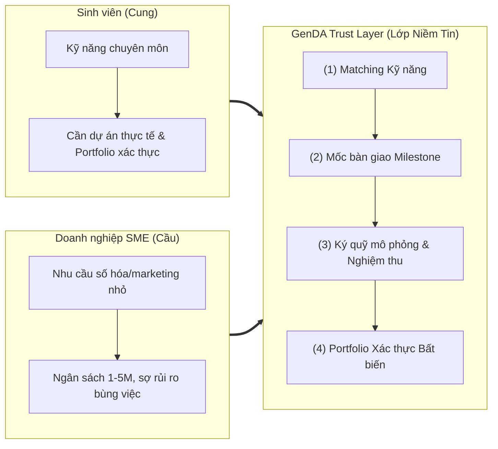
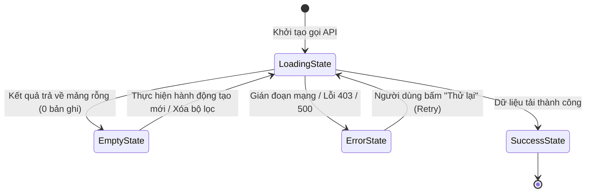
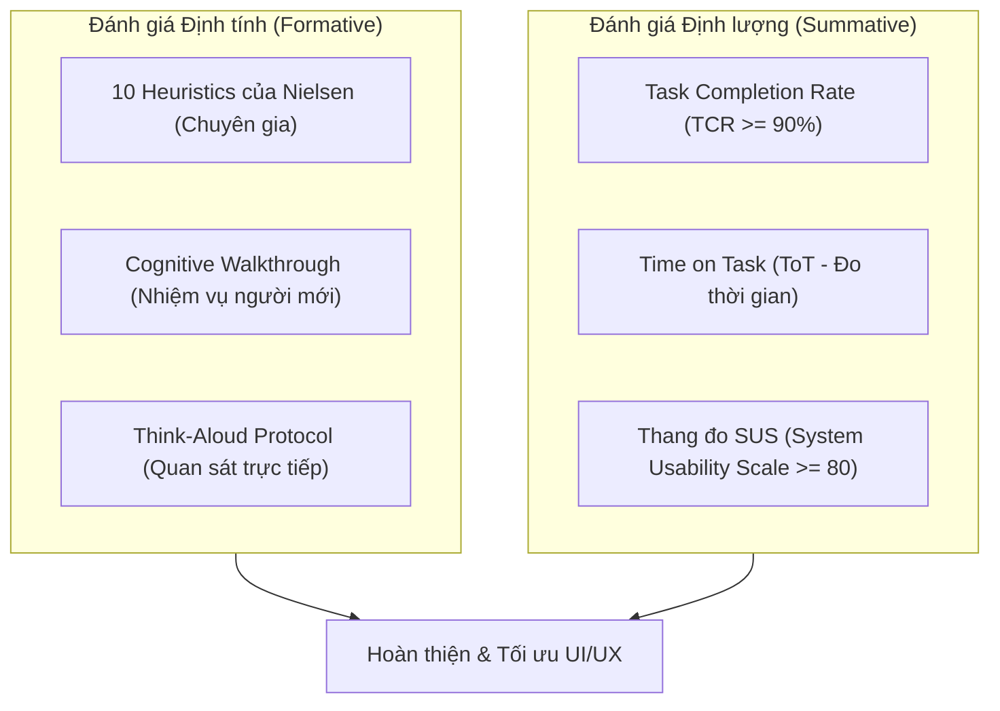

# Đặc tả Thiết kế Giao diện & Trải nghiệm Người dùng (UI/UX Design Specification) — GenDA

Tài liệu này đặc tả toàn diện kiến trúc giao diện, trải nghiệm người dùng (UI/UX), cơ sở lý luận khả dụng (HCI Foundations), hệ thống thiết kế (Design System), phân tích nhiệm vụ phân cấp (HTA) và phương pháp đánh giá khả dụng cho nền tảng **GenDA** (SkillBridge) trong phiên bản **MVP**.

Nguồn tham chiếu nền tảng:
- Nghiệp vụ & Kỹ thuật hệ thống: [`docs/requirement.md`](file:///c:/My%20Workspace/Competition/GenD/GenDA/docs/requirement.md), [`docs/architecture.md`](file:///c:/My%20Workspace/Competition/GenD/GenDA/docs/architecture.md), [`docs/domain-model.md`](file:///c:/My%20Workspace/Competition/GenD/GenDA/docs/domain-model.md), [`docs/authorization-matrix.md`](file:///c:/My%20Workspace/Competition/GenD/GenDA/docs/authorization-matrix.md), [`docs/frontend-conventions.md`](file:///c:/My%20Workspace/Competition/GenD/GenDA/docs/frontend-conventions.md).
- Tài liệu đề tài & bản sắc thương hiệu: `docs/general/[SSExFIC] Mô tả dự án vòng sơ loại GenD Arena .md`, `docs/general/SkillBridge_Slides.pdf`.
- Giáo trình & Tiêu chuẩn Khoa học Thiết kế Giao diện: Bộ bài giảng Thiết Kế Giao Diện (CSC13112 - ĐH Khoa học Tự nhiên ĐHQG-HCM, PGS.TS. Nguyễn Văn Vũ & TS. Lê Khánh Duy) và CS3240 (Interaction Design - NUS) trong `docs/general/design/`.

---

## 1. Tổng quan Sản phẩm & Triết lý Thiết kế

### 1.1. Sứ mệnh & Đề xuất Giá trị (UVP)
GenDA mang khẩu hiệu **"From Learn to Earn"** — là nền tảng số chuyên biệt đóng vai trò **Lớp Niềm Tin (Trust Layer)**, giải quyết triệt để sự đứt gãy giữa đào tạo lý thuyết và thực tiễn tuyển dụng tại TP.HCM.

Nền tảng chuẩn hóa các mini-project chuyên môn ngắn hạn (ngân sách 1.000.000 – 5.000.000 VNĐ) giữa sinh viên đại học (nguồn cung) và doanh nghiệp nhỏ & vừa (SME - nguồn cầu) thông qua quy trình 4 trụ cột khép kín:



### 1.2. Bốn Nguyên tắc Thiết kế Cốt lõi (Core Design Principles)

1. **Trust-First (Minh bạch tối đa để kiến tạo niềm tin)**: Mọi cam kết, trạng thái mốc, số tiền phân bổ và giới hạn pháp lý đều hiển thị rõ ràng. Đặc biệt, giao diện thể hiện minh bạch rằng cơ chế ký quỹ (escrow) ở bản MVP là **mô phỏng trạng thái** và thanh toán thực tế diễn ra ngoài nền tảng (FR-MIL-07) để bảo vệ tính trung thực.
2. **Duality & Empathy (Thấu cảm hai đối tượng người dùng)**:
   - *Sinh viên*: Trải nghiệm **Mobile-First**, giao diện trực quan, ngôn ngữ khích lệ học hỏi, thao tác tìm kiếm & nộp bài nhanh gọn.
   - *SME*: Tinh giản, **Frictionless**, tối ưu hiển thị trên Desktop/Tablet, tập trung kiểm soát kết quả đầu ra và tiến độ công việc.
3. **Progressive Disclosure (Tiết lộ tuần tự, giảm tải nhận thức)**: Chia nhỏ các tác vụ phức tạp (như đăng dự án hay nộp mốc bàn giao) thành các bước tuần tự (Wizard/Stepper), tránh gây ngợp nhận thức (Cognitive Overload).
4. **Radical Feedback (Phản hồi tức thì & rõ ràng)**: Bắt buộc hiện thực hóa 4 trạng thái giao diện chuẩn mực (*Loading, Empty, Error, Success*) trên 100% các màn hình tương tác với API (NFR-UX-02).

---

## 2. Cơ sở Lý luận Khả dụng & Quy tắc Vàng (HCI Foundations)

### 2.1. Năm Chiều Khả dụng của Jakob Nielsen (Usability Dimensions - LN02)

| Chiều khả dụng | Định nghĩa khoa học | Mục tiêu thiết kế đo lường trên GenDA |
| :--- | :--- | :--- |
| **1. Learnability (Khả năng học hỏi)** | Tốc độ người dùng mới thực hiện thành công tác vụ cơ bản trong lần đầu tiên tiếp xúc. | Sinh viên hoàn thành nộp đơn ứng tuyển đầu tiên trong **$\le 3$ phút**; SME đăng thành công dự án đầu tiên trong **$\le 5$ phút** mà không cần xem tài liệu hướng dẫn. |
| **2. Efficiency (Hiệu suất thao tác)** | Tốc độ hoàn thành tác vụ khi người dùng đã có kinh nghiệm sử dụng lặp lại. | SME kiểm tra và nghiệm thu một mốc bàn giao chỉ qua **$\le 3$ thao tác nhấp chuột**; sinh viên nộp lại bản sửa đổi trong **$\le 1$ phút**. |
| **3. Memorability (Khả năng ghi nhớ)** | Mức độ dễ dàng tái lập thành thạo sau một khoảng thời gian người dùng không sử dụng. | SME sau 2-3 tháng quay lại đăng dự án mới vẫn thao tác trơn tru nhờ bố cục quen thuộc và các mẫu gợi ý có sẵn. |
| **4. Low Errors & Recovery (Kiểm soát & phục hồi lỗi)** | Số lượng lỗi người dùng mắc phải, mức độ nghiêm trọng và khả năng tự phục hồi. | Tỷ lệ lỗi nộp form **$< 5\%$** nhờ kiểm tra hợp lệ tức thời (Inline Validation); có hộp thoại cảnh báo xác nhận rõ ràng trước các hành động không thể đảo ngược (chấp nhận ứng viên, xóa dự án). |
| **5. Subjective Satisfaction (Mức độ hài lòng)** | Cảm giác thoải mái, tin cậy và thẩm mỹ khi người dùng trải nghiệm hệ thống. | Điểm khảo sát độ hài lòng qua thang đo chuẩn **System Usability Scale (SUS) đạt $\ge 80$ điểm** (Xếp loại A - Excellent). |

### 2.2. Ứng dụng 8 Quy tắc Vàng của Ben Shneiderman (Shneiderman’s Eight Golden Rules - LN02)

1. **Nhất quán (Strive for consistency)**: Áp dụng đồng bộ một bảng màu, kiểu chữ, cấu trúc thẻ và vị trí nút điều hướng xuyên suốt cả 4 phân hệ (Public, Student, SME, Admin).
2. **Khả năng sử dụng phổ quát (Cater to universal usability)**: Hỗ trợ người dùng đa thiết bị (Mobile, Tablet, Desktop) và người khuyết tật thông qua chuẩn tiếp cận WCAG 2.1 AA.
3. **Phản hồi mang tính thông tin (Offer informative feedback)**: Mọi thao tác đều có phản hồi tương xứng: đổi màu khi rê chuột, spinner khi chờ đợi, toast thông báo khi hoàn tất, và banner giải thích khi có lỗi.
4. **Thiết kế hội thoại tạo cảm giác đóng gói (Design dialogs to yield closure)**: Các chuỗi tác vụ như đăng ký, đăng dự án 3 bước, nghiệm thu đều có màn hình chúc mừng/hoàn thành rõ ràng để người dùng biết tác vụ đã kết thúc.
5. **Ngăn chặn lỗi (Prevent errors & simple error handling)**: Ràng buộc nhập liệu chặt chẽ (ô ngân sách chỉ cho nhập số 1–5 triệu VNĐ, lịch chỉ cho chọn ngày tương lai); thông báo lỗi chỉ rõ nguyên nhân và cách khắc phục.
6. **Cho phép hoàn tác dễ dàng (Permit easy reversal of actions)**: Sinh viên được quyền rút đơn ứng tuyển (`WITHDRAWN`) khi chưa được duyệt (FR-APP-06); SME được sửa/xóa dự án ở trạng thái `DRAFT` (FR-PRJ-02).
7. **Trao quyền kiểm soát cho người dùng (Support internal locus of control)**: Người dùng chủ động quản lý dữ liệu cá nhân, sinh viên chủ động chọn ẩn hoặc hiện từng mục trên trang portfolio công khai (FR-CERT-04).
8. **Giảm tải trí nhớ ngắn hạn (Reduce short-term memory load)**: Tuân thủ quy tắc tâm lý học $7 \pm 2$ (Miller's Law). Không bắt người dùng nhớ thông tin từ trang trước; hiển thị tóm tắt thông tin dự án ngay tại màn hình nộp bàn giao.

### 2.3. Mô hình Tinh thần vs. Mô hình Hệ thống (Mental Model vs. System Image)
- **Mô hình Tinh thần của Sinh viên**: Kỳ vọng nhận được công việc rõ ràng, được bảo vệ tiền thù lao, không bị bùng việc và có thành quả chứng minh năng lực.
- **Mô hình Tinh thần của SME**: Kỳ vọng giao việc đúng người, nắm bắt tiến độ từng ngày, nghiệm thu hài lòng mới xác nhận giải ngân.
- **Hình ảnh Hệ thống (System Image của GenDA)**: Biến các quy tắc phức tạp thành giao diện trực quan gồm **Thanh Stepper tiến độ 7 bước**, **Thẻ Ký quỹ mô phỏng**, và **Thẻ Portfolio xác thực**.

---

## 3. Nghiên cứu Người dùng & Phân tích Nhiệm vụ Phân cấp (HTA - LN04)

### 3.1. Chân dung Người dùng Mục tiêu (User Personas)

#### Persona 1: Sinh viên — Nguyễn Hải Nam (21 tuổi)
- **Hồ sơ**: Sinh viên năm 3 CNTT, ĐH Khoa học Tự nhiên TP.HCM. Sống tại Ký túc xá ĐHQG.
- **Kỹ năng**: Lập trình Web (React, Next.js, HTML/CSS cơ bản), có khả năng tự học tốt.
- **Mục tiêu**: Có 1–2 dự án thực tế với doanh nghiệp để đưa vào CV; kiếm 2–4 triệu VNĐ/tháng trang trải sinh hoạt; được bảo đảm không bị bùng tiền.
- **Rào cản**: Thiếu kinh nghiệm phỏng vấn; sợ bị lừa đảo trên Facebook/Zalo; không cạnh tranh được trên các sàn freelance quốc tế.
- **Thiết bị**: 85% sử dụng Smartphone (Android/iOS), 15% sử dụng Laptop tại thư viện.

#### Persona 2: Doanh nghiệp SME — Chị Trần Mai Anh (34 tuổi)
- **Hồ sơ**: Chủ chuỗi 2 cửa hàng đồ uống tại Quận 1, TP.HCM. Quy mô 8 nhân sự.
- **Nhu cầu**: Cần xây dựng landing page giới thiệu thực đơn mới và lập fanpage trong 2 tuần; ngân sách dự kiến 3.000.000 VNĐ.
- **Mục tiêu**: Tìm người làm việc có trách nhiệm; kiểm soát công việc theo đầu việc rõ ràng; không muốn ký hợp đồng lao động dài hạn.
- **Rào cản**: Bận rộn quản lý kinh doanh; không hiểu sâu kỹ thuật lập trình; từng bị freelancer tự do nhận cọc rồi biến mất.
- **Thiết bị**: 60% Laptop tại cửa hàng, 40% Smartphone khi di chuyển.

#### Persona 3: Quản trị viên — Đỗ Minh Triết (24 tuổi)
- **Hồ sơ**: Thành viên đội ngũ vận hành GenDA.
- **Mục tiêu**: Duyệt dự án trong vòng 4 giờ; xác minh thẻ sinh viên chính xác; hỗ trợ xử lý khiếu nại bằng nhật ký kiểm toán.
- **Kỳ vọng**: Giao diện hàng đợi (Queue) tinh giản, hỗ trợ duyệt hàng loạt hoặc phím tắt.

---

### 3.2. Phân tích Nhiệm vụ Phân cấp (Hierarchical Task Analysis - HTA)

Theo phương pháp chuẩn hóa trong `LN04 - Task Analysis`, các tác vụ cốt lõi của GenDA được phân rã phân cấp như sau:

#### HTA 1: Doanh nghiệp Đăng Dự án Mới (Post Project)
- **Mục tiêu tổng quát (0)**: Tạo và xuất bản dự án tuyển sinh viên thực hiện.
- **Điều kiện tiên quyết (Preconditions)**: SME đã đăng nhập tài khoản có trạng thái hoạt động.
- **Cây phân rã nhiệm vụ**:
  ```text
  0. Đăng dự án mới
     1. Khởi tạo & Khai báo thông tin cơ bản
        1.1. Nhập tiêu đề dự án
        1.2. Nhập mô tả bài toán & yêu cầu công việc
        1.3. Chọn lĩnh vực hoạt động (F&B, Bán lẻ, TMĐT, Công nghệ, Khác)
     2. Thiết lập Kỹ năng & Ngân sách
        2.1. Chọn các kỹ năng yêu cầu từ danh mục chuẩn (FR-USR-05)
        2.2. Nhập ngân sách dự án (Ràng buộc: 1.000.000 - 5.000.000 VNĐ - BR-10)
        2.3. Chọn hạn chót hoàn thành (Ràng buộc: Ngày tương lai - BR-11)
     3. Thiết lập Tiêu chí Nghiệm thu & Phân bổ Mốc
        3.1. Nhập tiêu chí nghiệm thu chi tiết
        3.2. Định nghĩa các mốc bàn giao (Milestones)
        3.3. Kiểm tra tổng ngân sách các mốc bằng đúng ngân sách dự án (FR-MIL-02)
     4. Xem trước & Gửi duyệt
        4.1. Xem lại bản tóm tắt dự án
        4.2. Lưu bản nháp (DRAFT) HOẶC Bấm Gửi duyệt (DRAFT -> PENDING_REVIEW)
  ```
- **Kế hoạch thực hiện (Plan 0)**: Thực hiện tuần tự $1 \rightarrow 2 \rightarrow 3 \rightarrow 4$. Nếu có lỗi xác thực tại bước bất kỳ, dừng lại và thông báo lỗi tại trường đó.

---

#### HTA 2: Sinh viên Khám phá & Ứng tuyển Dự án (Apply for Project)
- **Mục tiêu tổng quát (0)**: Tìm dự án phù hợp với năng lực và nộp hồ sơ ứng tuyển.
- **Điều kiện tiên quyết (Preconditions)**: Sinh viên đã đăng nhập và đã được xác thực danh tính sinh viên (`VERIFIED` - BR-03).
- **Cây phân rã nhiệm vụ**:
  ```text
  0. Khám phá & Ứng tuyển dự án
     1. Tìm kiếm & Lọc dự án
        1.1. Nhập từ khóa tìm kiếm (tiêu đề, kỹ năng)
        1.2. Áp dụng bộ lọc kỹ năng (Figma, React, Content,...)
        1.3. Áp dụng bộ lọc khoảng ngân sách (1-2tr, 2-3tr, 3-5tr)
     2. Đánh giá mức độ phù hợp
        2.1. Xem thẻ dự án trong danh sách (sắp xếp theo Match Score - FR-MAT-02)
        2.2. Mở trang chi tiết dự án
        2.3. Đọc yêu cầu, tiêu chí nghiệm thu và các mốc bàn giao
     3. Nộp đơn ứng tuyển (Apply)
        3.1. Bấm nút "Ứng tuyển ngay" để mở modal nộp đơn
        3.2. Soạn thư ngỏ giới thiệu bản thân & cam kết
        3.3. Đính kèm liên kết sản phẩm minh chứng (GitHub, Behance, Drive)
        3.4. Gửi đơn ứng tuyển (Tạo bản ghi Application trạng thái SUBMITTED)
  ```
- **Kế hoạch thực hiện (Plan 0)**: Thực hiện $1 \rightarrow 2$. Nếu phù hợp thực hiện $3$. Ngoại lệ: Nếu sinh viên chưa `VERIFIED`, hệ thống chặn bước 3.1 và chuyển hướng sang trang xác thực hồ sơ (BR-03). Nếu đã nộp trước đó, chặn nộp lần 2 (FR-APP-02).

---

#### HTA 3: SME Đánh giá & Lựa chọn Ứng viên (Select Applicant)
- **Mục tiêu tổng quát (0)**: Lựa chọn 1 sinh viên duy nhất để giao thực hiện dự án.
- **Điều kiện tiên quyết (Preconditions)**: Dự án của SME đang ở trạng thái `PUBLISHED` và có ít nhất 1 ứng viên nộp đơn.
- **Cây phân rã nhiệm vụ**:
  ```text
  0. Lựa chọn ứng viên
     1. Xem danh sách ứng viên
        1.1. Mở trang quản lý ứng viên của dự án
        1.2. Xem danh sách sắp xếp ưu tiên theo điểm phù hợp (FR-MAT-03)
     2. Thẩm định năng lực từng ứng viên
        2.1. Xem hồ sơ kỹ năng, trường lớp và huy hiệu xác thực
        2.2. Đọc thư ngỏ và xem các sản phẩm minh chứng đính kèm
        2.3. Đánh dấu danh sách rút gọn (SHORTLISTED - tùy chọn)
     3. Chấp nhận ứng viên duy nhất
        3.1. Bấm nút "Chấp nhận ứng viên này"
        3.2. Đọc hộp thoại xác nhận cảnh báo (Dự án chuyển IN_PROGRESS, các ứng viên khác bị REJECTED)
        3.3. Xác nhận chọn (Thực thi transaction: Accept 1, Reject còn lại - FR-APP-05, BR-13)
        3.4. Hệ thống chuyển hướng cả 2 bên vào Workspace làm việc
  ```
- **Kế hoạch thực hiện (Plan 0)**: Thực hiện $1 \rightarrow 2 \rightarrow 3$.

---

#### HTA 4: Hợp tác Bàn giao & Nghiệm thu theo Milestone (Deliver & Accept)
- **Mục tiêu tổng quát (0)**: Sinh viên nộp sản phẩm từng mốc; SME kiểm tra, nghiệm thu và xác nhận thanh toán mô phỏng.
- **Điều kiện tiên quyết (Preconditions)**: Dự án đang ở trạng thái `IN_PROGRESS`, cả hai bên truy cập Workspace dự án.
- **Cây phân rã nhiệm vụ**:
  ```text
  0. Bàn giao & Nghiệm thu mốc
     1. Sinh viên nộp kết quả bàn giao mốc (Milestone Deliverable)
        1.1. Xem yêu cầu và hạn chót của mốc hiện tại
        1.2. Tải tệp đính kèm lên hệ thống lưu trữ (FR-MIL-09)
        1.3. Nhập liên kết demo/sản phẩm trực tuyến và ghi chú bàn giao
        1.4. Bấm nộp kết quả (Milestone chuyển sang SUBMITTED)
     2. SME thẩm định kết quả
        2.1. Nhận thông báo và mở xem tệp/liên kết bàn giao
        2.2. So sánh kết quả với Tiêu chí nghiệm thu đã thống nhất
     3. Xử lý kết quả nghiệm thu (Nhánh rẽ)
        3.1. Nếu chưa đạt: SME chọn "Yêu cầu chỉnh sửa"
             3.1.1. Nhập lý do bắt buộc cần sửa đổi (FR-MIL-04)
             3.1.2. Mốc chuyển sang CHANGES_REQUESTED
             3.1.3. Sinh viên xem góp ý, sửa đổi và nộp lại (Lưu toàn bộ lịch sử - FR-MIL-05)
        3.2. Nếu đạt: SME chọn "Nghiệm thu mốc này"
             3.2.1. Mốc chuyển sang ACCEPTED
             3.2.2. Cập nhật trạng thái thanh toán mô phỏng (FUNDED -> RELEASED)
     4. Hoàn tất dự án & Cấp Portfolio
        4.1. Khi mốc cuối cùng được ACCEPTED: Dự án chuyển sang COMPLETED (FR-PRJ-08)
        4.2. SME viết đánh giá sao và nhận xét cho sinh viên (FR-REV-01)
        4.3. Hệ thống tự động sinh mục Portfolio xác thực vào hồ sơ sinh viên (FR-CERT-01)
  ```
- **Kế hoạch thực hiện (Plan 0)**: Thực hiện $1 \rightarrow 2 \rightarrow 3$. Lặp lại $3.1 \rightarrow 1 \rightarrow 2$ nếu có yêu cầu chỉnh sửa cho đến khi $3.2$ thành công. Kết thúc bằng $4$.

---

## 4. Hệ thống Thiết kế & Nguyên lý Đồ họa Thị giác (LN08, LN09)

### 4.1. Ứng dụng Bộ Quy tắc Đồ họa CRAP (LN08, LN09)
Bốn nguyên lý cơ bản của thiết kế đồ họa được áp dụng triệt để:

```text
[ Contrast (Tương phản) ]   --> Tách bạch rõ rệt giữa nút CTA chính, thẻ nội dung và nền.
[ Repetition (Lặp lại) ]    --> Thống nhất hình dáng nút bấm, thẻ dự án và icon trên mọi trang.
[ Alignment (Căn gióng) ]  --> Căn lề trái nghiêm ngặt cho văn bản, căn phải cho số tiền/ngày tháng.
[ Proximity (Khoảng cách) ] --> Các phần tử có liên quan được nhóm gần nhau (Gestalt Law of Proximity).
```

- **Contrast (Tương phản)**:
  - Sử dụng màu thương hiệu **Warm Terracotta** (`#E06D53`) trên nền trắng để tạo điểm nhấn thị giác mạnh nhất cho nút hành động chính (Primary CTA).
  - Tỷ lệ tương phản chữ đạt tiêu chuẩn WCAG AAA ($\ge 7:1$) cho nội dung chính (`#0F172A` trên `#FAF9F6`).
- **Repetition (Lặp lại)**:
  - Cấu trúc thẻ dự án (Project Card), thẻ mốc (Milestone Card) và thẻ ứng viên (Applicant Card) dùng chung một bán kính bo góc (`rounded-lg: 16px`), màu viền (`#E2E8F0`) và độ nổi bóng (`shadow-sm`).
- **Alignment (Căn gióng)**:
  - Lưới 12 cột trên Desktop và lưới 1 cột trên Mobile.
  - Toàn bộ nhãn form, văn bản mô tả căn lề trái (Left-aligned) giúp mắt quét nhanh theo mô hình F-pattern; các con số ngân sách VNĐ căn lề phải (Right-aligned) trong bảng dữ liệu để dễ so sánh độ lớn.
- **Proximity (Khoảng cách nhóm)**:
  - Áp dụng nguyên lý Gestalt: Nhãn trường nhập liệu đặt sát ngay trên ô nhập liệu (khoảng cách 6px), trong khi khoảng cách giữa hai nhóm trường khác nhau là 20px. Thông báo lỗi đặt ngay sát dưới ô nhập liệu tương ứng.

### 4.2. Nguyên lý Tâm lý học Thị giác Gestalt (LN09)
1. **Định luật Gần gũi (Law of Proximity)**: Nhóm các mốc bàn giao và kết quả nộp bài của mốc đó vào chung một khối viền thẻ để người dùng nhận biết ngay chúng thuộc về nhau.
2. **Định luật Tương đồng (Law of Similarity)**: Mọi kỹ năng của sinh viên đều hiển thị dưới dạng viên thuốc (Tag Pills) bo tròn màu xám nhạt; mọi kỹ năng đã trùng khớp với dự án đổi sang màu xanh lá nhạt (`emerald-50`) có viền xanh để biểu thị độ tương đồng.
3. **Định luật Đóng kín & Hình/Nền (Closure & Figure/Ground)**: Sử dụng các hộp thẻ màu trắng (`#FFFFFF`) nổi bật rõ trên nền xám ấm (`#FAF9F6`) giúp mắt người dùng phân định tức thì vùng làm việc và khoảng đệm.

### 4.3. Nhận thức Hành vi: Affordance, Signifiers & Visible Constraints (LN08)
- **Perceived Affordance & Signifiers**:
  - Các nút bấm (Buttons) có hiệu ứng nổi nhẹ, bo góc, đổi màu và đổi con trỏ chuột sang dạng bàn tay (`pointer`) khi rê chuột, phát tín hiệu rõ ràng rằng "vật thể này bấm được".
  - Khu vực nộp bài (Deliverable Dropzone) có viền nét đứt (Dashed border), biểu tượng đám mây tải lên và dòng chữ "Kéo thả tệp vào đây hoặc Bấm để duyệt tệp", tạo tín hiệu nhận thức tức thì về hành vi kéo thả.
- **Visible Constraints (Ràng buộc trực quan chống lỗi)**:
  - Ô nhập ngân sách bị giới hạn cứng từ 1.000.000 đến 5.000.000 VNĐ; nếu nhập ngoài khoảng, nút gửi duyệt bị vô hiệu hóa (Disabled state) và hiện thông báo giải thích.
  - Bộ chọn ngày (Date Picker) làm mờ và khóa toàn bộ các ngày trong quá khứ và ngày hiện tại (bắt buộc chọn hạn chót trong tương lai - BR-11).

---

### 4.4. Hệ thống Semantic Tokens & Phối màu 60-30-10

Tuân thủ nguyên tắc phối màu hài hòa trong thiết kế đồ họa (60% màu nền trung tính, 30% màu cấu trúc chuyên nghiệp, 10% màu nhấn thương hiệu):

```text
[ 60% Nền Neutral ]   --> Warm Paper (#FAF9F6) & Card Surface (#FFFFFF)
[ 30% Cấu trúc Trust ] --> Slate Navy (#0F172A, #1E293B, #334155)
[ 10% Nhấn Brand & Trạng thái ] --> Terracotta (#E06D53), Emerald (#10B981), Amber (#F59E0B)
```

| Tên Token | Giá trị Hex | Ứng dụng & Ý nghĩa Tâm lý học |
| :--- | :--- | :--- |
| `color-primary-500` | `#E06D53` | **Màu thương hiệu (Warm Terracotta)**: Đại diện cho sự trẻ trung, nhiệt huyết "Learn to Earn" của sinh viên. Dùng cho nút hành động chính (Primary Action), chỉ báo tiến độ. |
| `color-primary-600` | `#C2410C` | Trạng thái Hover / Focus của nút hành động chính. |
| `color-trust-900` | `#0F172A` | **Màu doanh nghiệp (Deep Slate Navy)**: Mang lại cảm giác tin cậy, vững vàng của thể chế kinh doanh. Dùng cho Header, tiêu đề chính H1/H2. |
| `color-trust-700` | `#334155` | Màu nội dung bài viết, tiêu chí nghiệm thu, văn bản hướng dẫn. |
| `color-success-600` | `#059669` | **Màu bảo chứng (Sage Emerald)**: Huy hiệu sinh viên xác thực (`VERIFIED`), mốc nghiệm thu thành công (`ACCEPTED`), thẻ portfolio thật. |
| `color-warning-600` | `#D97706` | **Màu lưu ý (Warm Amber)**: Huy hiệu Ký quỹ mô phỏng, yêu cầu chỉnh sửa mốc (`CHANGES_REQUESTED`), dự án chờ duyệt. |
| `color-danger-600` | `#DC2626` | **Màu cảnh báo (Crimson Red)**: Từ chối dự án, hủy dự án, thông báo lỗi hệ thống. |
| `color-surface-bg` | `#FAF9F6` | Màu nền toàn trang (Warm Paper): Dịu mắt, sang trọng, giảm căng thẳng thị giác hơn màu trắng tinh. |
| `color-card-bg` | `#FFFFFF` | Nền thẻ làm việc, hộp thoại modal. |
| `color-border-subtle`| `#E2E8F0` | Đường kẻ phân cách, viền thẻ (Border). |

---

## 5. Kiến trúc Thông tin & Phong cách Tương tác (LN06, LN10)

### 5.1. Phong cách Tương tác (Interaction Styles - LN10)

Hệ thống kết hợp hài hòa 3 phong cách tương tác chính:
1. **Biểu mẫu điền thông tin (Form Fill-in)**: Dùng cho Onboarding sinh viên, Wizard đăng dự án và nộp đơn ứng tuyển. Được tối ưu với nhãn rõ ràng, tự động định dạng tiền tệ và kiểm tra hợp lệ tức thời.
2. **Thao tác trực tiếp (Direct Manipulation)**:
   - Kéo thả tập tin bàn giao vào vùng Dropzone với hiệu ứng đổi viền.
   - Kéo thanh trượt (Slider) để chọn nhanh ngân sách từ 1 đến 5 triệu đồng.
   - Thẻ gạt (Toggle Switch) để ẩn hoặc hiện mục trên trang portfolio công khai tức thì.
3. **Lựa chọn từ Menu (Menu Selection)**: Thanh điều hướng vai trò, các thẻ bộ lọc danh mục (Filter Chips) chạm để kích hoạt/hủy kích hoạt.

### 5.2. Kiến trúc Điều hướng & Sơ đồ Cấu trúc Site (Sitemap)

```text
GenDA Web Platform
├── (public) - Dành cho mọi người dùng
│   ├── /                          (Trang chủ: Giới thiệu UVP, Trust Layer, Danh mục dự án mẫu)
│   ├── /projects                  (Danh mục dự án PUBLISHED, thanh tìm kiếm & bộ lọc)
│   ├── /projects/[id]             (Chi tiết dự án, tiêu chí nghiệm thu, các mốc thanh toán)
│   ├── /portfolio/[studentSlug]   (Hồ sơ năng lực công khai, minh chứng dự án xác thực)
│   ├── /login                     (Đăng nhập tài khoản)
│   └── /register                  (Đăng ký tài khoản: Chọn vai trò STUDENT hoặc SME)
├── (student) - Dành riêng cho Sinh viên
│   ├── /student/profile           (Khai báo hồ sơ, kỹ năng, nộp thẻ sinh viên xác thực)
│   ├── /student/applications      (Quản lý trạng thái các đơn ứng tuyển cá nhân)
│   └── /student/workspace/[prjId] (Khu vực làm việc milestone, nộp bài, xem lịch sử sửa đổi)
├── (sme) - Dành riêng cho Doanh nghiệp SME
│   ├── /sme/projects              (Danh sách dự án của tôi theo trạng thái)
│   ├── /sme/projects/new          (Wizard 3 bước đăng bài toán mới)
│   ├── /sme/projects/[id]/review  (Danh sách ứng viên nộp đơn, xem Match Score & chọn 1 người)
│   └── /sme/workspace/[prjId]     (Không gian nghiệm thu milestone, duyệt mốc hoặc yêu cầu sửa)
└── (admin) - Dành cho Đội ngũ Vận hành
    ├── /admin/projects-queue      (Hàng đợi kiểm duyệt dự án PENDING_REVIEW)
    ├── /admin/verifications       (Hàng đợi duyệt minh chứng thẻ sinh viên)
    └── /admin/audit-logs          (Nhật ký kiểm toán chuyển trạng thái để xử lý khiếu nại)
```

---

## 6. Kho Mẫu Thiết kế Giao diện Chuẩn mực (UI Patterns - LN06, LN07)

Áp dụng đầy đủ các UI Patterns đã được kiểm chứng trong `LN07 - UI Design Patterns`:

```text
+-----------------------+-------------------------------------------------------------+
| Nhóm Pattern          | Mẫu thiết kế áp dụng cụ thể trên GenDA                     |
+-----------------------+-------------------------------------------------------------+
| 1. Navigation         | - Top Navigation Bar với Menu Dropdown & Active Indicator    |
|                       | - Breadcrumbs: Trang chủ > Dự án > Chi tiết mốc              |
|                       | - Fat Footer: Liên kết chính sách, quy chế TMĐT, hỗ trợ     |
|                       | - Mobile Bottom Navigation: 4 tab ngón tay cái dễ chạm      |
+-----------------------+-------------------------------------------------------------+
| 2. Forms              | - Multi-step Wizard: Đăng dự án 3 bước có Stepper           |
|                       | - Inline Validation: Kiểm tra lỗi tức thời ngay khi gõ      |
|                       | - Password Strength Meter: Đo độ mạnh mật khẩu khi đăng ký   |
|                       | - Form Fill-in: Gợi ý mờ (Placeholder), định dạng tiền tệ   |
+-----------------------+-------------------------------------------------------------+
| 3. Search & Filter    | - Single Search Input Box kèm Auto-suggestion                |
|                       | - Faceted Filters: Bộ lọc Kỹ năng, Ngân sách dạng Pill Chips|
|                       | - Clear/Reset All Filters button                             |
+-----------------------+-------------------------------------------------------------+
| 4. Feedback & Alerts  | - Toast Notification: Phản hồi hành động nhanh (3 giây)     |
|                       | - Modal Confirmation Dialog: Xác nhận chọn ứng viên duy nhất|
|                       | - Inline Notice Banner: Giải thích Ký quỹ mô phỏng          |
|                       | - Skeleton Shimmer Loading: Giữ chỗ khi tải dữ liệu         |
|                       | - Helpful Empty State: Hình minh họa + nút CTA hành động    |
+-----------------------+-------------------------------------------------------------+
```

---

## 7. Đặc tả Chi tiết 8 Màn hình Trọng yếu & Bố cục Wireframes

### 7.1. Màn hình 1: Trang chủ (Landing Page — `/`)
- **Mục tiêu**: Truyền tải UVP "From Learn to Earn", giải thích cơ chế Trust Layer và khuyến khích 2 nhóm đối tượng hành động.
- **Bố cục Wireframe**:
  ```text
  +-------------------------------------------------------------------------+
  | [Logo GenDA]  Khám phá dự án   Về Trust Layer       [Đăng nhập] [Tham gia]|
  +-------------------------------------------------------------------------+
  |                                                                         |
  |      FROM LEARN TO EARN: DỰ ÁN THẬT - NĂNG LỰC THẬT                     |
  |   Nền tảng kết nối Sinh viên với Doanh nghiệp SME qua mini-project      |
  |           ngắn hạn, bảo vệ bởi Cơ chế Ký quỹ & Milestone                |
  |                                                                         |
  |   [ Tôi là Sinh viên tìm dự án ]       [ Tôi là Doanh nghiệp cần việc ] |
  |                                                                         |
  +-------------------------------------------------------------------------+
  |  4 LỚP BẢO VỆ NIỀM TIN (TRUST LAYER):                                   |
  |  [ (1) Ghép nối kỹ năng ]   [ (2) Milestone minh bạch ]                 |
  |  [ (3) Ký quỹ an toàn   ]   [ (4) Portfolio xác thực  ]                 |
  +-------------------------------------------------------------------------+
  |  DỰ ÁN MỚI NHẤT DÀNH CHO BẠN (Ngân sách chuẩn 1.000.000 - 5.000.000 đ)  |
  |  +---------------------------+   +---------------------------+          |
  |  | Thiết kế Landing Page F&B |   | Viết 10 bài Content SEO   |          |
  |  | SME: The Coffee Lab       |   | SME: Thời trang Zen       |          |
  |  | Ngân sách: 2.500.000 đ    |   | Ngân sách: 1.500.000 đ    |          |
  |  | Kỹ năng: Figma, React     |   | Kỹ năng: Copywriting, SEO |          |
  |  | [Xem chi tiết & Apply]    |   | [Xem chi tiết & Apply]    |          |
  |  +---------------------------+   +---------------------------+          |
  +-------------------------------------------------------------------------+
  | FAT FOOTER:                                                             |
  | Về GenDA | Quy chế sàn TMĐT | Chính sách bảo mật | Quy trình khiếu nại  |
  | Bản quyền thuộc về Đội thi from L to E - Cuộc thi GenD Arena 2026       |
  +-------------------------------------------------------------------------+
  ```

---

### 7.2. Màn hình 2: Hồ sơ & Xác thực Sinh viên (`/student/profile`)
- **Mục tiêu**: Thu thập hồ sơ năng lực (FR-USR-01) và xác minh sinh viên chính quy (FR-USR-02, FR-USR-03) để đảm bảo luật BR-03.
- **Thành phần giao diện**:
  - **Visual Verification Banner**:
    - Nếu `UNVERIFIED`: Thẻ màu xám kèm thông báo: *"Bạn cần xác thực tài khoản sinh viên để có thể nộp đơn ứng tuyển dự án."*
    - Nếu `PENDING`: Thẻ màu hổ phách (`amber-50`): *"Minh chứng đang được BQT xét duyệt trong 24 giờ."*
    - Nếu `VERIFIED`: Thẻ màu xanh lá (`emerald-50`): *"Đã xác thực sinh viên chính quy — Sẵn sàng nhận dự án."* kèm tích xanh.
    - Nếu `REJECTED`: Thẻ màu đỏ (`rose-50`): *"Minh chứng bị từ chối: [Lý do từ Admin]"* kèm nút tải lại ảnh mới.
  - **Tabs Phương thức Minh chứng**:
    - *Tab 1*: Nhập email đuôi trường (`@hcmus.edu.vn`, `@uel.edu.vn`,...).
    - *Tab 2*: Vùng kéo thả tải ảnh Thẻ sinh viên còn hiệu lực (JPG/PNG tối đa 5MB).
  - **Chọn danh mục kỹ năng chuẩn (FR-USR-05)**: Dropdown chọn kỹ năng có sẵn (React, Next.js, Figma, SEO, Content...), không nhập tự do.

---

### 7.3. Màn hình 3: Wizard Đăng Dự án phía SME (`/sme/projects/new`)
- **Mục tiêu**: Giúp chủ doanh nghiệp tạo đề bài chuẩn mực trong 3 bước, bảo đảm các luật BR-01, BR-10, BR-11, FR-MIL-02.
- **Bố cục Stepper 3 bước**:
  ```text
  [ Bước 1: Mô tả bài toán ] ---> [ Bước 2: Kỹ năng & Ngân sách ] ---> [ Bước 3: Mốc & Nghiệm thu ]
  ```
  - **Bước 1**: Nhập tiêu đề, lĩnh vực kinh doanh, mô tả chi tiết yêu cầu.
  - **Bước 2**:
    - Chọn kỹ năng cần tuyển từ danh sách chuẩn.
    - Nhập ngân sách: Có ô nhập số tiền và thanh trượt trực quan giới hạn từ **1.000.000 VNĐ** đến **5.000.000 VNĐ** (BR-10). Tự động định dạng phân cách hàng nghìn (`2.500.000 đ`).
    - Chọn ngày hạn chót: Date picker chặn chọn ngày quá khứ (BR-11).
  - **Bước 3**:
    - Khai báo tiêu chí nghiệm thu rõ ràng (ví dụ: "Có mã nguồn, chạy không lỗi, có tài liệu hướng dẫn").
    - Tạo các Milestone bàn giao: Tự động kiểm tra tổng ngân sách các mốc bằng 100% ngân sách dự án (FR-MIL-02).
    - Nút **"Lưu bản nháp"** hoặc **"Gửi duyệt ngay (`PENDING_REVIEW`)"**.

---

### 7.4. Màn hình 4: Khám phá & Lọc Dự án (`/projects`)
- **Mục tiêu**: Sinh viên tìm kiếm dự án, xem điểm phù hợp và ứng tuyển (FR-PRJ-05, FR-MAT-01, FR-APP-01).
- **Thành phần giao diện**:
  - **Thanh tìm kiếm & Bộ lọc (Faceted Search Bar)**:
    - Ô tìm kiếm từ khóa với gợi ý tự động (Auto-suggestion).
    - Bộ lọc Kỹ năng (Figma, React, Content, Python...).
    - Bộ lọc Khoảng ngân sách (1–2 triệu, 2–3 triệu, 3–5 triệu).
  - **Thẻ dự án (Project Card)**:
    - Hiển thị tên SME, tiêu đề bài toán, ngân sách VNĐ và hạn chót.
    - **Điểm phù hợp kỹ năng (Match Score Breakdown)**: Ví dụ: `[ 90% Match: Trùng 3/3 kỹ năng của bạn ]`.
  - **Hộp thoại Ứng tuyển (Apply Modal Dialog)**:
    - Nếu sinh viên chưa xác thực: Hiển thị thông báo màu hổ phách chặn ứng tuyển và nút chuyển sang trang xác thực hồ sơ (BR-03).
    - Nếu đã xác thực: Form nhập Thư ngỏ (Cover letter) và Liên kết sản phẩm minh chứng đã từng làm. Nút bấm "Gửi đơn ứng tuyển".

---

### 7.5. Màn hình 5: Xem & Lựa chọn Ứng viên phía SME (`/sme/projects/[id]/review`)
- **Mục tiêu**: SME so sánh các ứng viên và chấp nhận đúng 1 sinh viên (FR-APP-03, FR-APP-05, BR-05, BR-13).
- **Bố cục giao diện**:
  - Danh sách ứng viên được hệ thống tự động sắp xếp giảm dần theo **Điểm phù hợp Match Score** (FR-MAT-03).
  - Mỗi thẻ ứng viên hiển thị: Tên sinh viên, trường đại học, huy hiệu thẻ SV đã xác thực, thư ngỏ và link sản phẩm mẫu.
  - Nút **"Chấp nhận ứng viên này"**:
    - Nhấp nút sẽ bật **Modal Xác nhận Quan trọng (Irreversible Confirmation Dialog)**:
      > *"Bạn có chắc chắn muốn chọn ứng viên **Nguyễn Hải Nam**?*  
      > *Khi bạn xác nhận: Dự án sẽ chuyển sang trạng thái **Đang thực hiện (IN_PROGRESS)**, và toàn bộ các ứng viên còn lại sẽ tự động nhận thông báo từ chối."*
    - Khi SME nhấn xác nhận: Hệ thống thực thi giao dịch, chuyển trạng thái và mở ngay Workspace hợp tác.

---

### 7.6. Màn hình 6: Không gian Quản lý Milestone & Bàn giao (`/workspace/[id]`)
- **Mục tiêu**: Trung tâm cộng tác có cấu trúc giữa Sinh viên và SME (FR-MIL-01..09).
- **Bố cục Wireframe**:
  ```text
  +-------------------------------------------------------------------------+
  | [DỰ ÁN: Xây dựng Landing Page Nông Sản]        Trạng thái: ĐANG THỰC HIỆN|
  +-------------------------------------------------------------------------+
  | BANNER THÔNG BÁO KÝ QUỸ MÔ PHỎNG (SIMULATED ESCROW - FR-MIL-07):        |
  | [!] Lưu ý: Ở phiên bản MVP, cơ chế ký quỹ được ghi nhận mô phỏng trên   |
  |     hệ thống để đảm bảo tiến độ. Thanh toán thực tế diễn ra trực tiếp.  |
  |                                                                         |
  | Trạng thái quỹ: [ PENDING_FUNDING ] -> [ * FUNDED * ] -> [ RELEASED ]   |
  +-------------------------------------------------------------------------+
  | TIẾN ĐỘ CÁC MỐC (MILESTONE STEPPER):                                    |
  | (1) Wireframe UI (1.000.000 đ) ---------> [ ĐÃ NGHIỆM THU ]             |
  | (2) Lập trình Web Responsive (2.000.000 đ) [ ĐANG THỰC HIỆN ]          |
  +-------------------------------------------------------------------------+
  | CHI TIẾT MỐC 2: Lập trình Web Responsive                                |
  | Hạn chót: 28/10/2026 | Ngân sách mốc: 2.000.000 VNĐ                     |
  | Tiêu chí: Chạy tốt trên Chrome, Safari; mã nguồn nộp qua GitHub.        |
  |                                                                         |
  | KHU VỰC BÀN GIAO CỦA SINH VIÊN:                                         |
  | [ Kéo thả tệp đính kèm mã nguồn/tài liệu (Dropzone) ]                   |
  | Link sản phẩm thực tế: [ https://landing-demo.vercel.app              ] |
  | Ghi chú bàn giao:      [ Đã hoàn thành các mục theo tiêu chí...       ] |
  | [ Gửi kết quả bàn giao (Chuyển sang SUBMITTED) ]                        |
  |                                                                         |
  | DÒNG THỜI GIAN LỊCH SỬ BÀN GIAO (IMMUTABLE AUDIT TRAIL - FR-MIL-05):    |
  | - Lần 1 (22/10): Sinh viên nộp -> SME yêu cầu sửa: "Font chữ mobile nhỏ"|
  | - Lần 2 (25/10): Sinh viên nộp cập nhật -> [Đang chờ SME nghiệm thu]   |
  |                                                                         |
  | THAO TÁC CỦA DOANH NGHIỆP:                                              |
  | [ Yêu cầu chỉnh sửa (Bắt buộc nhập lý do) ]       [ NGHIỆM THU MỐC NÀY ]|
  +-------------------------------------------------------------------------+
  ```

---

### 7.7. Màn hình 7: Nghiệm thu, Đánh giá & Portfolio Xác thực (`/portfolio/[slug]`)
- **Mục tiêu**: Đóng vòng đời dự án và tạo ra bằng chứng năng lực thực tế có thể kiểm chứng cho sinh viên (FR-REV-01..03, FR-CERT-01..05).
- **Quy trình đóng dự án**:
  1. Khi mốc cuối cùng được SME nghiệm thu: Dự án chuyển sang `COMPLETED`.
  2. Hệ thống hiển thị form đánh giá 1 chiều: SME chấm điểm sao (1–5 sao) và nhận xét thái độ, chuyên môn của sinh viên (FR-REV-01).
  3. Hệ thống **tự động sinh (System-generated)** một mục Portfolio xác thực không thể chỉnh sửa khống (FR-CERT-02).
- **Thẻ Portfolio Xác thực (Verified Portfolio Card Layout)**:
  ```text
  +-----------------------------------------------------------------------+
  | [TÍCH XANH GENDA] DỰ ÁN ĐÃ ĐƯỢC XÁC THỰC HOÀN THÀNH                   |
  | Dự án: Xây dựng Landing Page giới thiệu sản phẩm nông sản sạch        |
  | Đơn vị giao việc: Công ty Cổ phần Nông sản Eco (SME tại TP.HCM)       |
  | Thời gian: 10/10/2026 – 28/10/2026 | Vai trò: Frontend Developer      |
  | Kỹ năng chứng minh: Next.js, Tailwind CSS, Responsive Web             |
  |                                                                       |
  | ĐÁNH GIÁ CỦA DOANH NGHIỆP:                                            |
  | "Nam làm việc rất trách nhiệm, hoàn thành đúng tiến độ và giao diện   |
  | chạy rất mượt mà trên di động. Rất khuyến khích hợp tác!"             |
  | Đánh giá: [ ★★★★★ 5.0 / 5.0 ]                                         |
  |                                                                       |
  | Minh chứng: [Xem Demo trực tuyến] | [Xem mã nguồn dự án]             |
  | Quyền sở hữu: Hai bên đã thỏa thuận quyền công khai portfolio.        |
  +-----------------------------------------------------------------------+
  ```
- **Trang Portfolio Công khai (`/portfolio/[studentSlug]`)**:
  - Thiết kế bố cục lưới Bento Grid hiện đại (tham chiếu Contra/Readcv).
  - Có nút chuyển đổi (Toggle Switch) để sinh viên chủ động chọn Ẩn/Hiện từng dự án trên trang công khai (FR-CERT-04).
  - Có nút "Sao chép liên kết hồ sơ" để sinh viên gắn trực tiếp vào CV hoặc LinkedIn.

---

### 7.8. Màn hình 8: Bảng Điều khiển Quản trị viên (`/admin`)
- **Mục tiêu**: Hỗ trợ đội ngũ vận hành kiểm soát rủi ro, duyệt hàng đợi và tra cứu kiểm toán (FR-ADM-01..04).
- **Giao diện 3 tab chuyên biệt**:
  1. **Hàng đợi Duyệt Dự án (`PENDING_REVIEW`)**: Xem nội dung dự án; nút "Duyệt xuất bản (`PUBLISHED`)" hoặc "Từ chối kèm lý do bắt buộc" (quay về `DRAFT`).
  2. **Hàng đợi Duyệt Thẻ Sinh viên (`PENDING`)**: Xem ảnh thẻ/email trường; nút "Xác thực (`VERIFIED`)" hoặc "Từ chối kèm lý do" để sinh viên nộp lại.
  3. **Nhật ký Kiểm toán (Audit Logs - FR-ADM-02, FR-ADM-03)**: Bảng dữ liệu ghi nhận mọi biến động trạng thái gồm: Tên tác nhân, Vai trò, Hành động, Thời điểm và Lý do ghi nhận.

---

## 8. Chuẩn mực Xử lý 4 Trạng thái Giao diện (The 4 UI States - NFR-UX-02)

Mọi thành phần kết nối API đều bắt buộc phải có thiết kế riêng cho 4 trạng thái:



### 8.1. Trạng thái Đang tải (Loading State — Skeleton Shimmer Pattern)
- **Quy tắc**: Tuyệt đối không dùng vòng quay spinner đơn điệu giữa trang trắng.
- **Hiện thực**: Sử dụng khung xương xám nhạt (`#E2E8F0`) có hiệu ứng quét sáng (Shimmer) mô phỏng chính xác hình khối của thẻ dự án sắp hiển thị. Giúp loại bỏ hoàn toàn hiện tượng giật bố cục (CLS - Cumulative Layout Shift).

### 8.2. Trạng thái Trống (Empty State — Helpful Guidance Pattern)
- **Quy tắc**: Không để màn hình trắng trơn gây hoang mang.
- **Hiện thực**: Hình minh họa vector thân thiện, dòng thông điệp tích cực (ví dụ: *"Chưa có dự án nào phù hợp với bộ lọc này"*), lời khuyên cụ thể (*"Hãy thử xóa bớt kỹ năng để xem nhiều cơ hội hơn"*), và nút bấm hành động CTA (*"Xóa bộ lọc"*).

### 8.3. Trạng thái Lỗi (Error State — Humane & Actionable Pattern)
- **Quy tắc**: Không hiển thị các đoạn mã kỹ thuật khó hiểu (như "AxiosError", "Uncaught TypeError").
- **Hiện thực**: Thông báo tiếng Việt rõ ràng, giải thích nguyên nhân, hiển thị mã định danh truy vết `Mã yêu cầu (Request ID): req_4821a` (NFR-OPS-02), và nút **"Thử lại ngay" (Retry button)** để gọi lại API mà không cần tải lại toàn bộ trang.

### 8.4. Trạng thái Thành công (Success State — Closure & Next Step Pattern)
- **Quy tắc**: Mang lại cảm giác hoàn tất tác vụ (Closure) và hướng dẫn bước tiếp theo.
- **Hiện thực**: Toast xanh lá báo thành công kèm thông điệp rõ ràng, cập nhật giao diện ngay lập tức và gợi ý bước tiếp theo trong vòng đời dự án.

---

## 9. Kế hoạch Đánh giá Khả dụng Khoa học (Usability Evaluation Plan - LN12, CS3240)

Để đảm bảo thiết kế đạt chuẩn trước khi đưa vào vận hành chính thức, GenDA áp dụng quy trình kiểm thử khả dụng kết hợp cả định tính và định lượng:



### 9.1. Đánh giá Chuyên gia (Heuristic Evaluation theo 10 Nguyên lý của Nielsen)
Nhóm phát triển và các chuyên gia UI/UX đánh giá độc lập giao diện dựa trên 10 nguyên lý kinh điển của Jakob Nielsen, gán thang điểm mức độ nghiêm trọng (Severity Ratings) từ 0 đến 4:
- **Mức 0**: Không phải vấn đề khả dụng.
- **Mức 1 (Cosmetic)**: Lỗi thẩm mỹ nhỏ, chỉ sửa nếu còn thời gian.
- **Mức 2 (Minor)**: Lỗi nhỏ, gây chút bất tiện nhưng người dùng vẫn tự hoàn thành được.
- **Mức 3 (Major)**: Lỗi lớn, làm chậm đáng kể hoặc khiến nhiều người dùng bối rối. Cần ưu tiên sửa ngay.
- **Mức 4 (Catastrophic)**: Lỗi thảm họa, chặn đứng người dùng hoàn thành tác vụ (ví dụ: không bấm được nút nộp bài). Bắt buộc phải sửa trước khi phát hành.

### 9.2. Duyệt Nhận thức (Cognitive Walkthrough)
Đánh giá từng bước của 4 cây nhiệm vụ HTA đối với người dùng lần đầu:
1. *Người dùng có biết mình cần làm gì ở bước này không?*
2. *Thao tác thực hiện có hiển thị rõ ràng trên màn hình không (Affordance)?*
3. *Người dùng có nhận ra thao tác đó dẫn tới mục tiêu của mình không?*
4. *Sau khi thao tác, hệ thống có phản hồi rõ ràng là đã thành công chưa?*

### 9.3. Thử nghiệm Người dùng Định lượng (Controlled Usability Testing)
Thử nghiệm trên nhóm mẫu thử nghiệm giai đoạn Soft-launch (15–25 Sinh viên và 5–8 SME tại TP.HCM) với các chỉ số mục tiêu:
- **Tỷ lệ Hoàn thành Nhiệm vụ (Task Completion Rate - TCR)**: Mục tiêu $\ge 90\%$ trên cả 4 tác vụ HTA cốt lõi.
- **Thời gian Thực hiện Nhiệm vụ (Time on Task - ToT)**:
  - SME đăng dự án mới qua Wizard: Mục tiêu $\le 5$ phút.
  - Sinh viên tìm và nộp đơn ứng tuyển: Mục tiêu $\le 3$ phút.
  - SME nghiệm thu một mốc bàn giao: Mục tiêu $\le 2$ phút.
- **Độ Hài lòng Hệ thống (System Usability Scale - SUS)**: Khảo sát bộ 10 câu hỏi chuẩn mực sau khi hoàn thành buổi thử nghiệm; mục tiêu đạt **$\ge 80 / 100$ điểm** (Tương đương mức xuất sắc - Grade A).

---

## 10. Ma trận Truy vết Thiết kế (Design Traceability Matrix)

Bảng đối chiếu đảm bảo 100% các yêu cầu chức năng (FR), bất biến miền (BR) và yêu cầu phi chức năng (NFR) từ [`docs/requirement.md`](file:///c:/My%20Workspace/Competition/GenD/GenDA/docs/requirement.md) đều được hiện thực hóa trọn vẹn trong thiết kế:

| Mã Yêu cầu | Nội dung Yêu cầu Nghiệp vụ | Thành phần Giao diện & Mẫu Thiết kế Đảm nhiệm |
| :--- | :--- | :--- |
| **FR-AUTH-01..05** | Đăng ký, đăng nhập, chọn vai trò SV/SME, xác minh email | Màn hình `/login`, `/register`, Password Strength Meter Pattern |
| **FR-USR-01..03** | Hồ sơ SV, nộp thẻ SV/email trường, duyệt minh chứng | Màn hình `/student/profile`, Thẻ Visual Verification Badge |
| **FR-USR-04..05** | Hồ sơ SME, chọn kỹ năng từ danh mục hệ thống chuẩn | Màn hình Profile & Wizard, Component Tag Multi-select kỹ năng |
| **FR-PRJ-01..04** | SME tạo dự án nháp, gửi duyệt; Admin duyệt/từ chối kèm lý do | Màn hình 3 (Wizard 3 bước) & Màn hình 8 (Admin Queue) |
| **FR-PRJ-05..07** | Xem danh sách PUBLISHED, lọc phân trang, nhận ứng viên | Màn hình 4 (Thẻ dự án, Faceted Filter) & Màn hình 5 |
| **FR-APP-01..07** | SV ứng tuyển kèm thư ngỏ; SME xem và chọn 1 bạn duy nhất | Màn hình 4 (Apply Modal) & Màn hình 5 (Applicant Selection Card) |
| **FR-MAT-01..04** | Tính điểm phù hợp kỹ năng (Match Score); sắp xếp gợi ý | Thẻ hiển thị Match Score Badge trực quan (ví dụ: `92% Match`) |
| **FR-MIL-01..05** | Định nghĩa mốc, tổng ngân sách khớp, SV nộp bài, lưu lịch sử | Màn hình 6 (Workspace, Milestone Stepper & Immutable History) |
| **FR-MIL-06..07** | Trạng thái ký quỹ mô phỏng, banner thông báo minh bạch | Màn hình 6 (Banner Ký quỹ mô phỏng & Stepper FUNDED -> RELEASED) |
| **FR-REV-01..03** | SME đánh giá SV sau khi hoàn thành, hiển thị công khai | Màn hình 7 (Form đánh giá 1 chiều 5 sao + nhận xét thực tế) |
| **FR-CERT-01..05** | Hệ thống tự sinh Portfolio xác thực, link chia sẻ công khai | Màn hình 7 (Thẻ Verified Portfolio Card & Bento Grid Profile Slug) |
| **FR-ADM-01..04** | Hàng đợi duyệt dự án, duyệt thẻ sinh viên, nhật ký kiểm toán | Màn hình 8 (Bảng điều khiển Quản trị viên 3 tab chuyên biệt) |
| **BR-01..14** | Các bất biến miền (ngân sách 1-5M, SV verified mới được nộp...)| Visible Constraints (khóa nút, slider giới hạn, date picker) |
| **NFR-UX-01** | Giao diện tiếng Việt, Mobile-First, Semantic HTML, bàn phím | Hệ thống phông chữ, lưới bố cục và chuẩn tiếp cận WCAG 2.1 AA |
| **NFR-UX-02** | Bắt buộc 4 trạng thái: Loading, Empty, Error, Success | Mục 8 (Skeleton Shimmer, Empty CTA, Error Request ID, Success) |
