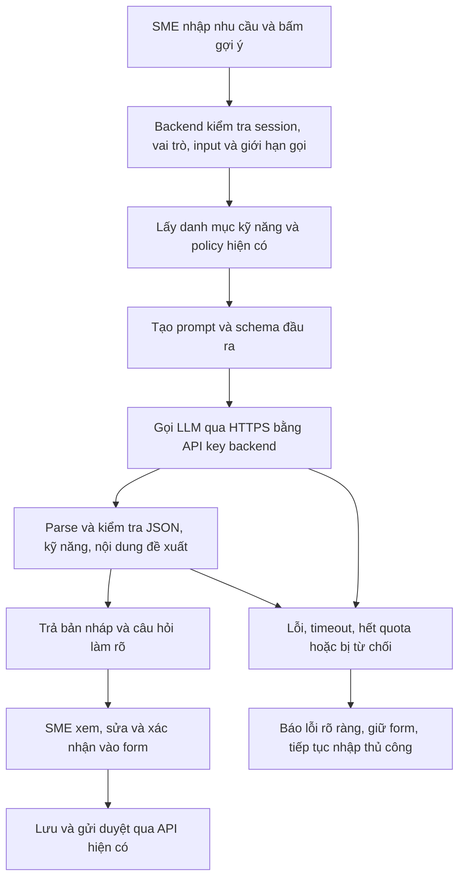

# GenDA — Hiện trạng công nghệ và việc cần làm để MVP dùng được

> **Mục đích:** biết phần nào đã implement, phần nào mới là demo/ý tưởng, và cần bổ sung gì để hoàn thiện sản phẩm.
>
> **Ngày đối chiếu code:** 10/10/2026. “Đã implement” trong tài liệu có nghĩa tìm thấy code và kết nối tương ứng, **không có nghĩa đã nghiệm thu bản live**. Lượt này chỉ sửa báo cáo.

## 1. Đọc nhanh: tình hình hiện tại

| Câu hỏi | Trả lời |
| --- | --- |
| Có frontend và backend thật chưa? | Có: Next.js/React/TypeScript + Java/Spring Boot + PostgreSQL. |
| Backend thật làm được đến đâu? | Tài khoản → hồ sơ/CV → tạo/duyệt dự án → ứng tuyển → SME chọn một người. |
| Vòng đời dự án đã chạy thật từ đầu đến cuối chưa? | Chưa. Bàn giao, yêu cầu sửa, nghiệm thu, đánh giá và thanh toán mô phỏng còn ở UI demo. |
| Matching có thật chưa? | Xếp ứng viên cho SME có backend thật. Điểm phù hợp trên trang tìm dự án/chi tiết vẫn dùng hồ sơ mẫu. |
| Có AI trong sản phẩm chưa? | Chưa thấy tích hợp mô hình AI, API key AI hoặc pipeline LLM trong mã ứng dụng/config được rà soát. Gen hiện là bộ quy tắc. |
| MVP cần công nghệ mới để hoàn thiện không? | Phần lớn không: cần implement các nghiệp vụ còn thiếu trên stack hiện có. Storage cho tệp bàn giao và dịch vụ AI là hai phần bổ sung riêng. |
| AI có bắt buộc để MVP dùng được không? | Không theo phạm vi hiện hành. AI là tính năng đề xuất thêm; không thay thế phần bàn giao/nghiệm thu còn thiếu. |

**Quy ước trạng thái:**

- **Đã implement:** có code thực hiện và API/kết nối tương ứng.
- **Một phần:** đã có một đoạn của tính năng, đoạn còn lại thiếu hoặc dùng dữ liệu mẫu.
- **Demo:** có UI/hành vi trong trình duyệt hoặc mock, chưa có backend nghiệp vụ tương ứng.
- **Chưa implement:** có yêu cầu/ý tưởng nhưng chưa tìm thấy luồng thực hiện.
- **Đề xuất mới:** hướng khuyến nghị trong báo cáo, chưa phải tính năng đã làm hay quyết định phạm vi đã chốt.

## 2. Công nghệ đang dùng thật và dùng ở đâu

### 2.1. Stack ứng dụng: đã có code sử dụng

| Công nghệ | Trạng thái | Đã dùng thật ở đâu? | Chưa làm được gì chỉ nhờ có công nghệ này? |
| --- | --- | --- | --- |
| Next.js 15 + React 19 + TypeScript | Đã implement | Màn hình đăng nhập, hồ sơ, dự án, ứng tuyển và xét ứng viên; trang catalog gọi backend | Workspace và Gen cũng được dựng bằng React nhưng dữ liệu nghiệp vụ còn demo |
| Java 21 + Spring Boot 4, modular monolith | Đã implement | Các module `auth`, `users`, `projects`, `applications`; admin gọi nghiệp vụ duyệt dự án | Chưa có backend thực thi milestone, bàn giao và đánh giá; tên module trong architecture không chứng minh có implementation |
| PostgreSQL + Spring Data JPA/Hibernate | Đã implement | Tài khoản/session, hồ sơ, CV, dự án/kế hoạch milestone, audit duyệt, đơn ứng tuyển, lịch sử kinh nghiệm | Bảng kế hoạch milestone chưa đồng nghĩa có lịch sử bàn giao/nghiệm thu |
| Flyway | Đã implement | Migration SQL trong backend; chạy khi startup, Hibernate cấu hình `validate` | Schema mới cho nghiệp vụ còn thiếu vẫn cần migration mới |
| Spring Security + BCrypt + JWT/HttpOnly cookies + CSRF | Đã implement | Đăng nhập, refresh/logout, bảo vệ API; backend kiểm tra vai trò/chủ sở hữu | UI kiểm tra vai trò hoặc localStorage không thay thế phân quyền backend |
| springdoc OpenAPI + `openapi-typescript` + `openapi-fetch` | Đã implement | Backend xuất contract; `packages/api-client` có snapshot/kiểu sinh; frontend dùng cho API thật | Endpoint mới vẫn phải bổ sung contract và sinh lại client |
| Apache PDFBox | Đã implement | Đọc cấu trúc CV để kiểm tra file có mở được, có trang, không khóa mật khẩu | Chưa OCR, trích nội dung CV, chấm năng lực, xác minh kinh nghiệm hoặc phân tích bằng AI |
| Quy tắc matching bằng Java | Đã implement một phần | `SkillMatch` tính tỷ lệ kỹ năng khớp; SME xem ứng viên xếp theo điểm | Chưa có recommendation cá nhân hóa hoàn chỉnh cho contributor |
| Quy tắc XP/hạng bằng Java | Đã implement một phần | `ExperienceService` đọc lịch sử trong database và suy ra XP/hạng; frontend gọi API standing | Chưa có luồng nghiệp vụ ghi kinh nghiệm từ một dự án mới vừa nghiệm thu |

CV hiện lưu metadata và nội dung trong **PostgreSQL**. Upload kiểm tra dung lượng tối đa 2 MB, đuôi/MIME/chữ ký PDF và cấu trúc file. `READY` là kết quả kiểm tra kỹ thuật; không phải xác minh nội dung hoặc bằng chứng quét malware đầy đủ.

Nguồn: [architecture](architecture.md), [backend dependencies](../apps/api/pom.xml), [frontend dependencies](../apps/web/package.json), [API client](../packages/api-client/package.json), [CV service](../apps/api/src/main/java/vn/skillbridge/users/application/CvService.java).

### 2.2. Công nghệ phục vụ chạy, kiểm thử và triển khai

| Công nghệ/dịch vụ | Điều đã tồn tại trong repo | Kết luận đúng |
| --- | --- | --- |
| Docker Compose | Có cấu hình frontend/backend/PostgreSQL, Dockerfile và healthcheck | Đã có cấu hình chạy local; lượt này chưa chạy lại stack |
| Vercel | Có cấu hình frontend và domain ghi trong deployment docs | Có hướng triển khai; chưa xác nhận tính năng hiện tại trên live |
| Render | Có `render.yaml`, Docker backend, healthcheck, cấu hình env | Có cấu hình triển khai; chưa nghiệm thu dịch vụ live |
| Supabase | Docs hướng dẫn dùng PostgreSQL qua JDBC; backend nhận datasource từ env | Hướng dùng làm database được tài liệu hóa; chưa kiểm tra kết nối live. Không thấy tích hợp Supabase Storage cho bàn giao |
| JUnit/MockMvc/ArchUnit | Có test nghiệp vụ, HTTP và ranh giới module | Có code kiểm thử; không tự chứng minh mọi luồng đã đạt |
| Vitest/Playwright | Có unit test frontend và E2E, gồm cả demo và API thật | Cần phân biệt test demo với bằng chứng backend/persistence |
| GitHub Actions | Có workflow backend verify, kiểm tra drift contract; frontend lint/typecheck/test/build | CI được cấu hình; chưa xem trạng thái run hiện tại |
| Pipeline AI/ML | Chưa thấy | Không có pipeline huấn luyện, embedding hay inference LLM hiện tại |

**Pipeline CI/build đã có khác với pipeline xử lý AI.** Việc có CI không có nghĩa sản phẩm có AI.

Nguồn: [Compose](../compose.yaml), [Render Blueprint](../render.yaml), [deployment](deployment.md), [testing strategy](testing-strategy.md), [backend CI](../.github/workflows/backend-ci.yml), [frontend CI](../.github/workflows/frontend-ci.yml).

## 3. Tính năng nào đang chạy bằng API thật, tính năng nào chỉ demo?

| Tính năng / màn hình | Trạng thái | Bằng chứng hiện tại | Việc còn thiếu |
| --- | --- | --- | --- |
| Đăng ký, đăng nhập, refresh, logout | Đã implement | `/api/v1/auth/*`, frontend gọi API session | Nghiệm thu môi trường triển khai; OTP/duyệt doanh nghiệp đang được hoãn |
| Hồ sơ contributor, học vấn, CV | Đã implement | `/api/v1/users/me/profile`, `education`, `cv` | Kiểm chứng quyền và lưu dữ liệu trên deploy |
| Hồ sơ SME | Đã implement | `/api/v1/users/me/sme-profile` | Thông tin tự khai, chưa xác minh doanh nghiệp |
| Xem/lọc dự án công khai | Đã implement | `GET /api/v1/projects`, `GET /api/v1/projects/{id}`; frontend gọi backend | Tách phần điểm phù hợp dùng mock khỏi dữ liệu dự án thật |
| SME tạo/sửa nháp, gửi duyệt; admin publish/return | Đã implement | API SME/admin; policy ngân sách/cấp độ và audit | Nghiệm thu đầy đủ persistence, rollback và thao tác đồng thời |
| Ứng tuyển, rút đơn, xem đơn | Đã implement | `/api/v1/applications`, `/me`, thao tác withdraw | Đối chiếu toàn bộ Must còn thiếu, không chỉ happy path |
| SME xét đơn, xem CV, shortlist, chọn một người | Đã implement | API SME; transaction giao dự án và đóng các đơn còn lại | Phần sau khi giao vẫn đi vào workspace demo |
| Điểm phù hợp và thứ tự ứng viên phía SME | Đã implement | Backend `SkillMatch` và `ApplicantReviewService` | Điểm dựa trên kỹ năng tự khai, không đo chất lượng thực hành |
| Điểm phù hợp trên trang tìm/chi tiết dự án | Một phần, dùng dữ liệu mẫu | Trang lấy dự án thật nhưng gọi `matchScore(..., CURRENT_STUDENT.skills)` | Dùng kỹ năng tài khoản đang đăng nhập; bổ sung sắp xếp gợi ý theo điểm từ backend |
| Kế hoạch milestone trước khi ứng tuyển | Đã implement | Lưu cùng dự án và trả trong API | Đây mới là kế hoạch, chưa có thực thi milestone |
| Workspace / bàn giao / yêu cầu sửa / nghiệm thu | Demo | Route dùng mock hoặc `LedgerWorkspace`; thao tác qua `demo-ledger` | API, schema, lịch sử nộp/duyệt, quyền của hai bên |
| Đánh giá sau hoàn tất | Demo | UI và hàm `submitReview` trong ledger | Backend reviews; chỉ đánh giá sau hoàn tất, một lần; hiển thị thật trên hồ sơ |
| XP/hạng | Một phần | Backend đọc lịch sử và tính hạng; dữ liệu demo có lịch sử seed | Ghi lịch sử đúng một lần khi dự án thật hoàn tất |
| Escrow/thanh toán mô phỏng | Demo | Trạng thái trong ledger | Nếu giữ phạm vi hiện hành: lưu trạng thái và quyền đổi trạng thái ở backend; vẫn không chuyển tiền |
| Gen | Demo, hệ quy tắc | `engine.ts`, `AssistantHost` đọc ledger; memory localStorage | Nối dữ liệu thật; AI là phần bổ sung riêng |
| Cộng tác viên/sự kiện | Demo | Opportunity UI và ledger | Chưa có backend nghiệp vụ; nằm ngoài vòng đời dự án cốt lõi |

### Hai điểm dễ hiểu nhầm

**1. Chọn người thật → workspace vẫn demo.** Frontend gọi API accept rồi có `mirrorAcceptedApplication` sao dữ liệu sang ledger để mở workspace. Đây là cầu nối trình diễn, không phải API thực thi dự án. Dữ liệu trình duyệt không đồng bộ đáng tin cậy giữa hai người/hai thiết bị.

**2. Matching phía SME thật → matching phía contributor chưa thật.** Hai trang công khai vẫn dùng `CURRENT_STUDENT`. Không thể nói điểm hiển thị là điểm cá nhân hóa của tài khoản đang đăng nhập.

Nguồn kiểm tra:
[ứng viên SME](../apps/web/features/applications/components/applicant-review.tsx),
[trang tìm dự án](../apps/web/app/(public)/projects/page.tsx),
[chi tiết dự án](../apps/web/app/(public)/projects/[id]/page.tsx),
[route workspace](../apps/web/app/workspace/[id]/page.tsx),
[workspace ledger](../apps/web/features/workspace/components/ledger-workspace.tsx),
[Gen host](../apps/web/features/assistant/components/assistant-host.tsx).

## 4. Cần implement gì để MVP đủ dùng?

**Khuyến nghị: hoàn thiện nghiệp vụ bằng stack hiện có trước; thêm AI như một tính năng có thể bật riêng.**

### 4.1. Các phần thiếu trên stack hiện có

| Thứ tự | Tính năng cần hoàn thiện | Tái sử dụng gì? | Cần viết thêm gì? | Khi nào coi là dùng được? |
| --- | --- | --- | --- | --- |
| 1 | Workspace từ dữ liệu backend | Người được giao, dự án, kế hoạch milestone, session hiện có | API đọc workspace và phân quyền; thay nguồn mock/ledger trong UI | SME và người được giao cùng thấy đúng dự án trên hai phiên khác nhau |
| 2 | Bàn giao → sửa → nghiệm thu | Spring Boot, PostgreSQL/JPA/Flyway, component form hiện có | Trạng thái thực thi milestone, bản nộp, quyết định, lịch sử và API | Nộp/sửa/duyệt đều lưu backend, giữ sau reload/restart; sai chủ sở hữu bị chặn |
| 3 | Hoàn tất → đánh giá → kinh nghiệm | Project lifecycle, XP policy và bảng lịch sử hiện có | Use case hoàn tất; reviews backend; facade ghi kinh nghiệm và constraint chống trùng | Milestone cuối được nghiệm thu thì dự án hoàn tất; đánh giá đúng một lần; XP không cộng lặp |
| 4 | Gợi ý dự án theo tài khoản thật | Danh mục kỹ năng, hồ sơ, quy tắc `SkillMatch`, catalog | API gợi ý/sắp xếp, hiển thị kỹ năng khớp/thiếu; bỏ `CURRENT_STUDENT` khỏi điểm cá nhân | Hai tài khoản có kỹ năng khác nhau nhận điểm/thứ tự khác nhau; không đăng nhập thì không hiện điểm giả |
| 5 | Thanh toán mô phỏng nếu giữ Must hiện hành | Các trạng thái UI và backend transaction | Lưu trạng thái, kiểm tra vai trò và audit | Hai bên thấy cùng trạng thái backend và nhãn “mô phỏng”; không tuyên bố có tiền thật |
| 6 | Kiểm chứng deploy và đồng bộ docs | CI, test, healthcheck, deployment config, OpenAPI client | Test cho luồng mới; cập nhật schema/client/docs; kịch bản E2E toàn vòng đời | Luồng đầu–cuối chạy trên bản dùng thử, không dựa vào ledger để hoàn thành nghiệp vụ |

Các nghiệp vụ mới giữ ownership: `milestones` sở hữu bàn giao/nghiệm thu; `projects` sở hữu trạng thái dự án; `reviews` sở hữu đánh giá; `users` sở hữu lịch sử kinh nghiệm. Gọi qua facade được công bố, không ghi trực tiếp bảng/repository của module khác. Cập nhật architecture allowlist và kiểm tra ArchUnit khi thêm phụ thuộc.

**Không cần framework mới cho sáu phần trên.** Cần thêm code nghiệp vụ, API, migration và UI integration; chúng không xuất hiện chỉ bằng việc cài thư viện.

### 4.2. Có hai yêu cầu Must không nên bỏ sót

| Yêu cầu hiện hành | Hiện trạng quan sát | Cách xử lý khi triển khai |
| --- | --- | --- |
| FR-MIL-09: tệp bàn giao ở object storage | Chưa thấy storage adapter/upload/download bàn giao | Nếu giữ requirement: implement private storage, metadata, kiểm tra quyền upload/download. Nếu chọn MVP chỉ bàn giao bằng liên kết: phải cập nhật phạm vi yêu cầu trước khi gọi là hoàn thành |
| FR-APP-10/11: lời mời MEDIUM và nguồn eligibility `SME_INVITATION` | Chưa thấy API tạo/chấp nhận lời mời trong các controller được rà soát | Implement lời mời, quyền, gate và audit nếu giữ Must; hoặc ghi rõ hoãn trong requirement. Không dùng việc có enum eligibility làm bằng chứng tính năng đã có |

FR-REV-03 còn yêu cầu đánh giá hiển thị trên hồ sơ công khai. UI hiển thị review trong demo chưa đáp ứng phần này; cần thêm phần đọc/hiển thị từ backend.

**MVP chỉ nhận link là đề xuất thu hẹp phạm vi, không phải quyết định đã được bạn chấp thuận.** Khi chưa đổi requirement, phần upload/storage vẫn là việc cần làm.

### 4.3. Công nghệ mới có thể cần cho tệp bàn giao

- **Giữ CV hiện tại:** tiếp tục PostgreSQL, không chuyển storage CV chỉ để đồng nhất.
- **Nếu giữ upload bàn giao:** bổ sung private object storage. Đề xuất cân nhắc Supabase Storage để dùng cùng hệ sinh thái triển khai đã được tài liệu hóa; hiện chưa implement và chưa chốt nhà cung cấp.
- Database lưu metadata/khóa đối tượng, không lưu file bàn giao; tải qua API kiểm tra quyền hoặc URL ký có thời hạn.
- Không cần storage mới cho MVP chỉ nhận liên kết, nếu phạm vi này được cập nhật chính thức.

Supabase hỗ trợ private bucket và URL ký có thời hạn: [Storage buckets](https://supabase.com/docs/guides/storage/buckets/fundamentals). Session/JWT của GenDA không tự trở thành quyền truy cập Supabase; adapter backend vẫn phải kiểm tra quyền dự án trước khi thao tác storage hoặc cấp URL.

## 5. AI nằm ở đâu và có cần API key/pipeline không?

### 5.1. Hiện tại: chưa có AI tích hợp

| Thành phần | Thực tế hiện nay |
| --- | --- |
| Gen | Bộ quy tắc và câu thoại trong frontend; không gọi LLM |
| Matching | Tính tỷ lệ kỹ năng khớp; không machine learning |
| CV | Kiểm tra file; không đọc nội dung bằng AI |
| API key AI | Không thấy khai báo/tích hợp trong mã ứng dụng và config đã kiểm tra; không kiểm tra hay xuất nội dung secret riêng tư |
| Pipeline LLM, RAG, embedding, fine-tuning | Không thấy implementation |
| Lộ trình AI trong docs | Là ý tưởng tương lai, không phải tính năng hiện có |

Nguồn: [assistant.md](assistant.md), [requirement.md](requirement.md), [Gen engine](../apps/web/features/assistant/engine.ts), [SkillMatch](../apps/api/src/main/java/vn/skillbridge/matching/domain/SkillMatch.java).

### 5.2. Đề xuất mới: AI soạn nháp dự án cho SME

**Vị trí:** nút “Gợi ý bản nháp” trong wizard tạo dự án của SME. Tính năng này chưa implement, cũng không phải Gen chatbot hiện tại.

**Đầu vào:** nhu cầu mô tả bằng tiếng Việt, ngân sách/thời hạn nếu SME đã nhập.

**Đầu ra:** đề xuất tiêu đề, mô tả phạm vi, kỹ năng từ danh mục, milestone/tiêu chí nghiệm thu và câu hỏi cần làm rõ. Không bịa ngân sách, deadline hoặc thông tin doanh nghiệp còn thiếu.

**Giá trị:** giúp SME viết dự án rõ ràng, giảm vòng trả về do yêu cầu mơ hồ. Ví dụ “làm landing page quán cà phê” được phân thành đầu ra cụ thể và câu hỏi về menu, form đặt bàn, nguồn nội dung.

### 5.3. Chọn cách tích hợp đơn giản: dịch vụ AI qua API key ở backend

**Phương án đề xuất:** dùng một nhà cung cấp LLM hosted; Gemini API là lựa chọn cụ thể để thử. Đây là đề xuất, chưa chốt tài khoản/model và chưa thêm dependency.

| Câu hỏi | Phương án đề xuất |
| --- | --- |
| Model chạy ở đâu? | Trên dịch vụ của nhà cung cấp, không chạy trên máy người dùng hoặc container backend |
| Ai cung cấp API key? | Chủ dự án tạo key cho tài khoản/project của nhà cung cấp và cấu hình backend |
| Người dùng phải nhập key không? | Không; SME đăng nhập GenDA rồi sử dụng tính năng |
| Key đặt ở đâu? | Biến môi trường riêng của backend: local env bị ignore; trên Render là secret/env của backend |
| Có thể đặt trong Next.js `NEXT_PUBLIC_*` không? | Không, vì giá trị sẽ lộ cho trình duyệt |
| Backend gọi bằng gì? | HTTP client `RestClient` của Spring hiện có; không cần thêm Spring AI/LangChain cho một lần gọi |
| Có cần GPU, train model hoặc Python service không? | Không cho phương án hosted này |
| Chi phí/quota? | Phụ thuộc tài khoản/model và số token; API key không bảo đảm miễn phí hoặc có quota |
| Nếu không có key/quota? | Wizard thủ công vẫn dùng được; hiển thị AI chưa khả dụng, không trả câu mẫu như thể AI đang chạy |

Ví dụ cấu hình **đề xuất, chưa tồn tại**:

```dotenv
AI_ENABLED=false
GEMINI_API_KEY=<secret-only-on-backend>
AI_MODEL=<model-available-to-your-account-with-structured-output>
```

Với REST adapter, code phải tự đọc biến môi trường, gắn key vào request và xử lý lỗi. Chỉ thêm key vào env **không tự tạo ra tính năng AI**. Model và contract nhà cung cấp phải được kiểm tra khi implement, không mặc định một tên model từ báo cáo.

Google hướng dẫn dùng API key và giữ key phía server: [Gemini API keys](https://ai.google.dev/gemini-api/docs/api-key). Spring có HTTP client đồng bộ phục vụ cách gọi này: [RestClient](https://docs.spring.io/spring-framework/reference/integration/rest-clients.html).

### 5.4. Có pipeline không? Có một luồng inference ngắn cần tự implement

Pipeline ở đây là chuỗi bước xử lý một yêu cầu soạn nháp; không phải pipeline huấn luyện mô hình.



Các bước bắt buộc:

1. Backend xác thực SME, giới hạn độ dài input và số lần gọi. Không tin dữ liệu vai trò/policy từ frontend.
2. Chỉ gửi mô tả cần xử lý và ngữ cảnh kỹ năng/policy; không cần gửi CV, hồ sơ ứng viên hoặc dữ liệu riêng của người khác.
3. Yêu cầu kết quả JSON có cấu trúc. Nhà cung cấp có structured output không có nghĩa kết quả luôn đúng nghiệp vụ; backend vẫn kiểm tra.
4. Không cho AI tự publish, nhận người hoặc sửa database. Kết quả nằm ở bản xem trước; không ghi đè form nếu SME chưa xác nhận.
5. Lưu/gửi duyệt tiếp tục dùng validation hiện có. Có câu hỏi chưa trả lời hoặc bản nháp chưa hợp lệ thì chưa được gửi duyệt.
6. Có timeout/giới hạn output; không tự retry vô hạn. Log requestId, thời gian, lỗi và token usage nếu có; không log API key hoặc toàn bộ dữ liệu nhạy cảm.

Gemini hỗ trợ đầu ra theo schema: [Structured outputs](https://ai.google.dev/gemini-api/docs/structured-output). Cấu trúc đúng không bảo đảm dữ kiện đúng hoặc tiêu chí nghiệm thu hợp lý.

### 5.5. Cần thêm thành phần nào?

| Thành phần | Tái sử dụng | Phần mới phải implement |
| --- | --- | --- |
| Frontend | Wizard, field, trạng thái loading/error, generated client | Nút gợi ý, xem trước, câu hỏi làm rõ và xác nhận áp dụng |
| Backend nghiệp vụ | `projects`, session SME, skill catalog và project policy | Use case gợi ý bản nháp; đề xuất thuộc `projects`, không cần tạo module assistant cho việc soạn dự án |
| Kết nối AI | Spring HTTP client và JSON mapping | Outbound port/adapter gọi nhà cung cấp, prompt/schema, config, timeout/error handling |
| API của GenDA | Tiền tố `/api/v1`, auth/CSRF, OpenAPI | Endpoint đề xuất: `POST /api/v1/sme/projects/draft-suggestions`; body mô tả và thông tin đã biết; response bản nháp/câu hỏi. Endpoint này chưa tồn tại |
| Database | Lưu dự án qua API hiện có sau khi SME xác nhận | Không cần bảng chat/history AI cho v1; không lưu riêng gợi ý chỉ để chuẩn bị cho tương lai |
| Kiểm thử | JUnit/MockMvc/Vitest và E2E hiện có | Provider stub; sai quyền/input, JSON sai, kỹ năng lạ, timeout/quota, không ghi đè form; thử vài yêu cầu SME thật với model trước demo |

Giữ module direction trong [architecture](architecture.md): adapter AI nằm ở infrastructure, use case ở application, validation nghiệp vụ ở domain/application. Client sinh từ OpenAPI phải được cập nhật cùng endpoint.

### 5.6. Những công nghệ chưa cần thêm

| Công nghệ/khả năng | Có cần cho AI soạn nháp v1? | Khi nào mới xem xét? |
| --- | --- | --- |
| RAG/vector database/embedding | Không | Khi cần truy xuất kho tài liệu lớn, không thể đưa ngữ cảnh cần thiết trực tiếp vào request |
| Agent tự chủ/tool calling | Không | Khi có tác vụ nhiều bước cần gọi công cụ, với quyền và kiểm chứng rõ ràng |
| Fine-tuning/training pipeline | Không | Khi có dữ liệu đánh giá và bằng chứng prompt/model thông thường không đủ |
| OCR/CV extraction | Không | Nếu chọn một tính năng khác là góp ý nội dung CV; PDFBox hiện tại chưa trích text |
| Queue/Redis/service AI riêng | Không cho thử nghiệm hẹp | Khi độ trễ, tải hoặc giới hạn gọi thực tế buộc phải đổi thiết kế |
| Chatbot tự do/AI matching | Không | Nằm ngoài tính năng soạn nháp và ngoài phạm vi matching MVP hiện hành |

## 6. Chốt phạm vi trước khi implement

| Quyết định | Khuyến nghị | Trạng thái |
| --- | --- | --- |
| Vòng đời chính | Hoàn thiện workspace, bàn giao/nghiệm thu, hoàn tất, đánh giá/XP qua backend | Cần implement trên stack hiện có |
| Recommendation | Dùng hồ sơ thật; bỏ điểm `CURRENT_STUDENT` | Cần hoàn thiện để đạt FR-MAT-02 |
| Bàn giao | Link-only là phương án nhỏ hơn; giữ upload thì thêm private storage | Chưa chốt thay đổi FR-MIL-09; không tự coi upload là ngoài scope |
| Lời mời MEDIUM | Đối chiếu FR-APP-10/11: implement hoặc chính thức hoãn | Chưa chốt thu hẹp requirement |
| AI | Một tính năng soạn nháp SME, có thể tắt, không cản vòng đời chính | Đề xuất mới, cần bổ sung yêu cầu trước triển khai |
| Provider/model/key AI | Một provider hosted, thử Gemini; key do chủ dự án cấu hình backend | Chưa chọn model/tài khoản, chưa tích hợp |
| Gen hiện có | Nối dữ liệu thật theo từng quy tắc; ẩn tình huống chưa có dữ liệu | Phần cải thiện riêng, không đồng nghĩa tích hợp LLM |

Đề xuất AI là thay đổi phạm vi, không phải requirement đã được phê duyệt. Giữ matching theo quy tắc; ghi rõ AI chỉ hỗ trợ soạn dự án khi cập nhật docs.

## 7. Khi nào có thể nói “MVP đủ dùng”?

### 7.1. Vòng đời nghiệp vụ

- [ ] SME đăng dự án → admin duyệt → contributor ứng tuyển → SME chọn → bàn giao → yêu cầu sửa/nghiệm thu → hoàn tất → đánh giá/XP, toàn bộ bằng API thật.
- [ ] SME và contributor dùng hai phiên/trình duyệt khác nhau vẫn đọc cùng tiến độ; reload/restart không mất lịch sử.
- [ ] Người ngoài dự án không xem/nộp/duyệt bàn giao; contributor không tự nghiệm thu; SME không sửa dự án của người khác.
- [ ] Thao tác lặp hoặc đồng thời không chọn hai người, cộng XP hai lần hoặc tạo review trùng.
- [ ] Matching contributor dùng kỹ năng thật; không còn điểm cá nhân hóa từ hồ sơ mẫu.
- [ ] Upload/storage, invitation MEDIUM, review công khai và escrow mô phỏng được hoàn thiện hoặc hoãn bằng cập nhật phạm vi rõ ràng.
- [ ] Trạng thái lỗi rõ, contract/schema/docs đồng bộ, các check phù hợp trong [Definition of Done](definition-of-done.md) đạt.

### 7.2. Nếu thêm AI

- [ ] Không cần key trên trình duyệt; không có key thì core MVP vẫn hoạt động.
- [ ] Input mơ hồ tạo câu hỏi làm rõ; không bịa sự thật, tiền/hạn hoặc kỹ năng ngoài danh mục.
- [ ] Kết quả có cấu trúc được backend kiểm tra và SME xác nhận trước khi lưu.
- [ ] Timeout/quota/lỗi model không xóa form hoặc làm hỏng dự án.
- [ ] Có đánh giá đầu ra trên một số nhu cầu SME tiêu biểu; không dùng một lần trả lời đẹp làm bằng chứng chất lượng.
- [ ] Có thể trình diễn nhu cầu thô → bản nháp AI → chỉnh sửa → gửi duyệt thật.

**Điểm khác biệt để trình bày:** chuẩn hóa giao dịch bằng phạm vi và tiêu chí nghiệm thu, matching giải thích được, lịch sử hợp tác và kinh nghiệm từ kết quả thật. AI bổ sung hỗ trợ đầu vào; những điểm này chưa chứng minh độc nhất so với đối thủ.

## 8. Docs và giới hạn của báo cáo

| Tài liệu | Cách dùng |
| --- | --- |
| [requirement.md](requirement.md) | Danh sách yêu cầu và Must; dùng đối chiếu hoàn thành, không coi như implementation |
| [architecture.md](architecture.md) | Stack, ownership và boundary; một số đoạn mô tả workspace/assistant cần cập nhật |
| [mvp-usecase-flows.md](mvp-usecase-flows.md) | Định hướng sáu luồng; chưa xác nhận mọi luồng đã nghiệm thu |
| [assistant.md](assistant.md) | Gen rule-based, demo và roadmap AI; kịch bản/nhận định backend có đoạn cũ |
| [README](../README.md), [integration](frontend-backend-integration.md), [deployment](deployment.md) | Có mô tả cũ về OTP và các nghiệp vụ demo; cần sửa khi đồng bộ docs, ưu tiên đối chiếu code |

Lượt rà soát trước đã đọc report Maven có sẵn ghi tổng 183 test, không failure/error/skipped. **Không chạy lại trong lượt này; không dùng con số đó xác nhận trạng thái code hiện tại, toàn bộ repo hoặc bản live.**

Chưa chạy ứng dụng, kiểm tra secret/quota AI, nghiệm thu deploy hay thực hiện nghiên cứu đối thủ. Chỉ viết lại báo cáo; không cài công nghệ, tạo API hoặc triển khai các đề xuất.

Rủi ro chính: nhiều màn hình có giao diện hoàn chỉnh nhưng vẫn dùng mock/ledger; nhầm “có UI/bảng/model” với “luồng backend đủ dùng” sẽ đánh giá quá cao mức hoàn thiện MVP.
